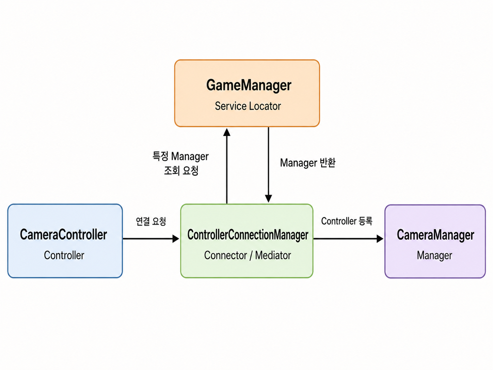

## :fire: Service Locator는 필요한 객체를 직접 생성하지 않고,   중앙 저장소(GameManager)에 요청해서 찾아오는 패턴이다.

#### :one: 고민한 이유
- Controller 와 Manager는 서로 의존된다.
- 하지만 둘 다 서로를 들고 있어 강한 결합을 만들 필요는 없다. 즉, 양방향 의존성을 없애고 싶었다.

 

#### :two: 도식화

 

#### :three: 사고 과정 및 도식화 해석
- Controller가 Manager보다 나중에 생성되는 게 보장된다.
- InputController는 MonoBehaviour Script이므로 Awake시에 자신의 탄생을 Mediator에게 알릴 수 있다.
- 여기서의 Mediator의 책임은 Controller 와 Manager를 연결시키는 게 전부다. Mediator는 타겟 Manager를 찾는 책임은 없다.
- Service Locator에게 Mediator는 타겟 Manager를 요청한다.

 

#### :four: 장점
- 책임이 명확하게 분리된다.
- Generic을 통해 컴파일 타임에 아는 정보를 제공하면 캐스팅이 없다. 또한, 깔끔하게 DI를 제거 할 수 있다.
- Manager만 Controller를 들고 있고, Controller는 Manager를 들고 있지 않도록 구현이 된다.

 

#### :five: 코드
~~~c#
// Mediator Class인 ControllerConnectionManager.cs의 코드
// Service Locator인 GameManager에게 요청한다.
public void ConnectManager<TManager, TController>(TController controller)
        where TManager : class, IManager, IHasController<TController>
        where TController : ControllerBase
{
    var targetManager = GameManager.Instance.GetManagerByType<TManager>();

    targetManager.RegisterController(controller);
}

// Service Locator인 GameManager에서 제공하는 Manager
public TManager GetManagerByType<TManager>() 
    where TManager : class, IManager
{
    if (_managerDict.TryGetValue(typeof(TManager), out var manager))
    {
        return manager as TManager;
    }
    throw new KeyNotFoundException($"Manager not found: {typeof(TManager)}");
}
~~~