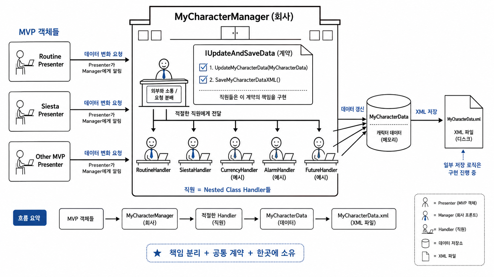

## :fireworks: 한 눈에 보는 클래스 구조도

 

## :fireworks: 위의 그림에 대한 고민의 과정
#### :one: 왜 쪼갰는가?
- 나는 인터페이스를 붙이는 클래스는 매우 핵심적이고 도메인에 가까워야 한다고 생각했었다.   그래서 자주 만들지 않았던 것 같다.   괜히 복잡해지는 느낌이 들어서
- 그러나 최근에 MyCharacterManager(게임의 플레이어 매니저 스크립트고, 씬과 무관하게 항상 들고 있는 데이터들 관리)를 개발하면서   이 클래스가 너무 하는 일이 많음을 경험했다.   과거에 회사에서도 이런 클래스가 2,000줄이 넘었던 기억이 있다.
- 그래서 이전에 고민했던 Facade Pattern을 생각해서 MyCharacterManager를 쪼개보려고 시도했다.

 

#### :two: 하지만 쪼갰을 때 단점
- '메서드 작게 쪼개기' , '클래스 작게 쪼개기' 이 것들이 매우 좋아보이지만 어설프면 파편화가 생긴다.
- 작으니까 재사용은 쉬우나 어딨는지 모르고 파편화되어서 조립도 힘들어진다.

 

#### :three: 공통 책임을 갖도록 쪼개자.
- MyCharacterManager를 회사로 만들었고, 여러가지 직원을 두도록 설계했다.
- 현재는 루틴 관련 성공 여부 데이터와 낮잠 시간 체크 데이터가 존재한다. 그래서 일단 둘을 직원으로 고용했다.   추후에 기능을 만들수록 직원은 늘어나겠지.

 

#### :four: 직원들이 세부적으로 하는 일은 같지만 추상적으로 공통된 기능을 하는 게 보였다.
- MyCharacterManager는 싱글턴이니까 MVP 객체들에 의해 호출이 된다.
- 보통 호출의 의도는 MVP 객체들이 게임 과정에서 데이터 변화 이벤트를 발생시키기 때문에 데이터 갱신을 요청하는 것 이다.
- 즉, MyCharacterManager는 추상적으로 MVP 객체들에게 변화된 데이터를 받는다.   그리고 직원들은 추상적으로 변화된 데이터를 MyCharacterData(entity)에서 갱신시킨다. 
- 처음에는 이걸 주석으로만 달았다. 그러나 문득, 이게 인터페이스인가?

 

#### :five: 직원들이 추상적으로 공통된 기능을 하면 그걸 명세로 만들어주는 게 인터페이스다. 
- 직원들은 모두 인터페이스를 상속받는다.
- 예를 들어 '받은 데이터 타입을 MyCharacterData를 통해 갱신하세요'라는 인터페이스의 메서드라면   모든 직원은 concrete method를 구현해서 이 책임을 수행한다.   만약 수행하지 못한다면 에러를 만들고 짤리겠지.
- 그렇게 되면 클래스는 쪼개지만 파편화가 되지 않는다.   MyCharacterManager의 nested class들로 묶여버린다. 
- 또한 각각의 클래스들은 응집도가 매우 높아지는 아주 훌륭한 결과가 생긴다.
- locality 관리도 잘 된다.

 

#### :six: 회사-직원 관계의 장단점
- 회사(MyCharacterManager)는 외부 업체(MVP 객체들)와 소통만 잘하면 된다.   회사가 Facade Class가 되는 것 이다.
- 회사는 직원에게 필요한 자원(MVP로 붙어 받아온 DTO)만 잘 주면 된다. 
  - 그래서 대부분 public method를 들고 있다. 
- 직원(MyCharacterManager의 Nested Class들 -> Handler를 붙인다.)은 인터페이스(회사에서 만들어 준 규율)를 잘 구현만 하면 된다.
- 내가 어떤 직원에게 기능을 추가하거나, 어떤 직원을 새로 고용하고 싶을 때   다른 직원의 업무를 알 필요가 없다.
  - 3개월 전에 구현하고 잘 돌아가고 있는 코드를 굳이 다시 읽지 않아도 된다.
  - 변경 범위가 작아진다.
