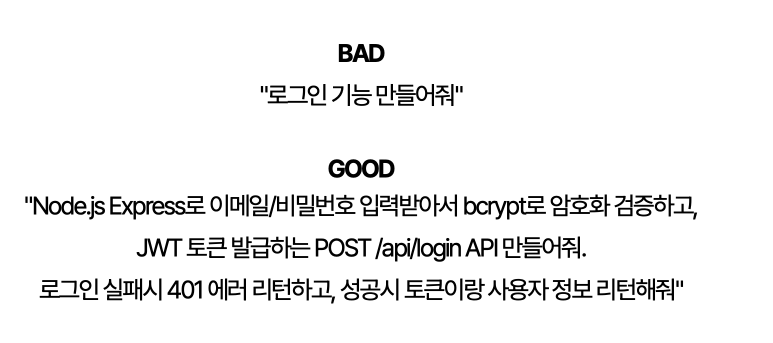
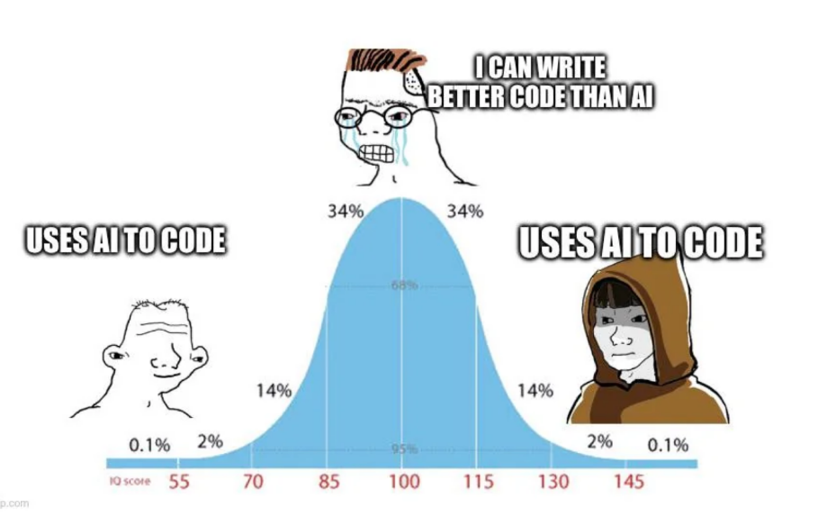

## 링크
- :airplane:[링크](https://velog.io/@teo/ai-and-developer)

## test

> 신입 개발자에게는 "최소한 AI보다는 잘해야" 하는 새로운 기준이 생겼습니다. AI 덕분에 개발이 쉬워졌다고 들어왔는데, 막상 취업 시장에 나와보니 문턱이 더 높아진 역설적 상황입니다. AI로 누구나 코드를 작성할 수 있게 되면서 공급은 늘고 있지만 정작 기업들이 원하는 건 "AI를 부려먹을 수 있는" 수준의 개발자입니다.

> 단순히 AI가 만든 코드를 복붙하는 수준이 아니라, 개발 기본기가 확실하면서도 즉각적인 실무 능력을 갖추고, AI를 효과적으로 활용할 줄 알며, 사람들과 소통과 협업을 잘하는 사람을 원하고 있습니다. 결국 "개발 잘하고, 일 잘하고, 소통 잘하는 사람"을 원한다는 겁니다. 사실 이런 사람은 예전에도 선호했습니다.

> 정작 개발자들의 실력은 어떻게 되고 있을까요? 여전히 잘하는 개발자는 찾기가 어렵습니다. 코딩이 쉬워지고 공급자를 늘리는 교육을 주로 하다 보니 기초보다는 당장 실습 가능한 실무 위주의 교육이 되었고, 거기에 물어보면 대답해주는 AI의 등장으로 우리는 AI에게 너무나 쉽게 "해줘~"라고 하게 되었습니다.

> 특히 요즘은 문제를 마주했을 때 '고민이 길어지는 것' 자체를 견디지 못하고 너무 쉽게 AI에게 즉각적인 답을 요구하는 모습을 자주 봅니다. 마치 우리가 쇼츠의 즉각적인 자극에 익숙해져 긴 호흡의 영상을 견디기 힘들어하듯 말이죠.

AI가 나 대신 공부하고, 나 대신 고민하고, 나 대신 코딩하게 두는 순간, 우리는 막막한 문제를 붙들고 씨름하며 얻어내는 개발자 고유의 문제 해결 능력을 잃게 됩니다. 자칫 AI 의존성이 생기고 기본 코딩 능력이 저하될 수 있습니다. 코딩이 쉬워지면서 오히려 코딩을 더 잘할 수 있게 하는 기회와 환경을 AI에게 빼앗기고 있는 중입니다. 
- 코테의 본질은 정답을 맞추는 시험이 아니다. 과거에 C++로 대기업 코테를 준비하던 대학생 시절 나는 어찌보면 암기를 했던 것 같다.
- 하지만 AI 시대에 그게 무의미함을 알았고, c#으로 암기가 아닌 이해를 바탕으로 코테를 풀기로 했다. 시간도 재지 않았다. 시험을 위한 공부가 아닌 현업에서 더 좋은 코드를 설계하는 능력을 키우기 위함이 었으니.
- 그리고 문제를 보고 종이에 설계를 하면서 문제를 풀었다.
- 그것이 “막막한 상태에서 문제를 구조화하는 능력”을 훈련하는 과정이었고 이게 지금 개발자에게 필요한 역량이라고 생각한다.

  

## test_2
