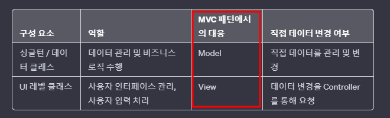

# 목차
- [목차](#목차)
- [Rule\_1 : 싱글턴 클래스 또는 데이터를 관리하는 데이터 클래스에 존재하는 필드를 UI 레벨의 클래스에서 변경하지 않는다.](#rule_1--싱글턴-클래스-또는-데이터를-관리하는-데이터-클래스에-존재하는-필드를-ui-레벨의-클래스에서-변경하지-않는다)
- [:star:Rule\_2 : 매개변수로 전달할 때 인스턴스(클래스)의 일부 필드를 뽑아서 전달하는 방식보다는 인스턴스 전체를 전달하자.](#starrule_2--매개변수로-전달할-때-인스턴스클래스의-일부-필드를-뽑아서-전달하는-방식보다는-인스턴스-전체를-전달하자)
- [Rule\_3 : 네이밍을 할 때 접두사와 접미사를 반드시 붙여 준다.](#rule_3--네이밍을-할-때-접두사와-접미사를-반드시-붙여-준다)
- [Rule\_4 : 게임 오브젝트의 계층 구조](#rule_4--게임-오브젝트의-계층-구조)
- [:star:Rule\_5 : 데이터 시트에 잘못된 데이터가 있거나 존재하지 않는 경우, 직접 수정하기 보다는 채널에서 기획자님께 수정을 요청을 드리자.](#starrule_5--데이터-시트에-잘못된-데이터가-있거나-존재하지-않는-경우-직접-수정하기-보다는-채널에서-기획자님께-수정을-요청을-드리자)
- [Rule\_6 : 매개변수로 넣어 줄 것의 Default 매개변수 세팅은 어디서든 접근 할 수 있는 클래스에 추가해 주자.](#rule_6--매개변수로-넣어-줄-것의-default-매개변수-세팅은-어디서든-접근-할-수-있는-클래스에-추가해-주자)
- [Rule\_7 : Cognitive Complexity를 측정해서 그 값이 높다면 해당 메서드를 다수의 메서드로 쪼개자.](#rule_7--cognitive-complexity를-측정해서-그-값이-높다면-해당-메서드를-다수의-메서드로-쪼개자)
- [:star:Rule\_8 : 두 번 이상 중복되는 코드가 적당히 복잡하면 메서드로 만들자](#starrule_8--두-번-이상-중복되는-코드가-적당히-복잡하면-메서드로-만들자)
- [Rule\_9 : 이벤트를 바인딩 하는 함수는 최대한 근처에 모아 둔다.](#rule_9--이벤트를-바인딩-하는-함수는-최대한-근처에-모아-둔다)
- [Rule\_10 : Transform 또는 RectTransform은 Unity Inspector에서 연결을 하거나 캐싱을 하자.](#rule_10--transform-또는-recttransform은-unity-inspector에서-연결을-하거나-캐싱을-하자)

   

# Rule_1 : 싱글턴 클래스 또는 데이터를 관리하는 데이터 클래스에 존재하는 필드를 UI 레벨의 클래스에서 변경하지 않는다.
- 
- View에서 Model을 변경하는 것은 절대 하지 말자.
- 서로 다른 싱글턴 클래스끼리도 변경하지 않는 것이 좋다. 
  - 하지만 어쩔 수 없는 상황에는 변경을 해야 한다.
    - 그런 경우에는 더 코어한 싱글턴에서 관련 필드를 만들고 변경하자.
    - 이렇게 하면 dependency가 감소한다. (머리로는 이해가 가는데 글로는 적기가 어렵다...) 
  
   

# :star:Rule_2 : 매개변수로 전달할 때 인스턴스(클래스)의 일부 필드를 뽑아서 전달하는 방식보다는 인스턴스 전체를 전달하자.
- 의존성이 증가 할 수 있다.
- 하지만 매개변수의 개수는 줄어든다.
- **필요한 데이터의 추가에 대해서 고민하는 시간을 없애준다.**
  - 이미 필요하거나 필요할 수도 있는 모든 데이터를 다른 클래스에 전달하기 때문에 인스턴스에 존재하는 모든 데이터를 편하게 이용할 수 있다!!!
- 
> 종속성이란 컴포넌트 A가 컴포넌트 B에 종속되어 있다고 가정할 때, 컴포넌트 B가 변경되면 A도 그에 따라 변경되어야 한다는 뜻입니다. 여기서 컴포넌트는 클래스, 함수, 인터페이스, 메서드, 심지어 필드일 수도 있습니다. A와 B의 종속성 또는 결합의 정도를 측정하는 척도는 강하거나 약할 수 있습니다. 코딩에서 종속성은 때때로 좋기도 하고 나쁘기도 합니다.
- 다형성으로 이동...

   

# Rule_3 : 네이밍을 할 때 접두사와 접미사를 반드시 붙여 준다.
- Prefix 또는 Suffix로 관리를 하여 멤버 변수도 모아 놓는 게 코드리딩에 좋다.
- 접두사 (Prefix)
  - 게임 오브젝트 : obj
  - 버튼 : btn
  - 이미지 : img
  - 텍스트 : txt
- 접미사 (suffix)
  - 상속 받을 여지가 있는 클래스 : Base 

   

# Rule_4 : 게임 오브젝트의 계층 구조
- 거대한 게임 오브젝트는 보통 다양한 게임 오브젝트가 계층적인 구조를 갖고 있다.
  - 각각의 게임 오브젝트는 컴포넌트로 스크립트를 넣을 수 있다.
- 최상단 게임 오브젝트에 스크립트를 추가하고 관리하지만 하위 게임 오브젝트에 스크립트를 추가해서 개별로 관리할 수 있다.
- 
  - b1 ~ b4를 관리하기 위해 A에 존재하는 스크립트에서 이 들의 코드를 적으면 분기를 많이 나눈다.
  - 이런 경우는 B 자체에 스크립트를 추가하는 것이 현명해 보인다.

   

# :star:Rule_5 : 데이터 시트에 잘못된 데이터가 있거나 존재하지 않는 경우, 직접 수정하기 보다는 채널에서 기획자님께 수정을 요청을 드리자.
- Case by Case 지만 내가 수정하고 기획에서 추후에 왜 바꿨냐고 할 수도 있기 때문에 안전하게 기획에 요청을 하자.
- 하지만 제대로 검토하지 않고 기획에 요청을 하게 되면 추후 수정이 난처하기 때문에 제대로 검토하고 채널에 요청하자.
- 어지간하면 기획자님께 수정을 요청 드리자 -> 편하다.

   

# Rule_6 : 매개변수로 넣어 줄 것의 Default 매개변수 세팅은 어디서든 접근 할 수 있는 클래스에 추가해 주자.
- 정확히 어떤 싱글턴이나 static 클래스인지는 중요하지 않다. 어디서든 접근만 하면 된다.
- = null로 하는 default 매개 변수는 보통 에러 처리의 영역으로 생각하기 때문에 에러와 관련 될 때로 체크를 해 보자.

   

# Rule_7 : Cognitive Complexity를 측정해서 그 값이 높다면 해당 메서드를 다수의 메서드로 쪼개자.
- 메서드가 길면 다 읽어야 하는 고통스러움이 존재한다.
- https://sonarqubekr.atlassian.net/wiki/spaces/SON/blog/2017/10/06/34996228/Cognitive+Complexity+Because+Testability+Understandability

   

# :star:Rule_8 : 두 번 이상 중복되는 코드가 적당히 복잡하면 메서드로 만들자
- 
- **두 번 중복 되는데 너무 간단하거나 짧은 구문은 굳이 메서드로 만들지 말자. 괜히 메서드로 만들어서 가독성을 해지는 경우가 있다. 하지만 조금만 복잡해져도 메서드로 만드는 게 좋다고 생각한다.**
- **사실 세 번 이상 중복되면 어지간하면 메서드로 만드는 게 좋다고 생각한다.**
- 경험 : 두 번 중복되고 복잡한데 메서드로 만들지 않은 코드를 내가 유지 보수 해야 하는 경험이 있었다. 
  - myData를 이용해서 동작을 하는 녀석과 enemyData를 이용해서 동작을 하는 녀석이었다. 둘은 Data만 다르고 같은 동작을 했다. 
  - 유지 보수를 하며 코드를 수정하는 동안 똑같은 짓을 두 번 했다. -> 시간 낭비
  - 수정하다가 둘 다 myData를 실수로 넣어서 제대로 동작을 하지 않았고 수정하고 해당 부분만 다시 서밋했다. -> 시간 낭비  

   

# Rule_9 : 이벤트를 바인딩 하는 함수는 최대한 근처에 모아 둔다.

   

# Rule_10 : Transform 또는 RectTransform은 Unity Inspector에서 연결을 하거나 캐싱을 하자.
- 