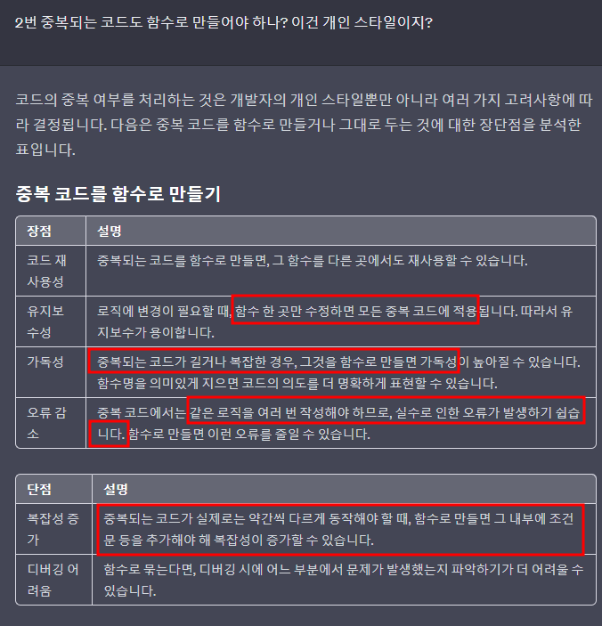
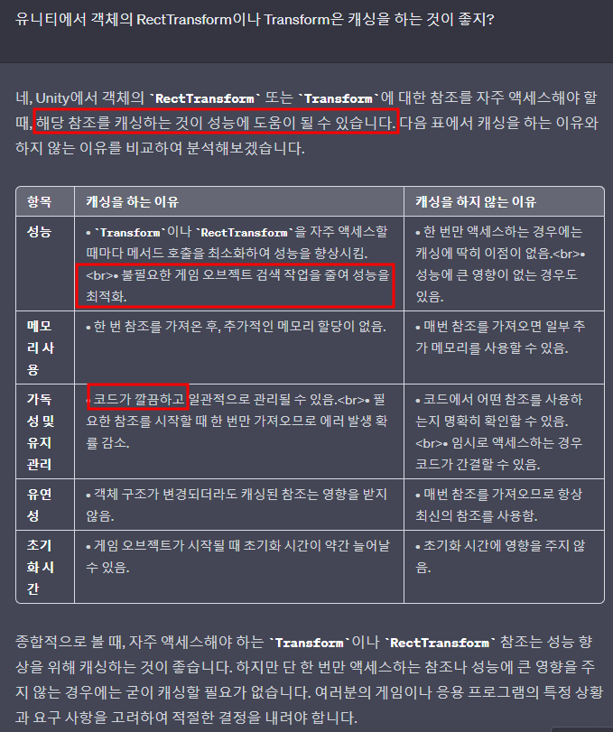
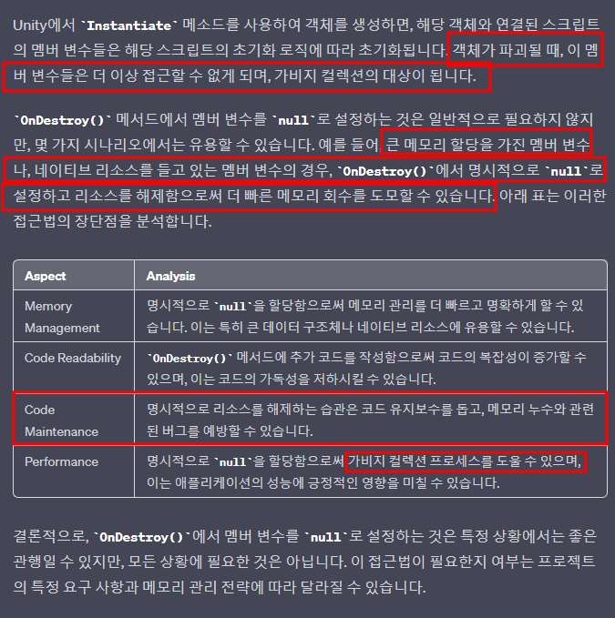
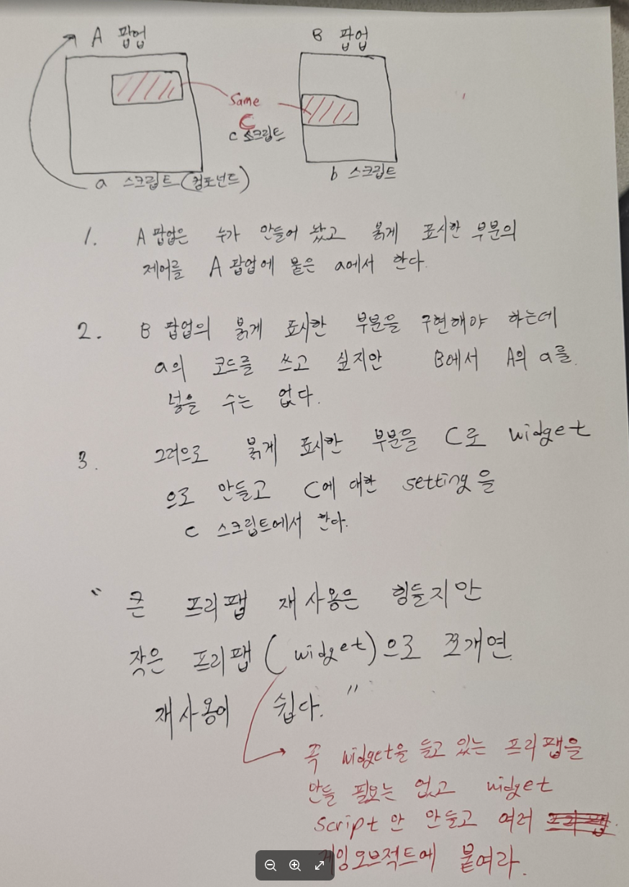

# 목차
- [목차](#목차)
- [Rule\_1 : 복잡한 메서드 상단에는 Summary 주석을 달아주자.](#rule_1--복잡한-메서드-상단에는-summary-주석을-달아주자)
- [Rule\_2 :  매개변수로 전달할 때 인스턴스(클래스)의 일부 필드를 뽑아서 전달하는 방식보다는 인스턴스 전체를 전달하자.](#rule_2---매개변수로-전달할-때-인스턴스클래스의-일부-필드를-뽑아서-전달하는-방식보다는-인스턴스-전체를-전달하자)
- [Rule\_3 :  이름을 지을 때 img, txt 접미사를 붙인다.](#rule_3---이름을-지을-때-img-txt-접미사를-붙인다)
- [Rule\_4 : 게임 오브젝트의 계층 구조](#rule_4--게임-오브젝트의-계층-구조)
- [Rule\_5 :  람다 표현에서 .을 붙일 때 마다 개행을 해주자.](#rule_5---람다-표현에서-을-붙일-때-마다-개행을-해주자)
- [Rule\_6 : 매개변수로 넣어 줄 것의 Default 매개변수 세팅은 어디서든 접근 할 수 있는 클래스에 추가해 주자.](#rule_6--매개변수로-넣어-줄-것의-default-매개변수-세팅은-어디서든-접근-할-수-있는-클래스에-추가해-주자)
- [Rule\_7 : 간단한 데이터 수정이 필요하다면 직접 수정해라.](#rule_7--간단한-데이터-수정이-필요하다면-직접-수정해라)
- [Rule\_8 : 두 번 이상 중복되는 코드는 많이 복잡하면 함수로 빼지만 그렇지 않으면 반복해도 문제는 없다고 생각한다.](#rule_8--두-번-이상-중복되는-코드는-많이-복잡하면-함수로-빼지만-그렇지-않으면-반복해도-문제는-없다고-생각한다)
- [Rule\_9 : 이벤트를 바인딩 하는 함수는 BindEvent로 네이밍하여 메서드로 만들어 준다.](#rule_9--이벤트를-바인딩-하는-함수는-bindevent로-네이밍하여-메서드로-만들어-준다)
- [Rule\_10 : Transform 또는 RectTransform은 Unity Inspector에서 연결을 하거나 캐싱을 하자.](#rule_10--transform-또는-recttransform은-unity-inspector에서-연결을-하거나-캐싱을-하자)
- [Rule\_11 : 명시적으로 null로 초기화 하는 것은 좋은 습관이 될 수 있다.](#rule_11--명시적으로-null로-초기화-하는-것은-좋은-습관이-될-수-있다)
- [Rule\_12 : 유니티에서 프리팹의 일부가 다른 곳에서 동일하다면 해당 프리팹의 일부분을 widget으로 따로 만든다.](#rule_12--유니티에서-프리팹의-일부가-다른-곳에서-동일하다면-해당-프리팹의-일부분을-widget으로-따로-만든다)
    - [1. A에 붙어 있는 스크립트 a에서 C를 세팅하는 메서드를 복붙한다.](#1-a에-붙어-있는-스크립트-a에서-c를-세팅하는-메서드를-복붙한다)
    - [2. 새로운 스크립트 c를 만들고 위에서 복사한 메서드를 붙인다. 이제 스크립트 c에서 게임 오브젝트 C를 세팅한다.](#2-새로운-스크립트-c를-만들고-위에서-복사한-메서드를-붙인다-이제-스크립트-c에서-게임-오브젝트-c를-세팅한다)
    - [3. A에서 C를 세팅하는 코드를 제거하고 A에 멤버 변수로 C를 추가한다.](#3-a에서-c를-세팅하는-코드를-제거하고-a에-멤버-변수로-c를-추가한다)
    - [4. A에서 C로 하여금 C를 세팅하는 코드를 호출한다.](#4-a에서-c로-하여금-c를-세팅하는-코드를-호출한다)
- [Rule\_13 : 시스템 레벨의 메서드를 사용할 때는 명확히 이해하고 재사용 하자.](#rule_13--시스템-레벨의-메서드를-사용할-때는-명확히-이해하고-재사용-하자)

   

# Rule_1 : 복잡한 메서드 상단에는 Summary 주석을 달아주자.
- ///를 쓰면 알아서 자동 완성이 된다.
- 한글로 적는 게 더 가독성이 좋다.

   

# Rule_2 :  매개변수로 전달할 때 인스턴스(클래스)의 일부 필드를 뽑아서 전달하는 방식보다는 인스턴스 전체를 전달하자.
- 의존성이 증가 할 수 있다.
- 하지만 매개변수의 개수는 줄어든다.
- **필요한 데이터의 추가에 대해서 고민하는 시간을 없애준다.**
  - 이미 필요하거나 필요할 수도 있는 모든 데이터를 다른 클래스에 전달하기 때문에 인스턴스에 존재하는 모든 데이터를 편하게 이용할 수 있다!!!
- 
> 종속성이란 컴포넌트 A가 컴포넌트 B에 종속되어 있다고 가정할 때, 컴포넌트 B가 변경되면 A도 그에 따라 변경되어야 한다는 뜻입니다. 여기서 컴포넌트는 클래스, 함수, 인터페이스, 메서드, 심지어 필드일 수도 있습니다. A와 B의 종속성 또는 결합의 정도를 측정하는 척도는 강하거나 약할 수 있습니다. 코딩에서 종속성은 때때로 좋기도 하고 나쁘기도 합니다.
- 다형성으로 이동...

   

# Rule_3 :  이름을 지을 때 img, txt 접미사를 붙인다.
- Unity 오브젝트 중에 수량 관련 텍스트 오브젝트는 string 이지만 그걸 구성하는 실제 값은 int이다.
- 둘 다 스크립트에서 공존 할 수 있으므로 접미사로 구분하자.

   

# Rule_4 : 게임 오브젝트의 계층 구조
- 거대한 게임 오브젝트는 보통 다양한 게임 오브젝트가 계층적인 구조를 갖고 있다.
  - 각각의 게임 오브젝트는 컴포넌트로 스크립트를 넣을 수 있다.
- 최상단 게임 오브젝트에 스크립트를 추가하고 관리하지만 하위 게임 오브젝트에 스크립트를 추가해서 개별로 관리할 수 있다.
- 
  - b1 ~ b4를 관리하기 위해 A에 존재하는 스크립트에서 이 들의 코드를 적으면 분기를 많이 나눈다.
  - 이런 경우는 B 자체에 스크립트를 추가하는 것이 현명해 보인다.

   

# Rule_5 :  람다 표현에서 .을 붙일 때 마다 개행을 해주자.
- 이게 이쁨.

   

# Rule_6 : 매개변수로 넣어 줄 것의 Default 매개변수 세팅은 어디서든 접근 할 수 있는 클래스에 추가해 주자.
- 정확히 어떤 싱글턴이나 static 클래스인지는 중요하지 않다. 어디서든 접근만 하면 된다.
- = null로 하는 default 매개 변수는 보통 에러 처리의 영역으로 생각하기 때문에 에러와 관련 될 때로 체크를 해 보자.

   

# Rule_7 : 간단한 데이터 수정이 필요하다면 직접 수정해라.

   

# Rule_8 : 두 번 이상 중복되는 코드는 많이 복잡하면 함수로 빼지만 그렇지 않으면 반복해도 문제는 없다고 생각한다.
- 

   

# Rule_9 : 이벤트를 바인딩 하는 함수는 BindEvent로 네이밍하여 메서드로 만들어 준다.

   

# Rule_10 : Transform 또는 RectTransform은 Unity Inspector에서 연결을 하거나 캐싱을 하자.
- 

   

# Rule_11 : 명시적으로 null로 초기화 하는 것은 좋은 습관이 될 수 있다.
- 

   

# Rule_12 : 유니티에서 프리팹의 일부가 다른 곳에서 동일하다면 해당 프리팹의 일부분을 widget으로 따로 만든다.
- 대문자는 게임 오브젝트를 의미한다. 소문자는 스크립트를 의미한다.
- A -> B -> C 구조에서 B를 세팅하는 코드와 C를 세팅하는 코드는 모두 A에 있다. 다른 게임 오브젝트 D에서 게임오브젝트 C와 완전히 동일한 기능이 있어서 A에서 C를 세팅하는 코드를 재사용하고 싶다.
- 이런 경우 다음의 절차를 따른다.
### 1. A에 붙어 있는 스크립트 a에서 C를 세팅하는 메서드를 복붙한다.
### 2. 새로운 스크립트 c를 만들고 위에서 복사한 메서드를 붙인다. 이제 스크립트 c에서 게임 오브젝트 C를 세팅한다.
### 3. A에서 C를 세팅하는 코드를 제거하고 A에 멤버 변수로 C를 추가한다.
### 4. A에서 C로 하여금 C를 세팅하는 코드를 호출한다.
- 이제 다른 게임 오브젝트에서 C만 필요하면 A랑 상관 없이 C를 이용하여 재사용 하면 된다.
- **반드시 C를 프리팹으로 만들 필요는 없다. C를 제어하는 스크립트 c만 만들고 필요한 게임오브젝트 마다 적절한 위치에 스크립트 c만 붙여도 된다.**
- 

   

# Rule_13 : 시스템 레벨의 메서드를 사용할 때는 명확히 이해하고 재사용 하자.
- 시스템의 로직에서만 호출 되어야 하는 메서드 들이 있다. 해당 의도를 명시적으로 파악하지 않고 사용하면 시스템을 깨기 때문에 잠재적으로 버그가 발생할 수 있다.
- 메서드의 재사용은 좋지만 재사용을 하지 않도록 설계된 메서드도 분명 존재한다.  
