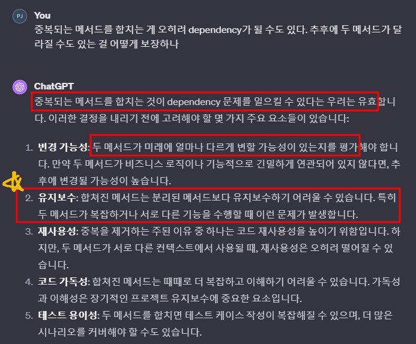
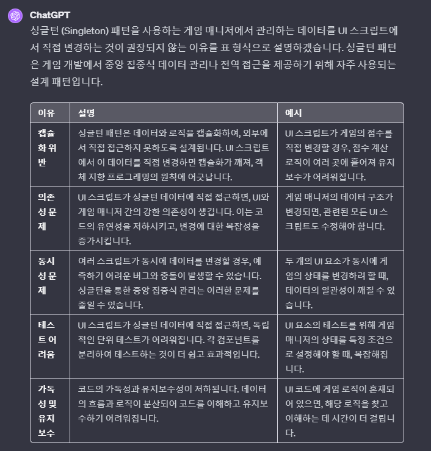

# 목차
- [목차](#목차)
- [Rule\_11 : 명시적으로 null로 초기화 하는 것은 좋은 습관이 될 수 있다.](#rule_11--명시적으로-null로-초기화-하는-것은-좋은-습관이-될-수-있다)
- [Rule\_12 : 유니티에서 프리팹의 일부가 다른 곳에서 동일하다면 해당 프리팹의 일부분을 widget으로 따로 만든다.](#rule_12--유니티에서-프리팹의-일부가-다른-곳에서-동일하다면-해당-프리팹의-일부분을-widget으로-따로-만든다)
    - [1. A에 붙어 있는 스크립트 a에서 C를 세팅하는 메서드를 복붙한다.](#1-a에-붙어-있는-스크립트-a에서-c를-세팅하는-메서드를-복붙한다)
    - [2. 새로운 스크립트 c를 만들고 위에서 복사한 메서드를 붙인다. 이제 스크립트 c에서 게임 오브젝트 C를 세팅한다.](#2-새로운-스크립트-c를-만들고-위에서-복사한-메서드를-붙인다-이제-스크립트-c에서-게임-오브젝트-c를-세팅한다)
    - [3. A에서 C를 세팅하는 코드를 제거하고 A에 멤버 변수로 C를 추가한다.](#3-a에서-c를-세팅하는-코드를-제거하고-a에-멤버-변수로-c를-추가한다)
    - [4. A에서 C로 하여금 C를 세팅하는 코드를 호출한다.](#4-a에서-c로-하여금-c를-세팅하는-코드를-호출한다)
- [Rule\_13 : 시스템 레벨의 메서드를 사용할 때는 명확히 이해하고 재사용 하자.](#rule_13--시스템-레벨의-메서드를-사용할-때는-명확히-이해하고-재사용-하자)
- [Rule\_14 : 메서드는 작게 쪼개는 게 좋다.](#rule_14--메서드는-작게-쪼개는-게-좋다)
- [Rule\_15 : 변수는 사용하는 위치에 최대한 가까이 선언한다. 이는 지역변수를 사용해야 하는 이유와 직결 된다.](#rule_15--변수는-사용하는-위치에-최대한-가까이-선언한다-이는-지역변수를-사용해야-하는-이유와-직결-된다)
- [Rule\_16 : Rider의 Reformat \& CleanUp 기능을 이용해서 코드의 통일성을 유지 시킨다.](#rule_16--rider의-reformat--cleanup-기능을-이용해서-코드의-통일성을-유지-시킨다)
- [Rule\_17 : 항상 상위 타입으로 묶는 게 좋은 것은 아니다.](#rule_17--항상-상위-타입으로-묶는-게-좋은-것은-아니다)
- [Rule\_18 : Update 하는 메서드에서 (bool isInitialized) 같이 bool 변수를 통해 내부 메서드에서 조건을 달지 말고 메서드를 2개 만들자.](#rule_18--update-하는-메서드에서-bool-isinitialized-같이-bool-변수를-통해-내부-메서드에서-조건을-달지-말고-메서드를-2개-만들자)
- [Rule\_19 : 매니저(싱글턴)에서 관리 되는 데이터는 UI에서 변경하지 말고, 특정 UI 한 곳 에서만 사용하는 데이터를 매니저의 필드로 만들지 말자.](#rule_19--매니저싱글턴에서-관리-되는-데이터는-ui에서-변경하지-말고-특정-ui-한-곳-에서만-사용하는-데이터를-매니저의-필드로-만들지-말자)
- [Rule\_20 : 큰 시스템을 개발할 때 변수 명 짓기 귀찮아서 똑같은 걸 지정하는 데 다양한 네이밍을 지을 때가 있다. 절대 그러지 마라. 나중에 업보로 돌아온다.](#rule_20--큰-시스템을-개발할-때-변수-명-짓기-귀찮아서-똑같은-걸-지정하는-데-다양한-네이밍을-지을-때가-있다-절대-그러지-마라-나중에-업보로-돌아온다)

   

# Rule_11 : 명시적으로 null로 초기화 하는 것은 좋은 습관이 될 수 있다.
- 

   

# Rule_12 : 유니티에서 프리팹의 일부가 다른 곳에서 동일하다면 해당 프리팹의 일부분을 widget으로 따로 만든다.
- 대문자는 게임 오브젝트를 의미한다. 소문자는 스크립트를 의미한다.
- A -> B -> C 구조에서 B를 세팅하는 코드와 C를 세팅하는 코드는 모두 A에 있다. 다른 게임 오브젝트 D에서 게임오브젝트 C와 완전히 동일한 기능이 있어서 A에서 C를 세팅하는 코드를 재사용하고 싶다.
- 이런 경우 다음의 절차를 따른다.
### 1. A에 붙어 있는 스크립트 a에서 C를 세팅하는 메서드를 복붙한다.
### 2. 새로운 스크립트 c를 만들고 위에서 복사한 메서드를 붙인다. 이제 스크립트 c에서 게임 오브젝트 C를 세팅한다.
### 3. A에서 C를 세팅하는 코드를 제거하고 A에 멤버 변수로 C를 추가한다.
### 4. A에서 C로 하여금 C를 세팅하는 코드를 호출한다.
- 이제 다른 게임 오브젝트에서 C만 필요하면 A랑 상관 없이 C를 이용하여 재사용 하면 된다.
- **반드시 C를 프리팹으로 만들 필요는 없다. C를 제어하는 스크립트 c만 만들고 필요한 게임오브젝트 마다 적절한 위치에 스크립트 c만 붙여도 된다.**
- 

   

# Rule_13 : 시스템 레벨의 메서드를 사용할 때는 명확히 이해하고 재사용 하자.
- 시스템의 로직에서만 호출 되어야 하는 메서드 들이 있다. 해당 의도를 명시적으로 파악하지 않고 사용하면 시스템을 깨기 때문에 잠재적으로 버그가 발생할 수 있다.
- 메서드의 재사용은 좋지만 재사용을 하지 않도록 설계된 메서드도 분명 존재한다.  

   

# Rule_14 : 메서드는 작게 쪼개는 게 좋다.
- 타인의 코드를 읽을 때 100줄 이상 넘어가는 메서드를 읽을 때는 피로하다.
  - 다 읽어서 dependency를 체크해야 한다.
- 메서드가 쪼개질수록 읽기도 쉽고 바꾸기도 쉽다.
  - 잘개 쪼개면 메서드 명만 보고 어디를 바꿔야 겠다고 바로 판단이 된다.

   

# Rule_15 : 변수는 사용하는 위치에 최대한 가까이 선언한다. 이는 지역변수를 사용해야 하는 이유와 직결 된다.
> 우리가 만든 함수는 매우 짧으므로 지역 변수는 각 함수 맨 처음에 선언한다.
  - 지역변수는 scope가 작기 때문에 가까이 있을 가능성이 높다.
  - 지역변수를 적극적으로 사용해야 함을 의미한다.

   

# Rule_16 : Rider의 Reformat & CleanUp 기능을 이용해서 코드의 통일성을 유지 시킨다.
- 원하는 부분 블록 잡고 Alt+Enter를 이용하고, Reformat & CleanUp을 누르면 된다.
- 정리한 코드가 정리하지 않은 코드보다 나쁠게 뭐가 있을까?

   

# Rule_17 : 항상 상위 타입으로 묶는 게 좋은 것은 아니다.
- 미래를 위해 중복되는 부분은 합치는 게 좋을까?
  - 반드시 그런건 아니다.
- 일단 돌아가게 구현하고 -> 더 좋은 설계를 찾아보는 방식도 중요하다.
  - 항상 완벽하게 설계를 하고 구현하는 것에 포커스를 두었지만 일단 구현하고 리팩터링 하는 방식이 지금 단계에서는 좋을 수도 있다.
  - 미래를 모두 커버하는 완벽한 설계가 어디에 있을까?
  - 구현해보고 더 좋은 설계를 찾는 게 최고의 공부다.
- 중복 되는 메서드를 합치는 게 오히려 Dependency는 증진 시킬 수 있다.
- 

   

# Rule_18 : Update 하는 메서드에서 (bool isInitialized) 같이 bool 변수를 통해 내부 메서드에서 조건을 달지 말고 메서드를 2개 만들자.
- 내부가 더러워진다.
- 메서드를 분리 하는 것이 깔끔하다.

   

# Rule_19 : 매니저(싱글턴)에서 관리 되는 데이터는 UI에서 변경하지 말고, 특정 UI 한 곳 에서만 사용하는 데이터를 매니저의 필드로 만들지 말자.
- 프로퍼티를 이용하거나 UI의 함수를 통해서 매니저의 필드를 바꾸는 경우도 지양하자.
- 특정 UI 한 곳 에서만 사용하는 데이터는 반드시 해당 UI에서만 관리한다.
  - 물론 매니저의 필드로 만들면 접근하기 쉬운 편리함이 있지만 목적에 부합하지 않는다.
- 

   

# Rule_20 : 큰 시스템을 개발할 때 변수 명 짓기 귀찮아서 똑같은 걸 지정하는 데 다양한 네이밍을 지을 때가 있다. 절대 그러지 마라. 나중에 업보로 돌아온다.
- UI에서도 다르고 A 스크립트에서도 다르고 B 스크립트에서 다르면 정신 나간다.
