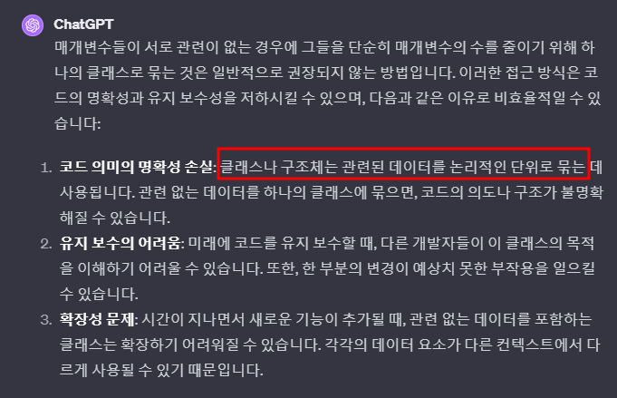

# 두 개의 모자
> 나는 소프트웨어를 개발할 때 목적이 '기능 추가'냐 아니면 '리팩터링'이냐를 명확히 구분해 작업한다. 켄트 벡은 이를 두 개의 모자에 비유했다. 기능을 추가할 때는 '기능 추가' 모자를 쓴 다음 기존 코드는 절대 건드리지 않고 새 기능을 추가하기만 한다. 리팩터링 할 때는 '리팩터링' 모자를 쓴 다음 기능 추가는 절대 하지 않기로 다짐한 뒤 오로지 코드 재구성에만 전념한다. 코드가 이해하기 어렵게 짜였다면 다시 모자를 바꿔 쓰고 리팩터링한다.
- 구현을 할 때에는 구현만 하고, 리팩터링 목록에 추가해 놓고 넘어가자.
  - 둘을 혼용하면, 리팩터링 하는 과정에서 발생하는 버그 때문에 기능 구현에서 발목이 잡힐 수도 있다.

# 시니어 개발자의 리팩터링에 대한 다른 견해
> 주니어 개발자로서는 리팩터링을 통해 자신의 능력을 향상시키고, 코드 품질을 지속적으로 개선하는 것이 현실적이며 효율적일 수 있습니다. 시니어 개발자의 접근 방식은 높은 수준의 능력과 경험에 기반한 것이므로, 당장 그렇게 하기는 어려울 수 있습니다. 따라서 주니어로서는 리팩터링을 적극 활용하여 지속적인 성장을 추구하는 것이 좋을 것 같습니다.

   

# 1. 함수 추출
- https://methodpoet.com/too-many-method-parameters/
- 클래스 안에 클래스를 추가해서 묶는 방식은 좋음. 그리고 여기서만 사용하면 priavte으로
- 
- 
# 2. 자료구조 가공으로 복잡도 줄이기
- LINQ를 사용해서 아무 생각 없이 순회를 하게 되면 그 메서드가 어디선가 n번 불릴 수도 있다.
  - 그 때 오버헤드가 감당이 되지 않는다.
  - 데이터를 게임 로드시에 아예 메모리에 올려서 순회 하지 않고 데이터를 찾는 메서드를 만들어 버리면 엄청난 최적화를 할 수 있다. 