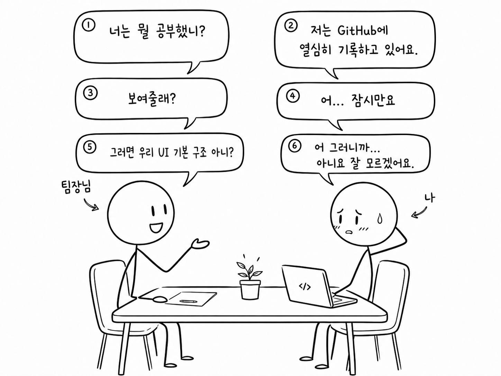
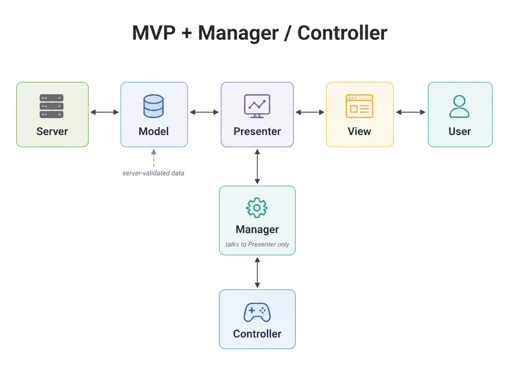
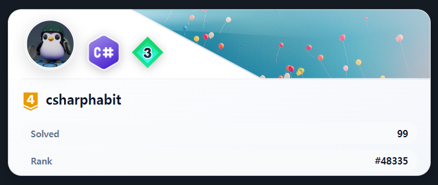
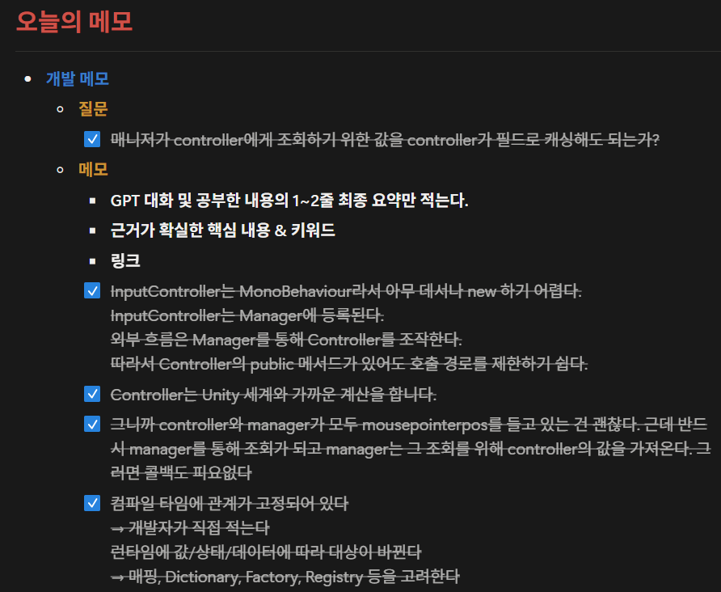
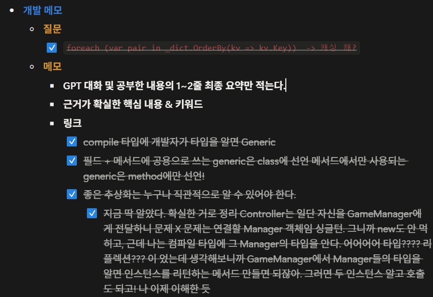
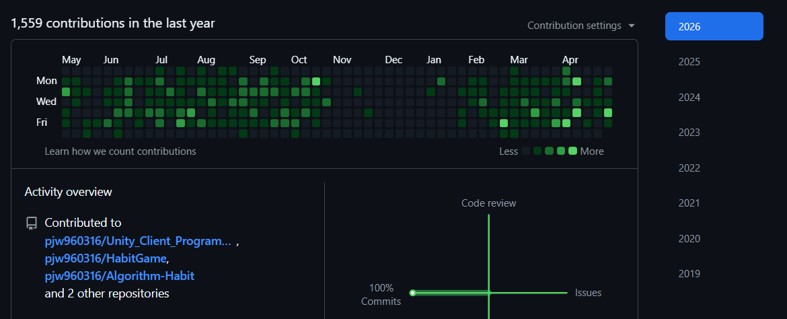

  <h1 style="font-size: 60px; margin: 0 0 36px 0;">
    박지원 포트폴리오
  </h1>

  

    Unity / C# Client Programmer
  

  

    2026
  

# 👤 이력서

 

## ✅ 기본 정보

- 이름  :  박지원
- 성별  :  남
- 생년월일  :  1996.03.16
  
- 🏠  :  서울특별시 동대문구 장안동
- 📫  :  pjw960316@naver.com
- ☎️  :  010-4761-3371
- 🔗  :  ✈️[Github](https://github.com/pjw960316/Unity_Client_Programmer)

  

## ✅ 학력
- **숭실대학교 컴퓨터학부**
  - 2016.03 ~ 2022.02 : 컴퓨터학부 학사
  - 2017.04 ~ 2019.01 : 군 복무

  

## ✅ 경력
- **넥슨게임즈 넥토리얼 2기 및 정규직**
  - 2022.12 ~ 2024.04 : 제우스 프로젝트_Unity 클라이언트 프로그래머
  - ✈️[Project ZEUS => GODSOME](https://www.nexongames.co.kr/en/game/project_zeus_en.php)
  - ✈️[GODSOME Official Trailer](https://www.youtube.com/watch?v=h6JmOxkbqqI)

 

- **펄어비스 인턴**
  - 2021.12 ~ 2022.02 : 플랫폼 프로그래밍 2팀

# 목차

 

## 🔍 이전 회사 경험에서 발견한 네 가지 문제점

   

## 🛠️ 첫 번째 해결과정 : 게임 기능 구현에서 게임 구조 설계로

   

## 🧮 두 번째 해결과정 : AI 시대에 필요한 구현 기본기

   

## 📚 세 번째 해결과정 : 쌓이기만 하던 메모를 다시 읽히는 기록으로 
 
   

## 🚀 네 번째 해결과정 : 다시 일하기 위한 저만의 지도

   

## 🌱 후기

# 🔍 이전 회사 경험에서 발견한 네 가지 문제점
### 1️⃣ 퇴사 직전 면담 때, '혼자 슈팅게임을 만들 수 있느냐?' 에서   저는 '아니요'라고 답했습니다.
- 코드의 밑바닥 설계부터 구현할 자신이 없었습니다. 

- 회사에는 몇 천 줄에 이르는 base class, Perforce의 커밋 로그와 히스토리처럼 천천히 읽고 이해해야 할 자료가 충분히 관리되어 있었습니다. 하지만 당시의 저는 그것을 깊게 읽고 제 것으로 만드는 힘이 부족했습니다.

- 팀에서 제게 요구했던 것은 단순히 메서드를 빠르게 생산하는 것이 아니라, 기존 코드의 흐름과 기반 구조를 이해한 뒤 그 위에 기능을 올리는 일이었습니다.

- 그러나 기반 구조를 충분히 이해하지 못한 상태에서 기능 구현에만 조급해졌고, 그 결과 중복 코드와 복잡한 의존성을 만들었습니다. 돌이켜보면 이 문제는 인턴 시절부터 어렴풋이 알고 있었지만, 제대로 마주하지 못했던 부분이었습니다.

 

### 2️⃣ 기초가 약했고, 실무에서 요구되는 수준의 기본기도 부족했습니다.   해야 할 것이 많다는 부담 때문에, 오히려 부족한 부분을 정면으로 채우지 못했습니다.

- 4년 동안 컴퓨터공학을 전공했지만, 스스로에게 “나는 개발을 잘하는가?”라고 물었을 때 자신 있게 답하지 못했습니다.

- 인턴을 마치고 정직원이 되었을 때, 난이도 있는 업무를 맡고 싶은 마음은 있었습니다. 하지만 동시에 그것을 해결하는 것이 두렵기도 했습니다.

- 기존 코드를 깊게 읽고, 왜 이렇게 설계되었는지 역으로 생각하는 힘이 부족했습니다.

- 부족함을 알고도 그것을 채우기 위한 꾸준한 실행으로 연결하지 못했습니다.

- 해야 할 일은 계속 리스트업했지만, 천천히 쌓아가는 공부와는 거리가 있었습니다.

# 🔍 과거의 회사 경험을 통해 문제 의식을 발현
### 3️⃣ 메모만 하고 기록으로 가공하여 제 것으로 만든 적이 없었던 것 같습니다.

  

  

    팀장님과의 중간평가에서 있었던 일화를 간단히 시각화한 AI 이미지입니다.
  

 

- 당시에도 공부를 하지 않은 것은 아니었습니다. 다만 제대로 된 공부를 하지 못했습니다.

- 배운 내용을 적기는 했지만, 다시 읽고 설명할 수 있는 형태로 만들지 못했고, 결국 지식이 제 안에 쌓이기보다 메모장 안에만 쌓였습니다.

- 이 경험을 통해 공부는 ‘적는 것’에서 끝나는 것이 아니라, 다시 읽히고 설명 가능한 기록으로 가공되어야 한다는 문제의식을 갖게 되었습니다.

 

### 4️⃣ 감정적으로 나약했고, 회사 밖의 삶을 지탱할 기준도 부족했습니다.
- 대학 졸업 전 인턴을 경험했고, 졸업 후에도 인턴과 정직원 생활을 이어갔습니다. 게임 회사에 들어가는 것이 오랜 목표였기 때문에, 목표를 이룬 뒤의 다음 방향을 충분히 준비하지 못했습니다.

- 회사에서 잘해야 한다는 생각은 강했지만, 회사 밖의 삶 전체를 어떻게 운영할지에 대한 기준은 부족했습니다.

- 돌이켜보면 팀장님, 파트장님, 멘토님은 저를 성장시키기 위해 많은 기회를 주셨습니다. 하지만 당시의 저는 그 도움을 충분히 받아들이고 제 성장으로 연결하는 법을 잘 알지 못했습니다.

- 특히 퇴사 전 팀장님께서 개인 발표 시간을 1대1로 들어주셨고, 그때 다뤘던 Jeffrey Richter's C# 책은 지금도 제게 중요한 의미로 남아 있습니다.

- 당시에는 인정받고 싶은 마음이 컸습니다. 칭찬을 받으면 기뻤고, 지적을 받으면 크게 흔들렸습니다. 좋은 피드백과 아픈 피드백을 모두 성장의 재료로 받아들이는 힘이 부족했습니다.

- 이 부분은 퇴사 이후 제가 다시 일할 수 있는 사람으로 바뀌기 위해 가장 많이 돌아본 지점이기도 합니다.

# 🛠️ [첫 번째 해결과정]   게임 기능 구현에서 게임 구조 설계로
## 1️⃣ 토이 프로젝트에서는 기능을 만드는 것만으로는 성장하지 않는다고 느꼈습니다.
- 보여지는 단순 기능은 많이 만들어도 결국 성장하지 못한다고 느꼈습니다. 기능이 동작하면 구현이 끝났다고 생각했지만, 시간이 지나면 그 코드가 왜 그렇게 작성되었는지, 어디까지 책임져야 하는지 설명하기 어려웠습니다.

- 그래서 게임의 근간을 받치는 기본 코드, 가장 밑바닥에서 자주 호출되는 베이스 클래스, 여러 기능이 의존하게 되는 구조를 직접 구현해보고 싶었습니다.

- 이번에는 단순히 “무슨 기능을 만들까?”보다 “이 코드는 어떤 계층에 있어야 하는가?”, “이 클래스는 어떤 책임을 가져야 하는가?”, “이 클래스는 누구와 대화해야 하는가?”를 먼저 고민했습니다.

- 특히 어떤 코드가 외부에 노출되면 위험한지, 새로운 기능이 추가될 때 기존 코드가 얼마나 오염되는지, 개발 도중 기획이 추가되었을 때 쉽게 확장할 수 있는지를 기준으로 구조를 바라보려 했습니다.

 

## 2️⃣ MVP + Manager & Controller로 책임을 나누었습니다.

#### 📌 설계도

  
  

    MVP + Manager / Controller 구조를 AI로 시각화한 이미지입니다.
  

# 🛠️ [첫 번째 해결과정]   게임 기능 구현에서 게임 구조 설계로
#### 📌 각 계층에 대한 내용

- **Model**
  - 게임 오브젝트의 데이터를 관리하는 영역입니다.
  - 클라이언트 & 서버 구조에서는 서버의 검증된 데이터를 패킷으로 받기 때문에, 넓게 보면 서버의 영역에 가깝다고 생각했습니다.
  - 다만 클라이언트에서도 서버로부터 받은 데이터를 캐싱하거나 화면 갱신에 필요한 상태를 보관할 수 있으므로, 클라이언트 전용 Model도 필요하다고 보았습니다.
  - 중요한 것은 데이터가 View에 직접 전달되지 않고, Presenter를 통해 전달되어야 한다는 점이었습니다.

 

- **Presenter**
  - View와 Model은 서로를 직접 알지 않도록 했습니다.
  - View는 데이터를 필요로 하고, Model의 변경 사항은 화면에 반영되어야 하지만, 이 둘이 직접 대화하면 책임이 쉽게 섞인다고 생각했습니다.
  - 그래서 Presenter가 View와 Model 사이에서 데이터를 전달하고, View 갱신을 지시하는 중간 계층이 되도록 했습니다.
  - 또한 MVP가 결합된 하나의 게임 오브젝트 단위가 되도록 보았습니다. 필드 오브젝트나 UI처럼 실제 게임 안에 존재하는 단위는 Presenter를 통해 관리되고, 외부 Manager는 View나 Model이 아니라 Presenter와 대화하도록 했습니다.

 

- **View**
  - View는 사용자에게 보여지는 영역입니다.
  - 그래서 View가 게임의 상태 변경이나 흐름 제어까지 직접 담당하지 않도록 했습니다.
  - View는 Presenter에게 의존하고, Presenter의 명령을 받아 화면을 갱신하는 역할에 집중하도록 했습니다.
  - 직장에 있을 때 View가 많은 책임을 가진 구조로 구현했던 기억이 있습니다. UI가 켜져 있을 때는 기능이 정상적으로 동작했지만, 몇 개월 뒤 해당 UI가 꺼졌을 때 관련 기능까지 동작하지 않는 문제를 뒤늦게 발견한 적이 있었습니다.
  - 그 경험 이후 View는 최대한 “보여주는 영역”으로 제한해야 한다고 느꼈습니다.

# 🛠️ [첫 번째 해결과정]   게임 기능 구현에서 게임 구조 설계로

- **Manager**
  - 필드 오브젝트가 여러 개 존재하면, 이들을 한곳에서 관리하는 주체가 필요했습니다.
  - 예를 들어 하나의 오브젝트를 클릭했을 때 타겟을 바꾸고, 이전 타겟의 상태를 되돌리는 흐름은 개별 View가 담당하기보다 Manager가 담당하는 편이 자연스럽다고 생각했습니다.
  - 게임에는 여러 Singleton Manager가 존재할 수 있고, Manager끼리는 필요한 경우 대화할 수 있습니다.
  - 다만 Manager가 개별 MVP 객체와 대화할 때는 View나 Model을 직접 건드리지 않고 Presenter와만 대화하도록 방향을 잡았습니다.

 

- **Controller**
  - Manager가 MonoBehaviour를 직접 상속하면 Unity 의존성이 커진다고 생각했습니다.
  - 그래서 Unity에서 직접 동작해야 하는 입력 처리, Raycast, MonoBehaviour 기반 기능은 Controller에서 담당하도록 했습니다.
  - 반대로 Manager는 가능한 한 C# 영역에서 게임 흐름과 상태 변경을 담당하도록 분리했습니다.
  - 즉, Controller는 Unity 세상에서 필요한 데이터를 가공하고, Manager는 그 데이터를 바탕으로 게임의 흐름을 결정하는 구조를 목표로 했습니다.

 

#### 📌 코드 예시

~~~c#
// 코드 추가 예정
~~~

## 3️⃣ 하나를 고치기 위해 여러 스크립트를 읽어야 했던 기존 방식에서 벗어나고 싶었습니다.

#### 📌 의존성과 책임

- Manager와 Controller를 분리하면서 처음에는 서로를 필드로 들고 있는 구조로 구현했습니다. Manager도 Controller를 알고, Controller도 Manager를 알고 있으니 구현은 쉬웠습니다. 필요한 메서드를 바로 호출할 수 있었기 때문입니다.

- 하지만 시간이 지날수록 이 구조는 서로를 강하게 의존하게 만든다고 느꼈습니다. 하나를 고치기 위해 다른 스크립트까지 함께 읽어야 했고, 변경의 주체가 누구인지 흐려질 수 있었습니다.

- 그래서 Manager와 Controller의 책임을 다시 나누었습니다. Manager는 MVP로 구성된 객체들에게 필요한 정보를 전달하고, 게임 흐름과 상태 변경을 관리하는 역할을 맡았습니다. Controller는 Unity 세상에서 Manager가 필요로 하는 입력, Raycast, 위치 정보 같은 데이터를 가공해 전달하는 역할로 제한했습니다.

- 이 구조에서는 Controller가 여러 외부 객체에 직접 노출되지 않고, Manager를 통해 제어되도록 제한됩니다. 어디서든 Controller를 직접 건드릴 수 있으면 변경 지점이 쉽게 퍼지지만, Manager를 통해서만 흐름이 바뀌면 변경의 주체를 추적하기 쉬워진다고 생각했습니다.

- 결과적으로 목표는 “서로 편하게 호출하는 구조”가 아니라, “각자의 책임이 있고 변경의 주체가 제한되는 구조”였습니다. 아직 완벽하게 의존성을 끊은 구조는 아니지만, 최소한 어떤 클래스가 무엇을 책임지는지 더 분명하게 볼 수 있게 되었습니다.

 

#### 📌 클래스와 메서드의 책임

- 의존성을 줄이려고 하다 보니 자연스럽게 클래스의 책임도 다시 보게 되었습니다. 처음에는 하나의 클래스가 여러 일을 처리하는 편이 빠르지만, 시간이 지나면 그 클래스가 무엇을 책임지는지 흐려집니다.

- 예를 들어 참새 View는 참새를 화면에 보여주고, 간단한 이동이나 애니메이션을 처리할 수 있습니다. 하지만 유저의 입력을 해석하고, 어떤 참새가 선택되었는지 판단하고, 이전 선택 대상을 되돌리는 흐름까지 View가 담당하는 것은 적절하지 않다고 생각했습니다.

- 그래서 유저 입력 처리는 InputManager와 Controller 쪽의 책임으로 두고, 필드 오브젝트의 선택 상태 변경은 FieldObjectManager가 담당하도록 나누었습니다. View는 자신에게 전달된 상태를 화면에 반영하는 역할에 집중하도록 했습니다.

- 이 과정을 통해 클래스의 책임을 나누면 코드가 단순히 쪼개지는 것이 아니라, “이 기능은 어디에 있어야 하는가?”를 판단하는 기준이 생긴다는 것을 느꼈습니다.

## 4️⃣ Rx와 event를 기능 동작이 아니라 노출 범위와 책임 기준으로 보게 되었습니다.

#### 📌 Rx를 과하게 사용했던 경험

- 과거에는 UniRx를 제대로 이해하고 사용했다기보다, Subscribe하고 OnNext를 호출하면 기능이 동작한다는 이유로 많이 사용했습니다. 기능은 돌아갔지만, 흐름이 많아질수록 어디서 이벤트가 발생하고 어디서 상태가 바뀌는지 추적하기 어려워졌습니다.

- 인턴을 마친 뒤 첫 업무 중 하나가 팀 전체의 UniRx, Action, MonoObserver, Observable 관련 코드를 정리하는 일이었습니다. 당시에는 이 작업의 의미를 충분히 이해하지 못했습니다. 지금 돌아보면 팀장님의 의도는 단순히 Rx 문법을 정리하라는 것이 아니라, Event System의 흐름과 의존성을 이해하라는 것이었다고 생각합니다.

- 혼자 개발하면서 과거에 UI 단에서 남발했던 public UniRx 흐름들이 얼마나 위험했을지 다시 보이기 시작했습니다. 기능이 동작하는 것과 변경 지점이 안전하게 관리되는 것은 다른 문제였습니다.

 

#### 📌 event와 Action을 다시 보게 된 이유

- 예전에는 Action 앞에 왜 event를 붙이는지 깊게 이해하지 못했습니다. 하지만 지금은 이것이 단순한 문법 차이가 아니라, 외부에 허용할 수 있는 행위를 제한하는 장치라고 이해하고 있습니다.

- public Action은 외부에서 구독할 수도 있지만, 직접 호출할 수도 있습니다. 반면 event는 외부에서 구독과 해제는 가능하지만 직접 호출할 수 없습니다. 즉, 이벤트의 실행 주체를 외부에 넘기지 않는다는 점에서 차이가 있습니다.

- 지금은 Rx가 항상 나쁜 것도 아니고, event나 Action이 항상 좋은 것도 아니라고 생각합니다. 중요한 것은 어떤 도구를 쓰느냐보다, 누가 이벤트를 발생시킬 수 있고, 누가 구독만 할 수 있으며, 어디까지 외부에 노출해도 안전한지를 판단하는 것입니다.

 

# 🛠️ [첫 번째 해결과정]   게임 기능 구현에서 게임 구조 설계로

## 5️⃣ 디자인패턴은 책으로 외운 이론이 아니라, 구현 중에 필요성을 느낀 구조였습니다.

#### 📌 과거에 바라본 디자인패턴

- 학교나 회사에 있을 때도 디자인패턴 책은 여러 번 샀습니다. 하지만 매번 싱글턴, 옵저버처럼 익숙한 패턴만 눈으로 읽고 넘어갔고, 새로운 패턴도 예제만 보면 절실함이 없어서 “이론이구나” 정도로 받아들였습니다.

- 파트장님께서 디자인패턴은 이론적으로 공부하는 것이 아니라, 구현하다 보면 어느덧 사용하고 있는 자신을 바라보는 것이라고 말씀하신 적이 있습니다. 당시에는 그 말을 제대로 이해하지 못했습니다. 하지만 직접 구조를 만들고 삽질해보니, 이제는 그 의미를 조금 이해하게 되었습니다.

 

#### 📌 게임을 통해 느낀 패턴의 의미

- 전략 게임에서 상위 랭크를 달성했을 때, 실력이 늘어난 이유를 돌아보면 결국 복잡해 보이는 상황을 몇 가지 패턴으로 정리했기 때문이라고 생각합니다. 상황마다 자주 반복되는 형태를 요약하고, 그 상황에 가까운 해답을 찾는 과정을 반복했습니다.

- 이 경험은 개발에서도 비슷하게 느껴졌습니다. 개발 상황도 겉으로는 매번 달라 보이지만, 추상적으로 보면 비슷한 문제 상황이 반복됩니다. 예전에는 매번 비슷한 상황에서 비슷하게 실수했지만, 이제는 그 문제에 대응하는 구조를 고민하게 되었습니다.

- ✈️[게임 연구 문서](https://persistent-hoverfly-e3c.notion.site/2d929daafd6680ae88c8f6777bea51bd)

 

#### 📌 구현하다가 패턴을 뒤늦게 이해한 경험

- 예를 들어 View가 생성될 때마다 Presenter를 누가 연결하고 관리해야 하는지 고민했습니다. 매번 직접 생성하고 연결하면 생성과 해제의 관리가 어려워질 수 있다고 생각했고, PresenterManager가 View 생성 시점에 Presenter를 생성하고 연결하는 구조를 만들었습니다. 나중에 돌아보니 이 구조는 Factory Pattern과 닮아 있었습니다.

- 입력 처리에서도 비슷한 고민을 했습니다. 입력의 종류가 늘어날수록 if-else가 계속 늘어나는 구조가 되었고, “입력은 다르지만 결국 입력을 처리한다는 기능은 동일하지 않은가?”라는 생각을 하게 되었습니다.

- 그래서 입력 종류마다 Handler를 분리하고, 입력 데이터와 Handler를 매핑하는 방식으로 바꾸려 했습니다. 분기는 완전히 사라지지 않지만, 분기 이후의 처리 책임을 각 Handler로 나누면 확장에 더 유리하다고 생각했습니다. 이 과정에서 Strategy Pattern의 필요성을 체감했습니다.

 

# 🛠️ [첫 번째 해결과정]   게임 기능 구현에서 게임 구조 설계로

#### 📌 디자인패턴도 결국 Trade-off라고 느꼈습니다.

- 부족하지만 내부 구조를 직접 구현하려고 많이 삽질했습니다. 그러다 보니 구현을 많이 하지 못하고 설계에 머문 시간도 있었습니다. 하지만 그 과정에서 클래스 구조의 확장성 문제, 의존성 방향, 자료구조 선택, 상속 구조, 다형성 적용 방식을 직접 마주할 수 있었습니다.

- 예전에는 개발 과정 없이 책만 읽었기 때문에 디자인패턴이 잘 와닿지 않았습니다. 하지만 제가 삽질하며 도달한 구조를 책에서 다시 찾아보니, 특정 디자인패턴과 닮아 있다는 것을 알게 되었고, 제가 겪은 문제와 비교하며 이해할 수 있었습니다.

- 그러면서 디자인패턴도 정답이 아니고 대단한 기법만은 아니라는 것을 알게 되었습니다. 결국 모두 장단점이 있고, 상황에 따라 선택해야 하는 Trade-off라고 생각합니다.

- 분기를 줄이고 싶어서 Strategy Pattern을 적용하면 구조가 복잡해질 수 있고, Observer Pattern으로 의존성을 줄이면 흐름 추적과 디버깅이 어려워질 수 있습니다. 그래도 이런 문제를 계속 의식하면서 개발하면, 결국 저만의 판단 기준과 패턴이 생긴다고 생각합니다.

  

# 🛠️ [첫 번째 해결과정]   게임 기능 구현에서 게임 구조 설계로

## 6️⃣ 달라진 점과 아직 남은 한계

#### 📌 달라진 점

- 예전에는 기능을 만들고 나서도 “왜 이렇게 만들었는지”가 오래 남지 않았습니다. 기능이 동작하면 구현을 끝냈고, 시간이 지나면 그 코드가 어떤 판단으로 만들어졌는지 설명하기 어려웠습니다.

- 지금은 코드를 작성할 때 “왜 이 클래스에 있어야 하는가?”, “왜 이 메서드가 public이어야 하는가?”, “왜 이 흐름은 Manager를 거쳐야 하는가?”를 더 자주 생각하게 되었습니다. 단순히 기능을 만드는 것이 아니라, 변경 지점과 책임의 위치를 함께 고민하게 되었습니다.

- 회사에서 보았던 구조들도 예전과 다르게 보이기 시작했습니다. 예전에는 시니어 분이 만든 Input FSM을 보고 “왜 이렇게 어렵게 만들었을까?” 정도로 생각했다면, 지금은 입력 기기가 늘어나고 상태가 복잡해질수록 FSM이 왜 필요했는지 이해할 수 있게 되었습니다.

- 이전에는 내 업무가 아니라고 생각했던 구조도, 이제는 “언젠가 내가 맡게 된다면 왜 필요한지부터 이해하고 접근할 수 있겠다”고 느끼게 되었습니다. 이것이 가장 큰 변화였습니다.

 

#### 📌 아직 남은 한계

- 반대로 과한 설계의 위험도 느꼈습니다. 좋은 구조를 만들고 싶다는 생각이 강해지다 보니, 작은 시스템에도 필요 이상으로 구조를 나누고, 오히려 가독성을 해치는 순간도 있었습니다.

- 아직 모든 디자인패턴의 필요성을 체감한 것은 아닙니다. 어떤 패턴은 여전히 책으로 읽어도 절실하게 와닿지 않습니다. 다만 이제는 그것을 모른다고 끝내기보다, 아직 그 문제 상황을 충분히 겪지 않았기 때문이라고 생각합니다.

- 그래서 지금의 목표는 완벽한 구조를 한 번에 만드는 것이 아닙니다. 기능을 구현하면서 책임이 흐려지는 지점, 의존성이 강해지는 지점, 변경이 어려워지는 지점을 발견하고, 그때마다 더 나은 구조로 고쳐가는 것입니다.

## 1️⃣ 문제 재정의 + 어떻게 해결해야 할지
- 보여지는 단순 기능은 많이 만들어도 결국 성장하지 않음을 깨달았습니다. 
- 게임의 근간을 받치는 기본 코드, 가장 밑 바닥에 가장 호출이 많이 되는 베이스 클래스를 제대로 구현해보고 싶었습니다.
- 이 코드를 어떤 계층에 적어야 할 지, 이 클래스는 어떠한 책임을 가져야 할 지, 이 클래스는 누구와 대화를 해야 할 지에 대해 고민을 해보았습니다.
- 어떤 게 외부에 노출되면 위험한지,
- 유지보수가 잘 되는 코드가 어떤 코드일지, 새로운 기능이 추가될 때, 개발 도중 기획이 추가될 때 나는 쉽게 추가할 수 있는지? 오염이 적은 지에 대해 고민해보았습니다. 

 

## 2️⃣ 설계 없이 기능부터 만들던 방식 → MVP + Manager & Controller로 책임 분리
### 설계도

 

### 설명
  - Model
    - 게임 오브젝트의 데이터를 관리하는 스크립트
    - 클라 & 서버 구조에서는 서버의 영역이라고 생각한다. 서버의 검증된 DB를 패킷으로 받기 때문이다.
    - 물론 클라도 일부를 캐싱해놓기 때문에 서버로부터 받는 데이터를 저장하는 클라 전용 Model
    - 데이터의 변경은 반드시 presenter를 통해 전달되어야 한다. 
  - presenter
    - view와 model은 서로 모릅니다.
    - 하지만 view는 데이터가 필요하고 model도 데이터의 변경 사항을 화면에 보여줘야 합니다. 그걸 presenter를 통해 대화를 합니다.
    - 또한 MVP가 결합된 하나의 게임 오브젝트가 됩니다. 게임 오브젝트는 크게 보면 필드 오브젝트 와 UI입니다. 특히 필드 오브젝트 한 개만 존재하지 않습니다. 그래서 필드 오브젝트 관리하기 위한 싱글턴 매니저는 필연적으로 존재하고, 이 싱글턴 매니저는 Presenter와만 대화를 합니다.
  - View
    - view는 아무것도 모르는 멍청한 영역입니다.
    - 오직 Presenter에게만 의존하며 presenter의 명령을 받으면 사용자에게 보여지는 View를 갱신하기만 합니다.
    - 직장에 있을 때 view가 모든 걸 다하도록 구현한 기억이 있습니다. 그래서 UI가 켜져 있으니 잘 돌아갔으나, 몇 개월 뒤에 그 UI가 꺼졌을 때 아무것도 동작하지 않음을 뒤늦게 발견했었죠.
  - Manager
    - 필드 오브젝트가 여러 개 존재하면 그 들을 관리해야 하죠. 예를 들면 클릭하면 타겟을 바꾸고, 이전 타겟을 롤백하는 기능 같이요. 그런거는 싱글턴으로 게임에서 한 녀석이 담당합니다.
    - 게임에는 다수의 싱글턴 Manager가 존재합니다. 그리고 그들끼리는 대화가 가능하죠. 그리고 Manager는 각각의 MVP 객체 (ex : 필드오브젝트, UI)와 대화를 하고 이 때 Presenter와만 대화를 합니다.
  - Controller
    - 매니저가 MonoBehaviour를 상속 받으면 의존성이 커집니다. 그러므로 Unity에서 동작하는 기능은 Controller에서, 그 외에 C# 영역은 Manager에서 하도록 둘 을 분리했습니다.

 

### 코드
~~~c#
int a = 10;
int b = 20;
Console.WriteLine(a + b);
~~~

 

## 3 하나를 고치려면 스크립트 여러개를 읽었던 기존의 방식 → 의존성 및 책임
### 양방향 의존성에서 단방향 의존성으로, 언젠가는 의존성을 끊기도 하는
- Manager와 Controller를 분리하면서 Manager도 Controller를 필드로 들고 있고, Controller도 Manager를 들고 있으니 구현은 쉬웠습니다. 하지만 서로 강하게 의존하고 있었죠.
- 둘은 각자의 책임이 존재합니다. Manager는 자신을 필요로 하는 MVP로 구성된 객체들에게 필요한 정보를 전달해주어야 하고, Controller는 유니티 세상에서 Manager가 필요로 하는 데이터를 가공해서 전달해줘야 합니다. 그러면 사실 Controller는 가공만 하면 됩니다. 그리고 Manager에게 열어두고요. Controller가 public으로 메서드를 열어두면 외부에서도 접근 할 수 있지만, Controller는 Monobehaviour 상속이므로 new가 되지 않고 이는 쉽지 않죠. 그러니 Manager가 해당 메서드가 사용 가능하고, 변경에 대해 안전합니다. 만약 어디서든 Controller도 접근이 되어 의존이 되면 변경이 너무 쉬워지기 때문에 관리가 되지 않습니다.
- Controller는 외부 여러 객체에 직접 노출되지 않고, Manager를 통해 제어되도록 제한했다. 다른 외부와 단절되어 있고요. 그렇게 안정성이 높아짐을 확인했습니다.
- 언제나 Manager를 통해서만 변경이 되므로 변경의 주체가 Manager 하나로만 종속되니 유지보수가 좋아집니다

### Rx Hell
- 신입은 기능 구현이 우선이다. 그리고 시니어라고 다를까?
- 하지만 나는 모든 기능을 Rx에 담아버렸다. UniRx를 제대로 이해하고 쓰지 않았다. 그냥 subscribe하고 OnNext()하면 다 돌아가니까
- 인턴 마치고 첫 업무가 팀 전체의 UniRx, Action, MonoObserver(custom), Observable을 정리하는 것 
- 팀장님의 의도는 Event System 코드를 보고 이해해라.
- 지금은 과한 Rx도 무겁다고 생각한다. event Action에서 예전에 왜 event를 붙이지? 근데 지금은 안다. 외부에서 호출이 자유로우면 의존성이 쉽게 열려버린다. 근데 event를 쓰면 구독 +-만 할 수 있다. 호출은 못한다. 저것도 가끔은 불안하다. 하지만 최소한 이벤트의 실행 주체까지 위임하지는 않는거다.
- 혼자 개발하다 보니 이런 게 보이고, 내가 UI단에서 남발한 UniRx의 public들이 얼마나 위험했을까. 그리고 형님들은 절대 재사용하지 않았을 거다.

### 클래스의 책임을 명확히하고 메서드는 하나의 기능만 다루는 게 좋습니다.
- 클래스의 책임을 분리하다보면 클래스가 자동으로 쪼개집니다. 
- 그러다 보면 책임이 명확해지기도 합니다. 
  - 이 클래스는 참새의 View를 담당하니, 간단한 이동, 간단한 애니메이션은 View지만 필드를 여기 두어도 되겠다.
  - 하지만 참새의 동작을 구현하기 위해 유저의 입력 처리는 참새 View 스크립트의 책임이 아니다. 이건 InputManager의 책임이다.

 

## 4회사 다니면서 디자인패턴 책만 3개 샀고 읽기만 -> 디자인 패턴에 대해서 알게 된
### 과거에 바라 본 디자인패턴
- 학교나 회사에서 디자인패턴 책은 항상 구매했었다. 매 번 싱글턴, 옵저버 같이 익숙한 패턴만 눈으로 읽고 넘어갔었다. 
- 새로운 디자인패턴도 예제만 읽어보면 절실함이 없으니 그냥 뭐 이론이구나 하고 슥 보고 넘어갔다.
- 파트장님께서 디자인패턴은 이론적으로 공부하는 게 아니라, 구현하다보면 어느덧 사용하고 있는 자신을 바라보는 거라고 했다. 당시에는 전혀 이해가 되지 않았다. 지금은 조금 이해가 됩니다.

 

### 롤토체스 게임 연구 과정과 연결 지은 생각
- 전략게임을 상위 랭크를 달성한 경험이 있습니다. 그 때 과연 왜 갑자기 잘해졌을까? 싶으면, 결국에 무수히 많아보이지만 게임의 상황은 10가지 안에 존재했던 것 같습니다. 그래서 그 패턴들마다의 상황을 요약하고 그 상황마다 최적의 해를 도출하는 걸 즐겼습니다. 그리고 나 보다 좋은 답을 찾으려고 고수들이 만들어 놓은 정답에 가까운 플레이를 해석했죠.
- 그리고 이게 결국 디자인 패턴과 유사함을 느꼈습니다. 게임 개발에서도 접목을 해봤습니다.
- ✈️[게임 연구 문서](https://persistent-hoverfly-e3c.notion.site/2d929daafd6680ae88c8f6777bea51bd)

 

### 디자인 패턴
- 생각해보면 개발 상황도 크게 보면 문제 상황이 비슷한 경우가 많습니다. 추상적으로요. 근데 매 번 똑같은 상황에 똑같이 실수 했었던 것 같습니다. 저만의 대응 패턴이 없었지요. 게임을 하면서 그걸 갈고 닦으니 실력이 빨리 늘었습니다. 공부와 개발과는 다르게 바로바로 결과가 보이는 게 장점이었고요.
- 책임을 분리하고, 아 매번 누가 대리로 생성을 해주면 생성과 해제의 관리가 쉽지 않을까 고민했음. 팩토리 패턴 모른 상태에서. 근데 그렇게 고민하고 개발을 해보니까 내가 한 게 팩토리 패턴인 걸 알게 됐음. 내가 view 생성시 awake의 콜백으로 PresenterMnager가 presenter 생성하는거!
- 추상적으로 같은 기능인데 데이터가 달라서 if-else를 무수히 많이 생성하게 되는 경우가 있습니다. 특히 input의 경우 다양한 게 들어오지만 결국 인풋을 처리한다의 기능으로 동일하고요. 그러다가 어떻게 하면 1,000개가 들어와도 처리가 될까? 결론적으로는 분기는 당연히 한 번은 필요합니다. 대신 handler를 이용하면 또한 맵핑을 하면 처리가 되지요. 그리고 그거에 가장 정답에 가까운 게 전략패턴이고요.  

- 부족하지만 내부 구조를 구현하려고 삽질을 좀 많이 했습니다. 그러다 보니 구현을 많이 못하고 설계만 하기도 했죠.
- 하지만 그 과정에서 클래스 구조의 확장성 문제를 직접 마주했고, 의존성 방향, 자료구조, 상속 구조, 다형성 적용 방식을 바꿔가며 여러 설계 시도를 했습니다.
- 예전에는 개발과정 없이 그냥 책만 읽었으니 도움이 안 됐습니다. 그러나 제가 삽질하며 도달한 구조를 책에서 찾다보니 특정 디자인 패턴과 닮아 있다는 것을 알게 되었고, 제가 삽질한 과정과 비교를 해봤습니다.  
- 그러다 알게 된 건 디자인 패턴도 정답이 아니고 대단한 기법도 아니다. 결국 모두 trade-off고 장단이 있다는 것을요.
- 분기를 줄이고 싶어서 전략패턴을 만들었지만 결국 코드가 복잡해지고, 옵저버 패턴을 만드니 의존성을 줄지만 디버깅이 어렵고. 하지만 분명 계속 개발하면서 이걸 신경쓰면 저만의 패턴이 생기는 거죠. 

 

### 코드 예시
~~~c#
~~~

 

## 3️⃣ 달라진 점 -> 이거 일부는 2번 해결과정에 적자.
#### +
- 예전에 그냥 만들었다고 생각한 기능들이 기억이 남. 근데 지금은 나도 만들다 보니까 왜 만들었는지 기억이남 왜가 생긴거. 역으로 생각하는 습관에 대해서 파트장님이 조언을 해주셨습니다. 어떤 걸 할 때 내가 이걸 왜 하고 있는지? 
  - Load를 왜 LoadAsync로 했는지
    - profiler 돌려보니 초반에 3시간 이상 음악 로드하는데 엄청 오래걸림. 
  - 인풋 FSM -> 
    - - 시니어 분이 인풋 시스템을 만드셨고 FSM을 쓰셨습니다. 상태 기반으로 기능이 동작하는. 팀에서는 반발도 있었죠. 굳이 어렵게 하고, 굳이 무거운 기능을 만드냐. 근데 기억에 우리 팀은 새로운 인풋 기기에 대한 묵은 지라 (2년 이상)가 많았던 걸로 기억합니다. 예전에는 시니어 분이 화이팅! 이러고 넘어갔고 나와는 먼 이야기니까 선을 그었습니다. 그러나 지금은 아 왜 FSM을 썼을까? 인풋이 엄청 대응이 되네 그리고 유니티도 API를 지원해주니 편하구나. 이런 게 보입니다. 이전에는 저 업무가 내게 올일은 없다. 그러나, 언젠가 오면 어쩌지? 나 못하는데 였으면. 이제는 적어도 왜 필요한지를 알게 되니 관심을 갖고 도전해 볼 영역이라 생각합니다.
  - abstract interface 그냥 쓰니까, 미니게임은 왜 namespace를 따로 뒀을까? 
- 저 만의 기준이 생기기 시작했습니다.
  - 이 메서드는 어디에 넣어야 겠다가 잘 보이기 시작.
  - 멘토한테 개인의 스타일 묻지좀 말라고 혼남. 
- 구조를 아니까 버그가 확실히 덜 나온다. 유지보수인가?
  - 구현 -> 버그 3개 이상 -> 버그 고치기 -> 잘못됨 깨달음 -> 돌아가니 방치 -> JIRA 생성 -> 야근 업무
  - 구현 -> 버그 1개 -> 버그 고치기 (난이도가 조금 쉬워짐) -> 리팩토링 할 건 여전히 보이나 방치될 때도 있지만 -> 

 

#### -
- 과한 설계의 독이 생겼다.
  - 좋은 설계도 있고 정답에 가까운 설계도 있지만 결국 정답은 없는 것 같다.
  - 작은 시스템도 과하게 설계를 하다가 가독성을 해치기도 합니다.
  - 어설픈 최적화
- 여전히 갈 길이 멀다.
  - 아직도 어떤 디자인 패턴은 필요성 조차 느끼지 못한다. 아직 그 고민을 할 때가 아닌 가 보다.

 

## 후기
- 게임 만든 계기
- 내 인생에 필요한 기능을 게임으로 만들고 싶은
  - 몇 개 기능 만들고 그만했었다가. 지금은 평생 독립적으로 만들기로 마음먹었다.
- 기능 캡처

 

## 🔗 GitHub 링크
- ✈️[GitHub_Unity_MVP Pattern](https://github.com/pjw960316/Unity_Client_Programmer/tree/main/1.%20Unity%20Programming/Unity%20Ver_2/MVP%20Pattern)
- ✈️[GitHub_디자인 패턴](https://github.com/pjw960316/Unity_Client_Programmer/tree/main/1.%20Unity%20Programming/Design%20Pattern)
- ✈️[GitHub_Toy Project](https://github.com/pjw960316/HabitGame)
- ✈️[GitHub_Toy Project Script Folder](https://github.com/pjw960316/HabitGame/tree/main/HabitGame/Assets/Script)

# 🧮 [두 번째 해결과정]    AI 시대에 필요한 구현 기본기

## 1️⃣ AI를 활용할수록, 구현 기본기가 더 중요하다고 느꼈습니다.
- AI가 주는 장점은 확실합니다. 멘토님께 물어보기 모호한 질문도 물어볼 수 있고, 구글에서 답을 찾고 양질의 답변을 고르는 시간도 줄일 수 있습니다.
- 전 직장에서도 StackOverflow의 코드, 시니어 개발자분들이 작성한 회사 코드, AI가 설명해준 코드까지 참고할 수 있는 자료는 많았습니다. 그러나 그 코드를 충분히 이해하지 못한 채 외워서 사용하거나, 동작만 확인하고 넘어가면 결국 제 구현 기본기는 크게 늘지 않았습니다.
- 그때 저는 제가 점점 코드몽키가 되어가고 있다는 감각이 있었습니다. 들키지 않았으면 좋겠다는 마음도 있었고, 동시에 이 상태를 고쳐야 한다는 자각도 있었습니다. 하지만 당시에는 그 문제를 끝까지 바꾸지 못했습니다.
- 그래서 지금의 AI 활용이 더 위험하게 느껴졌습니다. 과거의 복붙 개발과 현재의 AI 활용 개발은 겉으로는 달라 보입니다. 하지만 이해하지 못한 코드를 가져와 동작만 시키고 넘어간다는 점에서는 같은 상태가 될 수 있습니다.
- 오히려 GPT는 지식을 너무 편하게 전달해주기 때문에 더 조심해야 한다고 느꼈습니다. 쉽게 얻은 답일수록 스스로 구현해보고, 비용을 따져보고, 내 코드로 설명할 수 있는 수준까지 소화하지 않으면 결국 제 실력으로 남지 않는다고 생각했습니다.
- 결국 AI를 제대로 활용하려면, 답을 빠르게 얻는 능력보다 그 답이 맞는지 판단하고 직접 구현할 수 있는 기본기가 먼저 필요하다고 느꼈습니다.

 

## 2️⃣ 그래서 C#으로 코딩테스트를 다시 준비했습니다.
- 예전에는 코딩테스트를 보면서도 “이게 현업과 얼마나 연결될까?”라는 생각이 많았습니다. 
- 특히 C++로 준비했을 때는 기업 코딩테스트를 통과해도 Unity/C# 개발 실력으로 직접 남는다는 느낌이 크지 않았고, 지식이 분리되는 느낌이 강했습니다.
- 하지만 C#으로 다시 풀어보니 생각이 달라졌습니다. 현업에서 더 안정적으로 구현하고, 더 좋은 자료구조를 선택하고, 대용량 데이터를 빠르게 처리하기 위한 훈련이라고 생각하니 코딩테스트에서도 배울 것이 많았습니다.
- Unity 클라이언트 개발자로 성장하려면 C#으로 직접 부딪히며 익히는 편이 더 맞다고 판단했습니다. 그래서 코딩테스트를 단순한 이직 준비가 아니라, C# 구현력과 문제 해결 능력을 키우는 훈련으로 바라보게 되었습니다.
- ✈️[GitHub_알고리즘 전략](https://github.com/pjw960316/Unity_Client_Programmer/tree/main/1.%20Unity%20Programming/CodingTest%20With%20C%23)
- ✈️[GitHub_C# 코딩테스트 소스코드 모음](https://github.com/pjw960316/Algorithm-Habit)

 

  

  C#으로 코딩테스트를 다시 풀며 구현 기본기를 점검했습니다.   C#으로 푸는 아이디를 새로 만들어서 골드4 랭크를 달성했습니다.

# 🧮 [두 번째 해결과정]    AI 시대에 필요한 구현 기본기

## 3️⃣ 문제를 풀면서 부족한 구현 기본기가 바로 드러났습니다.
- C#으로 난이도 있는 문제를 풀다 보니, 부족한 기초가 바로 드러났습니다.
  - LINQ와 .NET Container는 편하지만, 반복 구간이나 대량 데이터 처리에서는 불필요한 순회와 비용이 문제가 될 수 있었습니다.
  - List를 편하게 사용하다가도, 상황에 따라 Array 기반 접근이 더 빠르고 단순한 경우가 있었습니다.
  - List.RemoveAt(0)처럼 단순해 보이는 코드도 내부적으로 요소를 당기는 비용이 발생하기 때문에, 반복되면 성능 문제가 될 수 있음을 체감했습니다.
  - 문자열을 반복해서 더하면 매번 새로운 문자열이 만들어질 수 있고, 누적 문자열 처리에는 StringBuilder를 사용해야 한다는 점도 코드로 확인했습니다.
  - struct와 class도 단순히 “스택이냐 힙이냐”로만 볼 문제가 아니었습니다. 값 복사, 참조 공유, 원본 변경 가능성, 메모리 사용량, tuple과 class 중 무엇을 선택할지까지 상황에 따라 판단해야 했습니다.
- 결국 정답을 받기 위해서는 문법 지식보다 실제 동작 방식과 비용을 이해해야 했습니다. 이 과정은 Unity에서 C# 코드를 작성할 때도 그대로 이어지는 구현 기본기라고 느꼈습니다.

 

## 4️⃣ C#과 .NET의 동작 방식도 함께 공부했습니다.
- 코딩테스트를 풀다 보면 단순히 문제 풀이 방법만으로는 부족했습니다. 왜 특정 코드가 느린지, 왜 메모리를 많이 쓰는지, 왜 어떤 자료구조를 선택해야 하는지 이해하려면 C#과 .NET의 동작 방식도 함께 봐야 했습니다.
- 퇴사 전 팀장님께서 제프리 리처의 책을 깊이 보길 권해주셨고, 그 조언을 떠올리며 C#과 .NET의 기본기를 천천히 공부했습니다.
- 문법을 아는 것에서 멈추지 않고, 컬렉션, 문자열, 값 형식과 참조 형식, 할당 비용, 복사 비용처럼 실제 구현에서 비용이 발생하는 지점을 이해하려고 했습니다.
- ✈️[GitHub_C#](https://github.com/pjw960316/Unity_Client_Programmer/tree/main/1.%20Unity%20Programming/C%23%20Ver_2)

 

## 5️⃣ 달라진 점
- 예전에는 코딩테스트를 이직을 위한 별도 준비라고 생각했습니다. 지금은 C# 구현 기본기를 점검하고, 부족한 부분을 드러내는 훈련으로 보고 있습니다.
- 문제를 풀면서 어떤 자료구조를 선택해야 하는지, 어떤 코드가 불필요한 비용을 만드는지, 어떤 상황에서 편한 코드보다 단순한 코드가 더 나은지 조금씩 판단할 수 있게 되었습니다.
- 아직 PriorityQueue, await, 코루틴과 UniTask의 차이처럼 더 명확하게 정리해야 할 부분도 있습니다. 하지만 예전에는 막연히 지나쳤던 반복적인 문자열 할당, new 할당으로 인한 메모리 문제 같은 부분은 이전보다 훨씬 분명하게 보이기 시작했습니다.

# 📚 [세 번째 해결과정]   메모 -> 기록

## 1️⃣ 문제 재정의: 많이 적었지만, 다시 읽히지 않았습니다.
- 회사생활을 돌이켜보면 실력도 늘었지만, 그보다 먼저 경험이 쌓였다고 느낍니다. 
- 현실적으로 회사는 공부를 하러 가는 장소가 아니기 때문에, 모르는 개념이 생겨도 모든 것을 깊게 공부하고 정리하기는 어렵습니다.
- 그럼에도 불구하고 모르는 것은 계속 발생합니다. 그리고 그것을 그냥 흘려보내면, 같은 문제를 다시 만나도 다시 처음부터 헤매게 됩니다.

 

- 퇴사 후 제가 가장 크게 돌아본 부분도 이 지점이었습니다. 저는 회사에서 메모를 많이 했습니다. 멘토님께 배운 내용, 시니어 팀원분들의 조언, 리드분들과 나눈 이야기, 심지어 기획자분과 술자리에서 들었던 태도까지 모두 적었습니다.
- 정직원 전환 당시에도 팀장님께서는 “실력은 아직 부족하지만, 사수에게 배운 것을 열심히 적고 배우려는 태도가 좋았다”고 말씀해주셨습니다. 배우려는 태도 자체는 분명 제 장점이었습니다. 하지만 그럼에도 왜 성장이 충분히 빠르게 이어지지 않았는지 돌아보았습니다.
- 문제는 메모의 양이 아니었습니다. 메모가 다시 읽히는 기록으로 가공되지 않았다는 점이 문제였습니다.
- 몇 백 페이지에 가까운 Notion 메모와 GitHub 기록은 있었지만, 다시 찾아보기 어렵고, 너무 길고, 중복도 많았습니다. 어디에 무엇이 있는지 바로 떠올리기 어려웠고, 다시 읽어도 핵심만 빠르게 복습하기 어려웠습니다.
- 이때 읽었던 책 중 가장 인상 깊었던 것은 『거인의 노트』였습니다. 그 책을 통해 “가공하지 않은 메모는 결국 다시 읽히지 않는다”는 점을 크게 느꼈습니다.

 

## 2️⃣ 해결 방식: 많이 적는 습관을, 다시 읽고 축적하는 시스템으로 바꾸었습니다.

퇴사 후에는 메모를 단순히 많이 남기는 방식이 아니라, 다시 읽을 수 있는 기록으로 가공하는 방식으로 바꾸기 시작했습니다.

기본 흐름은 다음과 같이 정리했습니다.

- 모르는 개념 발생
- GPT, 구글링, 공식 문서 등을 통해 1차 학습
- 핵심으로 기억할 부분만 Notion에 메모
- 중복되거나 불필요한 내용 제거
- 짧은 기록으로 1차 가공
- 집에서 다시 읽고 2차 가공
- 오래 남길 내용은 GitHub에 업로드

이 과정에서 중요하게 본 것은 “많이 적는 것”이 아니라 “다시 읽을 수 있을 만큼 짧게 만드는 것”이었습니다.

실제로 예전에 작성한 자료들을 다시 읽어보면, 100줄이 넘는 메모도 천천히 읽고 나면 10줄 안에 요약되는 경우가 많았습니다. 다시 보면 3줄로 줄어들기도 했고, 어떤 문서는 굳이 남길 필요가 없다는 판단이 들기도 했습니다.

- 그래서 필요 없는 메모와 중복된 메모는 과감하게 제거했습니다. 회사에서 배운 내용이든, 개인 공부 자료든, 독서 기록이든 기준은 같았습니다.

 

## 3️⃣ 다시 보는 습관까지 시스템화했습니다.
- 기록을 남기는 것만으로는 부족했습니다. 결국 다시 읽혀야 의미가 있습니다.
- 그래서 자주 봐야 하는 기록은 일일 계획표나 주간 계획표에 링크로 연결했습니다. 매일 확인해야 하는 기준, 루틴, 개발 원칙, 공부 방향은 Notion 안에서 바로 접근할 수 있게 만들었습니다.
- 또한 매주 금요일에는 GitHub에 정리한 기록을 30분 정도 다시 읽는 시간을 두었습니다. 이때 단순히 읽기만 하는 것이 아니라, 다시 보면서 틀린 부분을 고치고, 너무 긴 부분은 줄이고, 더 이상 중요하지 않은 내용은 제거했습니다.
- 기록을 다시 읽다 보면 또 한 번 가공할 부분이 보입니다. 그리고 그 과정을 반복할수록 기록은 점점 짧아지고, 지식이 되어갑니다.

 

## 4️⃣ 달라진 점: 이제는 회사에서도 반복 가능한 성장 방식이 생겼습니다.

예전에는 계획과 메모를 계속 보따리에 넣기만 했던 것 같습니다. 보따리는 점점 커졌지만, 어느 순간 꺼내보기 어려워졌습니다.

지금은 다릅니다.

일단 적되, 그대로 방치하지 않습니다.  
필요한 내용은 짧게 가공하고, 중복된 내용은 제거하고, 오래 남길 내용은 GitHub에 정리합니다. 그리고 정말 중요한 기록은 매일 또는 매주 다시 볼 수 있게 연결합니다.

이 과정을 거치면서 해야 할 일이 줄어들고, 지금 당장 무엇을 해야 하는지도 더 명확해졌습니다.

무엇보다 이제는 회사에서 모르는 개념이 발생해도 막연하게 불안해하지 않을 수 있습니다.  
모르는 것을 발견하면, 학습하고, 메모하고, 기록으로 가공하고, 다시 읽는 흐름에 넣으면 됩니다.

이전에는 배우려는 태도는 있었지만, 그것을 성장으로 연결하는 구조가 부족했습니다.  
지금은 그 태도를 지속 가능한 성장 프로세스로 바꾸었습니다.

# 📚 [세 번째 해결과정]   쌓이기만 하던 메모를 계속 수정하며 저만의 정리된 기록으로 바꿔서 공부했습니다.
## 1️⃣ 메모는 많았지만, 다시 읽지 않았습니다.
- 회사생활을 돌이켜보면 멘토님께 배운 내용, 시니어 팀원분들의 조언, 리드분들과 나눈 이야기, 기획자분에게 들었던 태도까지 Notion과 GitHub에 많이 남겼습니다.
- 정직원으로 전환되었을 때도 팀장님께서는 “실력은 아직 부족하지만, 멘토에게 배운 것을 열심히 적고 배우려는 태도가 좋았다”고 말씀해주셨습니다. 하지만 퇴사 후 돌아보니 문제는 메모의 양이 아니었습니다.
- 몇 백 페이지에 가까운 메모는 있었지만, 다시 찾아보기 어렵고, 너무 길고, 중복도 많았습니다. 결국 다시 읽지 않은 메모는 제 것이 되지 않았습니다. 이때 『거인의 노트』를 읽으며, 가공되지 않은 메모는 결국 성장의 재료가 되기 어렵다는 점을 크게 느꼈습니다.

 

## 2️⃣ 그래서 메모를 기록으로 바꾸는 방식을 만들었습니다.
- 예전에는 모르는 개념이 생기면 처음부터 완벽하게 정리하려고 했습니다. 하지만 회사에서는 업무가 계속 진행되어야 하고, 집에 와서는 긴 메모를 다시 읽을 에너지가 남아 있지 않았습니다.
- 그래서 회사에서는 모든 것을 완성하려 하지 않고, 집에서 다시 이어갈 수 있을 정도의 키워드와 질문만 짧게 남기기로 했습니다.
- 집에서는 그 메모를 다시 읽고, 중복을 제거하고, 핵심만 남기고, 제 문장으로 압축합니다. 필요 없는 내용은 지우고, 오래 남길 내용은 GitHub에 기록합니다.
- 처음에는 100줄이 넘던 메모도 다시 읽어보면 10줄로 줄어들었고, 다시 보면 3줄로 압축되기도 했습니다. 그 과정에서 기록은 한 번에 완성되는 것이 아니라, 계속 업데이트되어야 한다는 것을 배웠습니다.

 

## 3️⃣ 지금은 다시 읽히는 구조까지 함께 만들고 있습니다.
- 기록은 남기는 것보다 다시 읽히는 것이 더 중요하다고 생각합니다. 그래서 자주 봐야 하는 개발 원칙, 공부 방향, 루틴 기준은 일일 계획표와 주간 계획표에 연결해두었습니다.
- 또한 매주 금요일에는 GitHub에 정리한 기록을 다시 읽고, 틀린 부분은 고치고, 너무 긴 부분은 줄이고, 더 이상 중요하지 않은 내용은 제거합니다.
- 이전에는 배우려는 태도는 있었지만, 그것을 성장으로 연결하는 구조가 부족했습니다. 지금은 메모를 많이 남기는 사람이 아니라, 메모를 다시 읽히는 기록으로 바꾸는 사람이 되려고 합니다.

## 1️⃣ 가공하지 않은 메모는 결국 다시 읽히지 않습니다.
메모는 기록으로 가공되어야 하고, 기록은 다시 읽히며 내 문장으로 압축될 때 비로소 성장의 재료가 된다고 생각했습니다.
- 회사생활을 돌이켜보면 당연히 실력도 늘긴 하지만 경험이 늘었던 것 같습니다. 현실적으로 회사는 공부하러 가는 장소가 아니니까요.
- 그럼에도 불구하고 모르는 건 발생하기 마련이고 챙겨야 합니다. 퇴사하고 무엇이 가장 큰 문제였을지? 연구를 했습니다. 
- 참 신기하게도 대한민국에 이와 관련된 책이 많았고, 그 중 가장 인상 깊었던 '거인의 노트'를 읽고 가장 크게 배웟습니다. 
- 가공하지 않은 메모는 쓰레기다. 메모는 기록으로 가공한 짧은 글이 되고 그걸 계속 반복해서 가공하고 읽고 읽고 하다 나만의 문장을 만드는 것.
- 정직원 전환 됐을 때 팀장님께서 실력은 부족하지만 사수한테 배운 걸 열심히 적고 배우려는 태도가 좋았다고 했습니다. (이건 전환 됐으니까 이런 자랑도 필요하지!)
- 하지만 그런 태도를 갖고도 왜 성장하지 못했을까? 내가 그렇게 많이 적은 몇 백 페이지나 되는 노션 메모와 깃허브가 항상 너무 많아서 다시 본 적이 있는가? 가공한 적이 있는가? 어디 있는 지는 아는가?
- 멘토님, 다른 시니어 팀원분들, 리드분들 하물며 기획자분과 술자리에서 이야기 한 태도도 다 적었습니다. 지금도 제 가장 큰 장점이라고 생각합니다. 그러나 그것들이 한 곳에 모이지 않았습니다. 그리고 다 너무 길었습니다. 
- 

 

## 2️⃣ 메모를 기록으로 바꾸고 다시 보게된 과정
#### 회사 생활에서도 적용 할 수 있는 최소한의 성장 프로세스를 만들었습니다.
- 모르는 개념 발생 -> 공부 (GPT, 구글링) -> 핵심으로 기억할 키워드 노션 메모 -> 메모 1차 가공 -> 집 -> 메모 2차 가공 -> GitHub 업로드 
- 회사에서는 1차 가공까지만 해서 가볍게 노션에 적어둡니다. 그리고 주중이나 주말에 2차적으로 가공을 하고 GitHub에 기록합니다.
- 과거에는 공부한 내용 전체를 완벽하게 메모하려고 했습니다. 그러니 내용이 길어지고 지쳐서 집에와서 하지 않더라고요.
- 

 

#### 메모를 기록으로 지속적으로 가공하며 업데이트 하는 습관이 생겼습니다.
- 필요없는 메모, 중복된 메모는 과감하게 제거했습니다.
- 회사 자료, 지금까지 공부한 자료들을 몇 가지 읽으면서 느낀 점은 생각보다 내용들이 겹친다는 것 입니다.
- 100줄이 넘는 자료도 천천히 읽어보면 10줄안에 요약도 되고요. 그리고 다시 보면 3줄, 다시 보면 굳이 기억할 필요가 없는 문서가 되죠.
- 비단 개발만이 아니라 매일 매일 떠오르는 생각을 막 적어 놓는 게 아니라 가공하고 중복되지 않으면 적어 놓고. 독서에서도 그렇고. 

 

#### 자주 봐야 하는 기록은 매일 볼 수 있게 시스템화 합니다. 기록을 다시 보는 습관이 생겼습니다.
- 지금은 매주 금요일 Github를 30분 정도 다시 읽어봅니다. 읽다보면 또 가공할게 생깁니다. 틀린 부분도 찾게되고요.
- 메모들을 가공하다보면 항상 기억해야 하는 중요한 자료들이 생깁니다. 그것들은 매일 볼 수 있게 일일계획표에 링크를 달고요.
- 출근길이나 회사 아침에 읽으면 좋을 것 같습니다. 

- 

 

## 3️⃣ 달라진 점
- 항상 계획과 메모가 보따리에 넣어만 놓고 보따리는 커지기만 하고 어느 순간 꺼내보지 못한 것 같습니다.
- 그러나 지금은 정말 필요한 내용만 적어 놓거나, 일단 적고 가공을 하는 과정을 거칩니다. 그러다 보면 해야 할 일도 줄고, 지금 당장 할 수 있는 게 명확해집니다.
- 그러다 보니, 차근차근 할 수 있게 됩니다.
- 이제는 회사에서 모르는 게 발생하도 프로세스에 맞춰 천천히 하나씩 알아 갈 수 있습니다.

# 🚀 [네 번째 해결과정]   다시 일하기 위한 저만의 지도를 그리기 시작했습니다.
## 2024년은 몸과 마음이 무너졌던 시기였습니다.
- 2024년에는 몸과 마음이 많이 무너졌고, 다시 밖으로 나가는 것조차 쉽지 않았습니다. 앞으로 무엇을 해야 할지 몰랐기 때문입니다.
- 그러던 중 친구 덕분에 불암산에 오르게 되었습니다. 원래도 체중이 많이 나갔고, 한동안 집에만 있었기 때문에 몸 상태도 좋지 않았습니다. 30번 정도 중간에 쉬었지만, 결국 정상에 올랐습니다. 그 과정에서 많은 생각이 들었습니다.
- 이후 작은 것부터 천천히 시작했습니다. 집 앞 공원에 나가보고, 헬스장에 가서 걷기만 하다가 돌아오기도 하고, 도서관에 가서 책도 읽었습니다. 시간이 많았던 덕분에 책도 많이 읽을 수 있었습니다.
- 물론 여전히 중간에 포기하기도 했고, 집에만 있던 날도 있었습니다. 하지만 조금씩 나아지기 시작했습니다.

 

## 2025년은 다시 개발자로 살고 싶었고, 루틴을 하나씩 만들어갔던 시기였습니다.
- 매일 8천 보를 걷기 시작했습니다. 그 습관은 지금도 이어지고 있으며, ‘손목닥터’ 앱으로 100원씩 버는 일도 지금까지 제게 소소한 즐거움으로 남아 있습니다.
- 운동도 거창하게 시작하지는 않았지만, 조금씩 꾸준히 이어가기 시작했습니다.
- 다시 개발자로 살아보려고 노력하자, 두려움도 조금씩 줄어들었습니다. 주 2번 간신히 가던 도서관도 3번, 4번으로 점점 늘어났습니다.
- 다시 Notion으로 매일 계획표를 작성하기 시작했습니다.
- 개발도 무엇부터 해야 할지 몰라 처음부터 천천히 다시 시작했습니다. 한동안 손도 대지 못했던 게임 개발도 다시 이어가며, 완성 리비전을 묶기 시작했습니다.

 

## 2026년은 매일 하나씩 배우면서 살고 있는 시기입니다.
- 매일 8시에 일어나 9시에 도서관에 갑니다. 이제는 주중에는 하루도 빠짐없이 나가고 있습니다. 일단 나가면 무엇이든 배우게 됩니다.
- 2025년에 아쉬웠던 루틴들을 2026년에는 하나씩 달성해 나가고 있습니다.
- 등산도 꾸준히 이어가고 있습니다. 최근에는 불암산을 쉬지 않고 등반할 수 있게 되었고, 2024년에 함께 산에 올랐던 친구를 이제는 제가 이끌어주기도 했습니다.
- 이직에도 계속 도전하고 있습니다. 많이 탈락했고, 그때마다 여전히 슬프기도 합니다. 하지만 이제는 맛있는 음식을 먹고, 자전거를 타고, 일찍 자면서 훌훌 털어낼 수 있게 되었습니다. 예전처럼 감정에 오래 휘둘리기보다, 다시 다음 날의 루틴으로 돌아오는 힘이 생겼습니다.
- 저는 정재승 작가의 『열두 발자국』에서 말하는 “자신만의 지도”라는 표현을 좋아합니다. 오늘 하기로 한 일을 꾸준히 해나가다 보면 많은 시행착오를 겪게 됩니다. 그 과정에서 제가 어떤 사람인지 알아가는 시간이 생겼고, 조금씩 나아질 수 있었습니다. 저는 그 시간이 저만의 지도를 그리는 과정이라고 생각합니다.
- 이제 저는 완벽한 계획보다, 계속 업데이트되는 저만의 지도를 믿습니다. 그리고 그 지도 위에서 다시 개발자로 일할 준비를 하고 있습니다.

 

  

- 2025년 11월 ~ 2026년 1월은 이직 서류 준비, 필기 시험 준비를 병행하던 시기입니다.
- 돌아보면 이 시기에도 게임 개발을 완전히 놓지 않았어야 했습니다. 
- 이후에는 개발 기록과 학습 기록이 끊기지 않도록 루틴을 다시 정리했습니다.

# 🌱 후기
- 이제는 슈팅 게임을 혼자 만들 수 있을 것 같습니다.
- 하지만 혼자서 할 수 있는 일에는 한계가 있고, 좋은 팀 안에서 배울 수 있는 것들이 분명히 있다고 생각합니다.
- 그래서 조금은 달라진 사람으로, 다시 회사에서 팀에 기여해보고 싶습니다.

 

  <h1 style="
    font-size: 46px;
    font-weight: 700;
    margin: 0 0 40px 0;
    line-height: 1.4;
  ">
    긴 시간 읽어주셔서 감사합니다!
  </h1>

