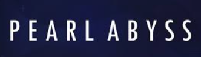

  <h1 style="font-size: 60px; margin: 0 0 36px 0;">
    박지원 포트폴리오
  </h1>

  

    Unity / C# Client Programmer
  

  

    2026
  

# 👤 이력서

  <strong>숭실대학교 컴퓨터학부</strong>

  2016.03 ~ 2022.02 : 컴퓨터학부 학사
   
  2017.04 ~ 2019.01 : 군 복무

 

  
  <strong>펄어비스 인턴</strong>

  플랫폼 프로그래밍 2팀
   
  2021.12 ~ 2022.02

 

  
  <strong>넥슨게임즈 넥토리얼 2기 및 정규직</strong>

  제우스 프로젝트_Unity 클라이언트 프로그래머
   
  2022.11 ~ 2024.04
   
  ✈️ [Project ZEUS => GODSOME](https://www.nexongames.co.kr/en/game/project_zeus_en.php)

 

  <strong>X1</strong>

  2024.05 ~ 2024.12

 

  <strong>X2</strong>

  2025.01 ~ 2026.현재

  

  2025년 11월 ~ 2026년 1월은 이직 서류 준비, 필기 시험 준비를 병행하던 시기입니다.
  그러나 이 때도 게임 개발을 꾸준히 했어야 했습니다.

# 포트폴리오를 소개하는 공간 + 목차
## 1. 과거의 회사 경험을 통해 문제 의식을 발현

 

## 2. 설계를 중점으로 게임 개발 시작
- 기술적 영역
- MVP, Dependency, Manager-Controller, Presenter, Model/View 분리, 의존성 방향 같은 내용이 들어가면 좋습니 
- mvp + manager + controller 구조도
- 링크는
  - 디자인 패턴과 mvp

 

## 3. 게임 개발한 거 설명 -> 아직 부족하지만
어떤 게임인가 + 왜 만들었는가?
어떤 기능을 만들었나
그 기능을 만들며 어떤 구조 문제가 있었나
MVP/Manager/Controller/Presenter 구조가 실제로 어떻게 쓰였나  -> 코드 ~~~c# 이용
만들며 깨달은 한계와 다음 개선점
- 핵심 기능 이미지 2~3개?
- 코드

- 링크 
  - habitGame

 

## 4. c# 구현력과 AI
- AI가 코드를 만들어주는 시대일수록,
- 내가 그 코드를 읽고 판단하고 수정할 수 있는 C# 구현력이 더 중요하다고 느꼈다.
  - 사실 과거에도 코드 몽키는 가능했으니.
  - 물론 AI 시대에 코드 몽키가 과연 나쁜가? 그건 아직 의문이다
- 제프리 리처를 근간으로 공부를 한 것.
- 링크
  - C#
  - algo

 

## 5. 메모 -> 기록
 
 

## 🌱 마치며 -> 나의 지도관련 이야기

# 1번 항목
### 기초 설명
- 프로젝트는 80명 규모의 팀. 나는 클라팀 신입 막내였고, 그 위로는 전 기수 형님이랑 3년차 형님, 그 외에는 모두 8년차 이상 시니어로 15명이었다.
- 프로그램실은 총 30명이었고 우리 클라팀 15명을 제외하곤 15명의 서버팀. 서버팀과는 주로 패킷 관련 이야기를 했다.
- 결국에는 이런 환경에서 나는 왜 나오게 되었는가? 결국 돌이켜보면 문제는 나에게 있었다. 
- 돌이켜보면 몇 가지 큰 상황이 기억에 남는다.

### 퇴사 이후 마주한 나의 문제
- 퇴사 직전 면담 때 혼자 슈팅게임을 만들 수 있느냐?에서 나는 아니라고 답했었다.
  - 당장 코드 밑바닥 설계부터 자신이 없었다. 당시의 입사 포폴은 그냥 모든 걸 monobehaviour 아래에 박았었으니 만들었던 거고. 
  - 매 번 base class의 코드가 몇 천줄인 걸 하나씩 천천히 읽어 볼 생각, perforce의 commit 로그, 히스토리 그게 참 관리 되어 있었는데 못 봤었다.
  - 팀에서 내게 요구했던 건 그건데. 나는 조급해서 당장 메서드 하나라도 막 생산만 하는...
  - base를 이해를 못하니, 중복을 만들고, 스파게티를 만들고, 총체적 난국. 근데 당시에 어디서 부터 잘 못 됐을까? 근데 사실 인턴 때 부터 알고 있었다. 회피했던 것 뿐이다. 내가 성장하지 않았던 거를. 그 고민의 결과가 팀장님의 저 질문에서 아니라고 말했던 거 같다. 

- 기초가 약했다. 아니 없었다. 그러나 꾸준히 해보려 하지 않고 조급하기만 했다. 
 - 4년 전공자여도 항상 불안했다. -> 나는 스스로에게 물었을 때 코딩을 잘하나? 아니다. 
   - github 링크 -> 대학 시절
  - 인턴을 마치고 정직원이 됐을 때 높은 난이도의 업무를 받고는 싶었으나 또 해결하는 게 두려웠다.
    - deep한 코드를 읽으려 했는가?   
    - 욕심은 또 있다. 그러나 너무 조급했다. 
  - 역으로 생각하는 힘이 있었을까?
    - 내가 이 부분이 부족한데 그걸 채우려는 노력을 했었나? 
  - 천천히, 꾸준히와 가장 대척점에 있었다.
    - 할 건 많고 리스트업은 하지만 안했다. 
- 생각해보면 그냥 공부를 못했다. 매 번 90점은 잘 받아도 왜 100점을 못 맞을까? 

- 메모만 하고 기록을 하는 과정이 없었다.
  - 인턴 중간 평가 때 팀장님께 혼난 기억이 있다
    - 너는 뭘 공부했니? 나도 뭔가를 많이했었다. 
    - 저는 vscode에 열심히 기록하고 있어요 (사실 메모 수준) 
    - 보여줄래?
    - 어... 그니까... 적기만 하고 본 적이 없으니... 모바일로 아이디 로그인도 못했던. 실제로 뭔가 한 것도 별로 없었고 제대로 정리한 거도 없고.  

- 감정에 나약했고, 꿈도 너무 빨리 이뤘다
  - 대학 졸업전에도 인턴을 했고, 대학 졸업하고도 인턴 및 정직원을 했다. 이게 인생의 목표였었고 금방 이뤘다. 다음이 없었고 회사에서 잘해야지만 머릿속에 담았던 거 같다. 4개월의 크런치도 크게 힘들지 않았다고 착각했다. 그래서 버텨졌다.
  - 회사가 아닌 삶 전체의 지도가 없었다.
  - 유복하게 자라왔고 살면서 큰 위기도 없었다. 그러다보니 무언가 혼자 해결해 본 적도 발버둥 처본 적도 없었다. 하지만 퇴사하고 그렇게 무던하게 살아온 거에 감사하면서도 그래서 나약했구나 싶었다.
  - 그렇게 퇴사를 하고 가장 인상깊은 이야기 -> 그 정신력이면 또 같은 이유로 퇴사를 한다고 하더라. 
  - 도움을 받을 줄도 몰랐다. 돌이켜보면 팀장님과 파트장님 그리고 멘토님은 정말 어떻게 해서든 나를 성장시키려고 노력하셨다.
    - 심지어 팀장님은 마지막에 개인 발표시간도 1대1로 해주셨다. 그 때 했던 게 jeffery ritcher였다. 얼마 안했지만. 그래서 이 책은 나에게 큰 의미를 준다.
  - 회사를 다닐 때 파트장님께 인정받고 싶었다. 그래서 혼나면 슬퍼하고 칭찬받으면 기뻐했다. 팀장님 면담을 하고 희망차면 또 기뻐하고, 절망적이면 며칠을 잠을 못잔다. 
  - 지금은 좀 단단해 진 거 같은 이야기를 (이건 좀 마지막에 들어감)  -> 마치며에서 채움.
  
### 결론
2장에서는 MVP, Manager, Controller 구조를 직접 설계하고 구현한 과정을 설명합니다.
3장에서는 그 구조가 실제 게임 프로젝트에 어떻게 적용되었는지 보여줍니다.
4장에서는 C# 구현력과 AI 시대의 개발자 역량에 대해 정리합니다.
5장에서는 메모를 기록으로 바꾸기 위해 만든 Notion과 GitHub 기반의 학습 시스템을 설명합니다.

# 2번 항목
#### 설계 방향
- mvp pattern
- Design Pattern
- 기존의 문제점을 해결하기 위함.
- 주니어 개발자의 경우 특히 그렇다. 경험이 적은 상태에서 AI가 생성한 코드를 리뷰하는 건, 아직 운전을 배우는 중인 사람에게 자율주행차의 판단을 평가하라고 하는 것과 비슷한 면이 있다. 직접 핸들을 잡아봐야 도로 위의 감각이 생기는 것처럼 직접 코드를 짜봐야 구조에 대한 감각이 생긴다.

#### 구현을 하며 느낀 문제점
- c# 구현력이 약함.

# 3번 항목
#### 단순 기능 구현 연습은 의미가 없다.
- 학교나 회사에서 디자인패턴 책은 항상 구매했었다. 항상 쉬운 패턴은 열심히 읽고 어려운 패턴은 외웠었습니다.
- 파트장님께서 디자인패턴은 이론적으로 공부하는 게 아니라, 구현하다보면 어느덧 사용하고 있는 자신을 바라보는 거라고 했다. 
  - 당시에는 이해가 되지 않았으나 지금은 조금 이해가 됩니다.
- 롤토체스를 하면서 배운 게 있습니다. 무수히 많은 상황 같아도 결국은 정해진 몇 가지 패턴이란 것을. 그리고 그 상황마다의 패턴을 기록해 놓는 게 핵심인 것을요.
  - 이 개념이 디자인패턴과 크게 다르지 않다고 생각합니다. 유니티 개발에서 매 번 막히는, 고민하는 설계도 사실 지금 제 수준에서는 몇 가지 였고요.
  - 그걸 고민하다보니 자연스레 고수분들은 이럴 때 어떻게 할까? 아 이게 디자인패턴이구나.

#### 문제 해결을 위해 기록한 내용
- 부족하지만 내부 구조를 구현하려고 삽질을 좀 많이 했습니다. 그러다 보니 구현을 많이 못하고 설계만 하기도 했죠.
- 하지만 그 과정에서 클래스 구조의 확장성 문제를 직접 마주했고, 의존성 방향, 자료구조, 상속 구조, 다형성 적용 방식을 바꿔가며 여러 설계 시도를 했습니다.
- 예전에는 개발과정 없이 그냥 책만 읽었으니 도움이 안 됐습니다. 그러나 제가 삽질하며 도달한 구조를 책에서 찾다보니 특정 디자인 패턴과 닮아 있다는 것을 알게 되었고, 제가 삽질한 과정과 비교를 해봤습니다.  
- 그러다 알게 된 건 디자인 패턴도 정답이 아니고 대단한 기법도 아니다. 결국 모두 trade-off고 장단이 있다는 것을요.
- 분기를 줄이고 싶어서 전략패턴을 만들었지만 결국 코드가 복잡해지고, 옵저버 패턴을 만드니 의존성을 줄지만 디버깅이 어렵고. 하지만 분명 계속 개발하면서 이걸 신경쓰면 저만의 패턴이 생기는 거죠. 

### ⚠️ 문제 상황
- 예전에는 시니어 분들의 코드를 암기했던 거 같음
- 그리고 어차피 신입에게 주어지는 UI 쪽 View 코드는 구현하기 쉬웠음.
- 팀장님은 그러면서도 내가 내부 코드를 읽길 바랬음. 하지만 나는 그러지 못했음.
- 회사에서 디자인 패턴 책만 3번 샀었던 거 같음. 매 번 눈으로만 읽으니까 뭐 어쩌라고? 싶었음. 그러다가 파트장님이 디자인패턴은 공부하는 게 아니라 짜다보면 필요함을 느끼고 내가 쓰던 게 그런 거구나 알게되는 거. 당시에는 전혀 이해가 안 갔음.

### ✅ 해결 과정
- 회사를 돌이켜보면 어쨌든 구현시에 마주하는 문제는 크게 몇 가지 상황이었다. 롤체로 따지면 덱을 몇 개 정해놓고 그에 맞는 최선의 플레이 방법이 있는 거 처럼. 근데 나는 정해 놓은 덱이 없던 것 이다. 
- 아 그러면 이런 상황에는 이렇게 해야 한다.가 없구나. 코테에서도 그랬다. 나름의 원칙과 기준이 있어야 함.
- 유니티에서 처음에 생각한 게 mvp -> 
- 그러다가 나름의 룰. 아 근데 좀 고수들의 룰을 알고 싶은데 -> 아 그게 디자인 패턴이구나를 드디어 이해했다.
- 그리고 일단 구현을 했다. strategy pattern -> 이걸 책을 보고 한 게 아니라. 그냥 뭐 분리를 하고 싶어서 2일 정도를 설계만 했었다. 그치만 진전이 나가지 않았고, 아 분명 이런 상황은 많을 텐데. 그래서 일단 내가 할 수 있는 최선으로 구현을 해 봤는데 그게 strategy pattern이랑 비슷한 거다. 그리고 예전에 사 놓은 책을 읽으니 너무 이해가 잘 되는 것 이다. 그 때 깨달았다. 이거다.
- 맨날 수학의 집합처럼 싱글턴만 보던 내가 드디어 다른 패턴을 이해하기 시작

### 문제점
- 근데 과설계 병에 걸렸다. -> 그리고 이것도 해결했다.
  - 생각해보면 매 번 회사에서는 내게 이런 고민을 할 시간을 주지 못한다.

# 4번 항목
### ⚠️ 문제 상황
- 한 달에 한 번씩 회사에서 책을 사줬다. 매번 
### ✅ 해결 과정
1. C# 제프리 문서 학습 
2. 글로 읽지 않고 코드를 짜기 시작
3. AI 시대에 구현력이 중요한가에 대한 의심

### 🎮 게임 개발 적용

### ✈️ 깃허브 링크

# 5번 항목 : 메모 -> 기록
### ⚠️ 문제 상황  :  무언가를 많이 적어 메모는 많지만 

  - 우리 코드 UI 어떻게 구성되었니? 어 나는 UI 쪽 코드 계속 봤고 메모도 했는데? 조금만 깊게 물어보시면 제대로 아는 게 하나도 없더라.
  - 2023년에도 회사에서 gpt 유료를 지원해줬었다. 그래서 당시부터 나는 ai를 적극적으로 사용했다.
    - ai가 답을 환상적으로 만들어주니 나의 메모는 대부분 gpt 답변 캡처였던 거 같다. 그게 내 지식이라고 착각했고
    - 그러니  
2. 많이 적혀있지만 그게 어디 있는 지 나도 모른다.
   - 과거 문서 캡처 및 링크
- - 메모는 많이 한다. 그리고 어디에도 잘 저장한다. 그러나 돌이켜보면 다시 본 기억이 없다. 그러니 실력이 늘지 않았다. 링크나 캡처는 또 엄청 한다. 가공하기 귀찮으니까
1. 퇴사 직전 시점에 입사 이전보다 개발자로의 경험이 늘었는가? 실력이 늘었는가? 실력에 대해서 늘었다고 생각을 못했고 무너졌던 거 같다. 

### ✅ 해결 과정  :  나의 한 줄을 기록하고 다시 보고 고치고 고치고 고친다.
1. 현실적인 직장인의 한계에 맞게 만들어 낸 기록 시스템
   - 회사에서 업무를 하면서 동시에 공부를 하기란 어렵다. 즉, 메모 -> 기록이 현실적으로 어렵다.
   - 하지만 패턴화 하면 된다.
   - 
   - 
     - 우선 이렇게 노션에 적는다. gpt를 통해 공부하거나 코드를 읽으며 모르는 개념을 구글링하다보면 핵심 키워드가 생기고 그걸 적는다.
     - 
2. 구현과의 병행 

### 문제점
- 이력서를 제출할 때 개발을 멈추기도 했었음.

# 🌱 마치며
- 이제는 슈팅게임을 혼자 만들 수 있을 것 같아요. 아니 어떤 게임도 혼자서 만들 수 있을 것 같습니다.
- 하지만 부족한 사람이라 혼자서 하기에는 벅차고 배움이 적어요
- 그래서 조금은 달라진 사람으로 회사에서 팀에 기여해보고 싶습니다.

 

- 2024년, 거의 집에만 있으며 몸과 마음이 무너졌었습니다. 병원도 가볼까 했었습니다. 전화도 했었고요. 근데 가는 게 무서워서 안 갔습니다. 지금도 항상 운이 좋았다고 생각합니다. 그리고 친구들과 부모님 그리고 유튜브 GPT 덕분에 어찌어찌 다시 나가보게 되었습니다. 불암산을 끌려 간적이 있습니다. 당시에 거의 100kg가 되었지요. 30번 쉬었지만 올라갔어요. 그 때 좀 많은 걸 느꼈습니다. 그리고 친구들과 일본 여행도 다녀왔습니다. 그렇게 다시 무언가를 해보려고 했어요. 
- 2025년, 다시 하나씩 천천히 해봤습니다. 24년에 시간이 많아서 책은 참 많이 읽었어요. 그러면서 배운 건 그냥 쉬운 걸 하나씩 해보자. 몸이 정신보다 중요하다. 헬스장 등록만 하고 안 가본 기억이 많았죠. 매 번 운동 프로그램만 계획하고. 지쳐서 그냥 안 가고. 근데 그냥 한 두달은 러닝머신만 탔습니다. 그러다보니 많이 나아지더라고요. 매일 오전에 일어나서 샤워부터 시작했습니다. 그것도 어려웠고요. 그러나 점차 나아지니 샤워도 하고, 처음에는 동네만 다니다가 어느 순간 도서관도 가보고, 내가 왜 다시 개발하는 게 무서웠는지도 계속 시도하며 나아졌습니다. 그러다보니 주 2번 나가던게 3번이 되고 4번이 되고 결국 주중에 매일 나가게 되었습니다. 뭘 계속 해보다 보니 좀 더 좋은 방향이 보이고 제가 그런 걸 하나씩 달성하다보니 스스로 즐거운 게 느껴지더라고요. 
- 2026년, 이직도 도전해보았습니다. 많이 탈락도 해봤고, ai시대라 급변도 했고요. 탈락하면 여전히 마음은 아픕니다. 그러나 이제는 그냥 걷거나, 카페가서 생각을 정리하거나 하는 저만의 방패도 생겼어요. 꼭 잘 먹고 일찍 자고요. 지금은 주중에는 매일 정해진 시간에 나갑니다. 그러지 않으면 집에 눕는 다는 걸 2025년에 많이 알았거든요. 뭐라도 하루에 하나는 배웁니다. 꾸준히 뭐라도 하다보니 문제 해결력이 생깁니다. 루틴이 잡히고요. 

# 글감 TMP
#### 문제 해결을 위해 기록한 내용
- 필기테스트 보고 온 후기 -> 아 뭔가 더 갈고 닦으면 100점 맞을 수 있겠는데? 아쉽지만 30점 맞던거 90점 된거 같다.
- 지금이야 내가 온전히 시간을 관리하니 가능할지 모른다. 과연 회사를 다니면서도 이 프로세스가 정상으로 동작할까? 과거처럼 무너지지 않을까? 하지만 이젠 확신할 수 있다. 적어도 그 상황에 맞는 최선의 해결책을 찾는 능력은 생긴 것 같다. 또 수정하고 또 고치면 된다. 하다보면 바뀐다.