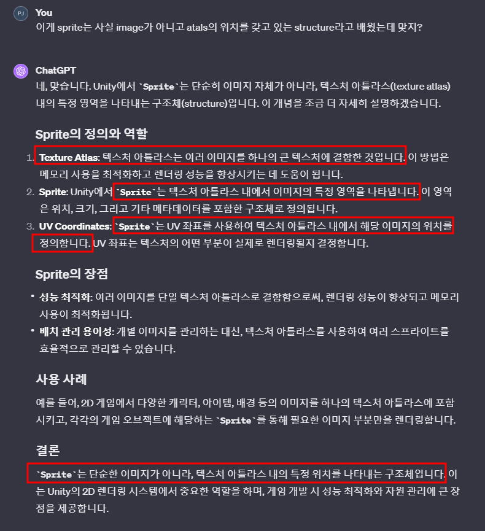
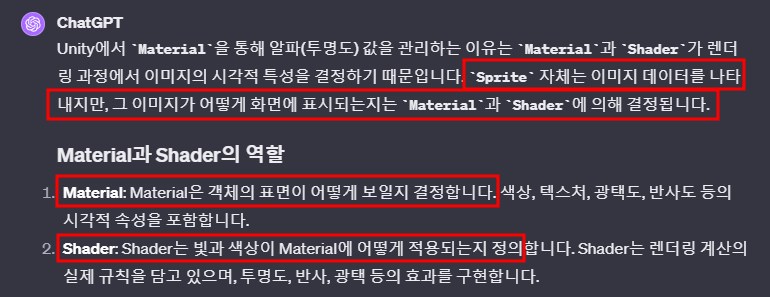
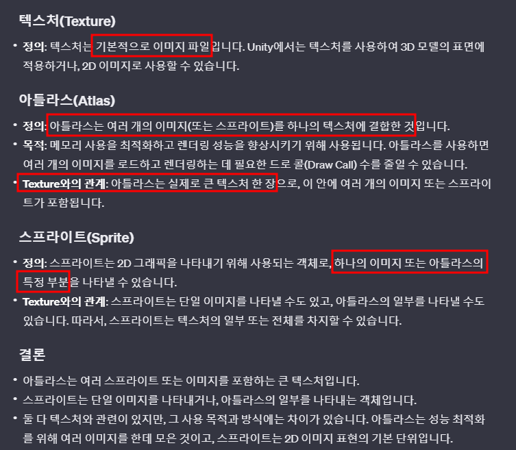

# 목차
- [목차](#목차)
- [Sprite는 사실 Texture가 아닐 수 있다.](#sprite는-사실-texture가-아닐-수-있다)
- [SpriteRenderer의 alpha 값을 변경해도 바뀌지 않는 이유](#spriterenderer의-alpha-값을-변경해도-바뀌지-않는-이유)
- [Texture의 관점으로 바라 본 Sprite 와 Atlas](#texture의-관점으로-바라-본-sprite-와-atlas)

   

# Sprite는 사실 Texture가 아닐 수 있다.
- 
- > 단, Unity에서 Sprite가 atlas 없이 독립적으로 존재하는 경우도 의미가 있습니다. Sprite가 아틀라스를 사용하는 경우에는 texture atlas 내의 특정 영역을 나타내지만, 단일 이미지로도 사용 될 수 있습니다.

   

# SpriteRenderer의 alpha 값을 변경해도 바뀌지 않는 이유
- SpriteRenderer가 사용하는 Material이 알파를 지원하는지 확인합니다.
  - Material이 알파를 지원하지 않으면 SpriteRenderer의 Color의 알파 값을 변화시켜도 투명도는 변화하지 않는다.
- 

   

# Texture의 관점으로 바라 본 Sprite 와 Atlas
-  