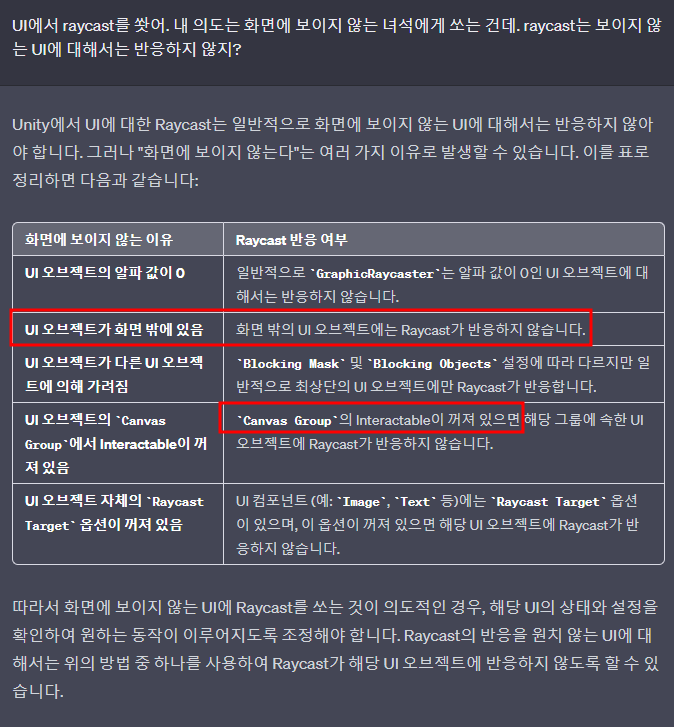

# BoxCollider2D
- Raycast를 할 때 UI Image에다가 BoxCollider를 붙이면 raycast가 인식한다.
- BoxCollider의 경우 가변 UI 객체에 대해 런타임 상황에서 알아서 변경되지 않으므로 코드를 이용해서 업데이트 해 주어야 한다.

~~~c#
_boxCollider.size = _lineImageRect.rect.size; //크기 대응해주고
_boxCollider.offset += new Vector2(_boxCollider.size.x / 2, 0); // offset 대응해주고.
~~~

# RayCast 보이지 않는...
- 