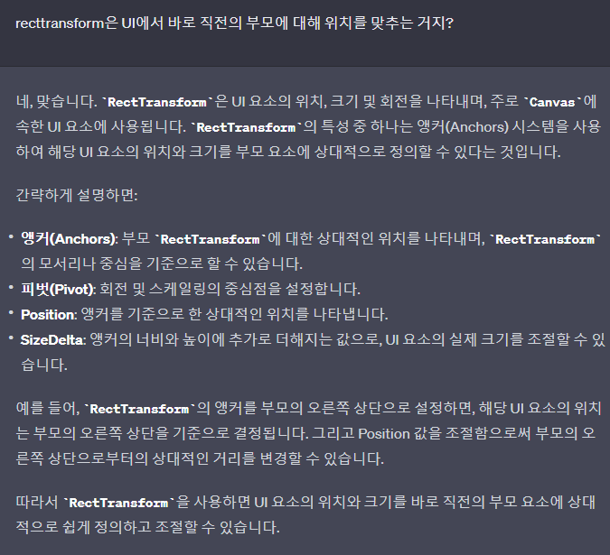
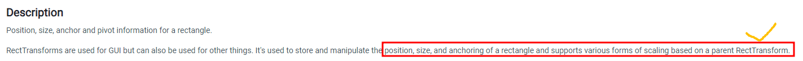
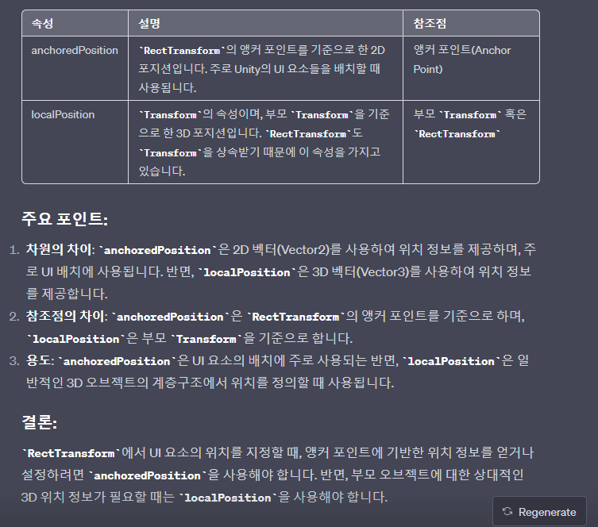

# 목차
- [목차](#목차)
- [:star::star::star:RectTransform:star::star::star:](#starstarstarrecttransformstarstarstar)
- [AnchoredPosion Vs LocalPosition](#anchoredposion-vs-localposition)
- [Anchor와 Pivot을 잘 정해야 비율 계산이 쉽다.](#anchor와-pivot을-잘-정해야-비율-계산이-쉽다)
    - [1. 붉은 Anchor](#1-붉은-anchor)
    - [2. 파란 Anchor : Stretch](#2-파란-anchor--stretch)
    - [3. Pivot \& Anchor](#3-pivot--anchor)

   

# :star::star::star:RectTransform:star::star::star:
- 
- 
  > 부모 Canvas 또는 다른 UI 요소에 대한 상대적인 위치와 크기로 생각 할 수 있습니다.
- Transform을 상속받는다.
- Position과 Anchor 그리고 Pivot이 기존의 Transform과 다른 부분이다. 이를 제대로 이해해야 한다.
  - Anchor를 이해하면 나머지를 모두 이해하기 쉽다.
- :star:**기본적으로 이를 사용하는 이유는 제각각인 핸드폰의 해상도에 대응하기 위해서다.** 
  - 앵커를 이용하면 어떤 해상도에서도 개발자가 원하는 위치에 UI를 위치 시킬 수 있다. 
- [Youtube](https://www.youtube.com/watch?v=A0prWX3afwg)

   

# AnchoredPosion Vs LocalPosition
- 

   

# Anchor와 Pivot을 잘 정해야 비율 계산이 쉽다.
- 위치를 코드로 잡을 때 비율을 이용해서 rect 위치를 이동하는데
- 이 때 가운데가 pivot이면 가운데를 기준으로 이동하니까 어렵다.
- 그러므로 왼쪽으로 피봇을 박는게 맞다.
  - 실수 조심해라. 왼쪽부터 시작일 때 실제 객체가 왼쪽에 존재해서 계산 되는 지 정말 중요하다.

 

### 1. 붉은 Anchor
- 
- 앵커는 무조건 자신의 직속 부모의 UI에 맞춰진다.
- :star:**항상 잘못 생각했던 오류 : 나의 앵커를 이동해도 앵커 표시(4개 삼각형)는 움직이는데 내 UI 자체는 움직이지 않았다. 그건 유니티가 자동으로 PosX와 PosY값을 변경해서 움직이지 않도록 하기 때문이다. 그러므로 PosX와 PosY를 0으로 변경해서 확인해보자.**
- 앵커가 Left-Top 이라면 어떤 해상도로 변경해도 해당 UI는 부모 UI 기준 왼쪽 상단에 항상 고정된다.
- Width와 Height로 값을 조절할 수 있는데 이 크기를 키워서 부모 UI의 크기보다 커지면 당연히 넘어가서 화면에서 짤린다.

 

### 2. 파란 Anchor : Stretch
- 
- 상단 메뉴바 같은 거는 언제나 윗쪽에 위치하며 왼쪽 끝 ~ 오른쪽 끝을 모두 채워야 한다.
  - 이런 경우에 stretch를 이용한다.
  - 얘도 당연히 부모 UI를 기준으로 배치된다.
- Stretch로 변경하면 Position 부분이 Left, Top, Right, Bottom으로 변경되는데 이는 여백을 나타낸다.
  - 모두 0,0,0,0으로 하면 부모 UI를 꽉 채울 것 이다.

 

### 3. Pivot & Anchor  
- 어떤 사각형 UI를 Bottom-left로 붉은 Anchor를 설정하면 부모 캔버스의 좌측 하단으로 이동할 것 이다. 하지만 피벗이 중앙(0.5, 0.5)으로 설정되어 있어 아래의 문제가 생긴다.
  - 
    - 짤린다.
- 피벗을 좌 상단(0,0)으로 맞추고 posX와 posY를 다시 (0,0)으로 바꿔주면 잘 나온다.
  - 
    - 유니티는 피벗을 바꾸면 또 posX와 posY를 바꿔 변경 사항이 없는 것 처럼 바꿔버린다. ㅠㅠ
- 결론적으로 피벗은 어떤 UI의 기준점이 되고, 이 기준점을 통해 앵커도 형성된다.