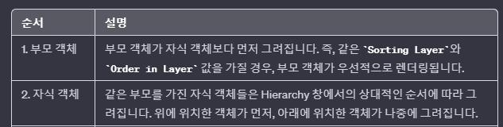
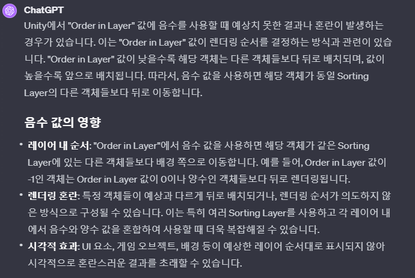

# 목차
- [목차](#목차)
- [History](#history)
- [:star::star::star:그려지는 순서:star::star::star:](#starstarstar그려지는-순서starstarstar)
    - [1. Sorting Layer 비교](#1-sorting-layer-비교)
    - [2. Order In Layer 비교](#2-order-in-layer-비교)
    - [3. Unity Hierarchy에서의 위치 비교](#3-unity-hierarchy에서의-위치-비교)
- [Sorting Layer](#sorting-layer)
- [주의 사항](#주의-사항)
- [Particle은 특수하게 Order를 조절한다.](#particle은-특수하게-order를-조절한다)
- [Sorting Layer vs Layer](#sorting-layer-vs-layer)

   

# History
- UGUI의 오브젝트가 코드에서 SetActive(true)인 상태임에도 불구하고 보이지 않는 경우가 있다.
- 그럴 때는 UGUI의 Rendering System에 따라 그려지는 순서를 확인해 본다.

   

# :star::star::star:그려지는 순서:star::star::star:
### 1. Sorting Layer 비교
  - **Sorting Layer가 높을 수록 위에 그려진다. (위에 그려지는 것이 보인다.)**

 

### 2. Order In Layer 비교
  - **Order In Layer가 높을 수록 위에 그려진다.**

 

### 3. Unity Hierarchy에서의 위치 비교
- 
  
   

# Sorting Layer
- 

   

# 주의 사항
- order 들을 관리할 때는 order가 음수가 되면 예상하지 못한 버그가 발생할 수 있기 때문에 양수로 관리한다.
  - 보통 제일 아래 깔리는 order를 0으로 default setting을 하기 때문이다.
  - 
- 동적으로 order를 변경하는 코드(Observer Pattern)를 이용하여 order가 변경 됐을 때 보이지 않을 수 있는 잠재적인 상황도 제어한다. 

   

# Particle은 특수하게 Order를 조절한다.
- Particle은 내부적으로 rendering order를 관리하고 있기 때문에 GetComponent를 이용해서 가져온다.

   

# Sorting Layer vs Layer
- 
  