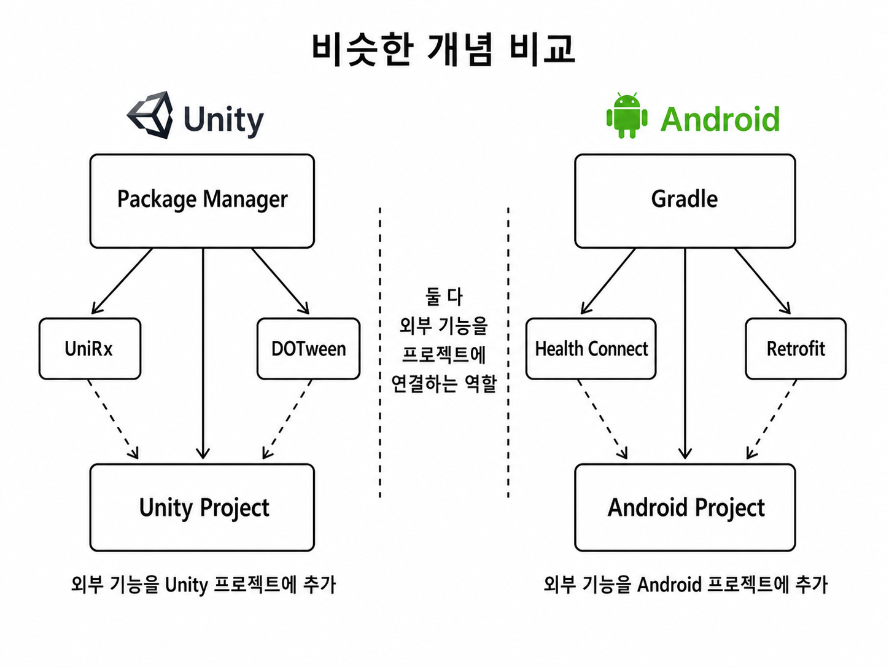

## :fireworks: 기본적인 안드로이드 참고 기록
- :airplane:[docs](https://docs.unity3d.com/6000.0/Documentation/ScriptReference/AndroidJavaClass.html)
- project setting → players → android
- Unity Android 빌드 → Android Studio 없어도 가능

  

## :fire: Unity의 Package Manager와 Android의 Gradle은 기본적으로 비슷한 개념을 갖는다.   둘 다 외부 개발자가 만든 기능을 내 프로젝트에 추가하고 관리한다.
- Library == Plugin == Package로 이해한다.   결국 타인이 만들어 놓은 기능이라는 큰 개념은 변하지 않는다.
- Unity Package Manager는 Unity/C#에서 사용할 Package를 다운로드하고 관리한다.
- Gradle은 Android/Java/Kotlin에서 사용할 Library를 다운로드하고 관리한다.
- Gradle은 Library 관리뿐만 아니라 Android 앱 빌드도 담당한다.

 

