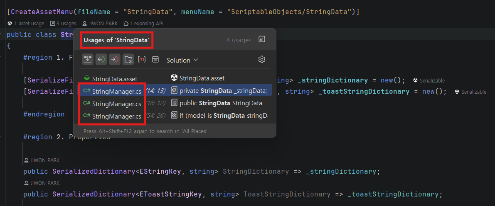

## :book: ScriptableObject == SO

  

## :fire: Runtime에 변하지 않는 Readonly Data는 SO에 저장한다.   :fire: 한 번 만 쓰인다면 prefab에 직접 넣어도 되지만   파편화 방지를 위해 SO에 저장한다.  
> ScriptableObject is a data container that you can use to **save large amounts of data, independent of class instances.**
> It’s common to have many GameObjects which rely on duplicate data that **does not need to change at runtime**. <ins>Rather than having this duplicate local data on each GameObject</ins>. you can funnel(이동시키다) it into a ScriptableObject. 

> Each of the objects stores a reference to the shared data asset, rather than copying the data itself. This can provide significant performance improvements in projects with thousands of objects.
- AudioClip이 단 한 번만 사용되더라도 SoundData 명칭의 ScriptableObject Script에 저장한다.
- 기획자는 XML로 데이터를 관리하고, 개발자는 SO로 데이터를 관리한다.
  - PlayerPrefs, Addressable도 있다.

  

## :fire: SO는 Manager Class로 관리한다. 
> While Scriptable Objects don't have a dedicated manager, a **manager class** might be used to access or manage multiple instances of a Scriptable Object or to coordinate their usage with other parts of the game. 

> A presenter class might also use Scriptable Objects to provide data to UI elements.
- ScriptableObject 데이터에 접근을 하기 위해 Manager를 이용한다.
- 

  

## :fireworks: SO의 .cs 스크립트와 .asset의 차이를 반드시 이해한다.   :fire::one: .cs 스크립트는 SO를 구성할 설계도   :fire::two: .asset은 설계도로부터 생성된 데이터 인스턴스   그리고 SoundData.asset이 생성되었다면, 이는 반드시 메모리에 1개만 상주한다.
> Instead of duplicating data like this, you can use a ScriptableObject to store the data and then access it by reference from all the prefabs. This means that there is one copy of the data in memory.

> One of the main use cases for ScriptableObjects is to reduce your project’s memory usage by avoiding copies of values.

> Saving data as an asset in your project to use at runtime.

  

## :fire: SO의 cs script에서는 View나 Presenter처럼   Terminate() 또는 Dispose()를 구현하지 않아도 된다.
- SO.asset은 GC가 관리를 하지 않고, Scene과 무관하게 메모리에 상주한다.
- 게임이 종료되면 해제된다. 