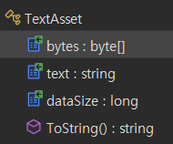
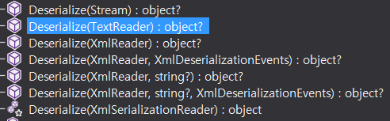
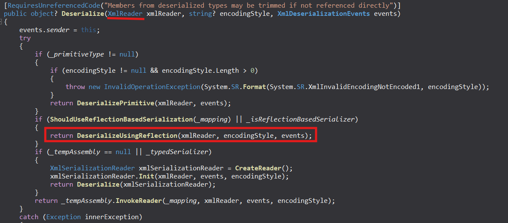

## :fire: IModel을 상속 받는 클래스를 Xml로부터 만들어야 할 때 사용한다.

~~~c#
public class MyCharacterData : IModel
~~~

  

## :fire: Unity에서 xml은 TextAsset에 포함되고, TextAsset으로 관리된다.
> Represents a raw text or binary file asset.

> Text assets are a format for imported text files. When you drop a text file into your Project folder, Unity converts it to a Text Asset. The supported text formats are: <ins>.bytes / .xml / .json / .txt / .md / </ins> 
- 더 많은 format이 존재하지만 생략했다.

  

## :fireworks: XML을 C# Class로 변환시키는 4단계 과정   (XmlDocument가 아닌 XmlSerializer를 사용하기로 했다.)

#### :one: [<ins>C# Class</ins>] (Xml에 대응하는 C#의 Class를 만들어 준다.) 
- :todo: 코드 완성하고 예제로
- 잡다한 xmlelement attribute 정도?

 

#### :two: [<ins>Load</ins>] (디스크에 있는 Xml을 런타임 메모리로 올리는 과정)
- Resources.Load()를 사용하고 있지만, Addressable을 이용하도록 한다.

 

#### :three: [<ins>Decode</ins>] (TextAsset인 XML의 Raw Byte[]를 String으로 변환하는 과정)
- 

~~~c#
public string text
{
    get
    {
        byte[] bytes = this.bytes;
        return bytes.Length == 0 ? string.Empty : TextAsset.DecodeString(bytes);
    }
}
~~~
- TextAsset 클래스가 알아서 해준다.

 

#### :four: [<ins>Deserialize</ins>] (Xml의 String을 C#의 Class에 대응하는 과정)
- :link:[MSDN XmlSerializer](https://learn.microsoft.com/ko-kr/dotnet/standard/serialization/xml-and-soap-serialization)
- 
- 
  - 내부적으로 reflection을 사용하고 있다.
  - StringReader -> TextReader로 사용한다.

 

#### [전체 예시]

~~~xml
<?xml version="1.0" encoding="utf-8"?>
<MyCharacterData>
    <name>ParkJiWon</name>
    <routineOneSuccessTime>99999</routineOneSuccessTime>
</MyCharacterData>
~~~

~~~c#
//xml load
TextAsset textAsset = Resources.Load<TextAsset>(resourcePath);

//test
byte[] bytes = textAsset.bytes;
string text = textAsset.text;

// 1번 : raw bytes
Debug.Log(string.Join(", ", bytes));

// 2번 : hex
Debug.Log($"{bytes.ToHexString()}");

// 3번 : string
Debug.Log($"{text}");

/* 1번 결과
60, 63, 120, 109, 108, 32, 118, 101, 114, 115, 105, 111, 110, 61, 34, 49, 46, 48, 34, 32, 101, 110, 99, 111, 100, 105, 110, 103, 61, 34, 117, 116, 102, 45, 56, 34, 63, 62, 13, 10, 60, 77, 121, 67, 104, 97, 114, 97, 99, 116, 101, 114, 68, 97, 116, 97, 62, 13, 10, 32, 32, 32, 32, 60, 110, 97, 109, 101, 62, 80, 97, 114, 107, 74, 105, 87, 111, 110, 60, 47, 110, 97, 109, 101, 62, 13, 10, 32, 32, 32, 32, 60, 114, 111, 117, 116, 105, 110, 101, 79, 110, 101, 83, 117, 99, 99, 101, 115, 115, 84, 105, 109, 101, 62, 57, 57, 57, 57, 57, 60, 47, 114, 111, 117, 116, 105, 110, 101, 79, 110, 101, 83, 117, 99, 99, 101, 115, 115, 84, 105, 109, 101, 62, 13, 10, 60, 47, 77, 121, 67, 104, 97, 114, 97, 99, 116, 101, 114, 68, 97, 116, 97, 62

1번 결과에서 '60, 63, 120, 109, 108, 32, 118, 101, 114, 115, 105'
부분이 '<?xml versi' 이다.

2번 결과
3C3F786D6C2076657273696F6E3D22312E302220656E636F64696E673D227574662D38223F3E0D0A3C4D79436861726163746572446174613E0D0A202020203C6E616D653E5061726B4A69576F6E3C2F6E616D653E0D0A202020203C726F7574696E654F6E655375636365737354696D653E39393939393C2F726F7574696E654F6E655375636365737354696D653E0D0A3C2F4D79436861726163746572446174613E

3번 결과
<?xml version="1.0" encoding="utf-8"?>
<MyCharacterData>
    <name>ParkJiWon</name>
    <routineOneSuccessTime>99999</routineOneSuccessTime>
</MyCharacterData>
*/
~~~

  

## :fireworks: XML의 기본 특징에 대해 공부한다.

#### :one: Xml은 대소문자에 민감하다. 

 

#### :two: XML은 get과 set이 public인 property와 함께한다. 
> XmlSerializer only looks at public fields and properties.

 

#### :three: XML의 Root Element가 C#의 [XmlRoot] attribute고, XML의 Child Element가 C#의 [XmlElement] attribute다.

~~~XML
<MyCharacterData>
<Name>지원</Name>
<Age>30</Age>
</MyCharacterData>
~~~
- MyCharacterData = Root Element
- Name & Age = Child Element 
- :link:[formatting XML](https://dontpaniclabs.com/blog/post/2025/05/06/formatting-xml-when-serializing-c-objects/)

  

## :fire: [XmlIgnore] attribute를 이용해서 테스트 시에   Serialize 실패 에러를 무시할 수 있다.   :question: Model의 데이터 필드로 존재하는 Dictionary의 경우 [XmlIgnore]를 이용해서 무시하고,   List를 Serialize 한 걸 property로 참조하여 이용한다.  