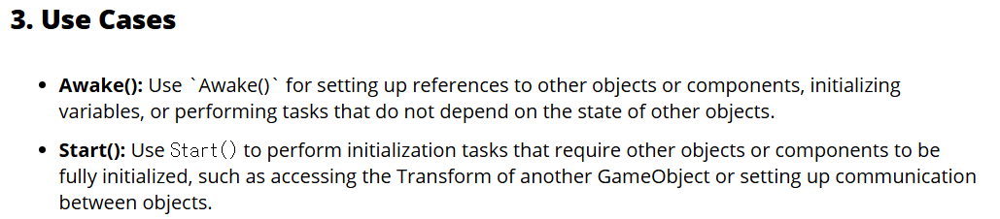
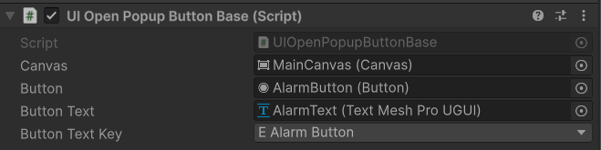
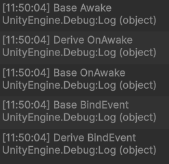

## :fire: Awake와 Start는 둘 다 초기화를 수행하는 unity event method다.   :fire: Awake는 다른 instance와 상관 없이 나 자신이 스스로 초기화 하는 데 문제가 없는 멤버들을 초기화 한다.   :fire: Start는 다른 instance의 행동이 완료 되었을 때 초기화를 해야 하는 의존적인 멤버들을 초기화 한다.
- Awake가 Start보다 빠름. -> 그럼 모든 Awake는 Start보다 빠르냐?
- 두 메서드는 초기화를 하는 공간이지만, dependency의 유무의 차이를 갖는다로 정리할 수 있다.

- [Reference](https://artoonsolutions.com/unity-awake-vs-start/)

  

## :fire: Initialization에서 Dependency(=의존성) 개념은 이러하다.   :fire: 클래스 A가 클래스 B를 필드로 들고 있고, B의 메서드 동작의 결과로 인해 A의 멤버나 메서드의 동작이 바뀌는 것 이다.
> 어떤 instance가 예정된 작업을 정상적으로 수행하기 위해 다른 instance를 필요로 하는 경우 두 instance 사이에 dependency가 존재한다고 말한다.
> 협력을 위해서 dependency가 필요하지만 과도한 dependency는 게임을 수정하기 어렵게 만든다. 
  - 조금 변경하고 싶어도 다 변경해야 하니까
  - 단일 책임 원칙에 따르면 클래스는 하나의 책임을 가져야 한다 -> 클래스를 많이 쪼개야 한다. -> 클래스 혼자서 할 수 있는 일이 적다. -> 다른 클래스와 협력해야 한다. (회사에서 여러 부서가 각자 일에 집중하고 책임지지만 결국 협력을 해야 한다.) -> 그러면 서로 의존성이 생길 수 밖에 없다! -> 설계관점에서 의존성이 좋지 않다고 하지만 사실 필연적이다.
- :link:[지울 과거의 dependency 문서](https://github.com/pjw960316/Unity_Client_Programmer/blob/main/1.%20Unity%20Programming/C%23%20Ver_1/Dependency%20(%EC%9D%98%EC%A1%B4%EC%84%B1).md)

  

## :fireworks: 현재 상황은 GameObject에 Derived Type이 존재하는 Script를 붙였다.   Script의 this의 Instance Type은 Derived Type이 된다.   :fire: Awake는 상속구조에서 virtual OnAwake를 이용해서 구현한다.   :fire: 또한, BindEvent() 같이 Base에서도 1번, Derived에서도 1번 호출되어야 하는 method는   virtual로 구현하지 않고 **Shadowing** 기법으로 구현한다.   :fire: 아래 코드에서 Base의 BindEvent()를 virtual로 선언하면   Dervied Type의 BindEvent()로 호출되기 때문에 주의한다.   :fire: 결론적으로 Virtual 키워드 없이 같은 method 네임을 사용하는 Shadowing도 필요하다.

- 
  - UIOpenPopupButtonBase가 Derived Type이다.

#### [Base Type의 Script]
~~~c#

public void Awake()
{
    Debug.Log("Base Awake");

    OnAwake();
}

public virtual void OnAwake()
{
    Debug.Log("Base OnAwake");

    BindEvent(); // 의도 : Base Type의 BindEvent가 호출.
}

// Note
// Virtual로 변경하지 마세요.
// 모든 상속 구조에서 Binding은 독립적으로 각각 실행되어야 합니다.
private void BindEvent()
{
    Debug.Log("Base BindEvent");
    _button.onClick.AddListener(() => _onClickButton.OnNext(default));
}
~~~

#### [Derived Type의 Script]
~~~c#
public override void OnAwake()
{
    Debug.Log("Derive OnAwake");
    
    base.OnAwake();
    
    BindEvent();
}

private void BindEvent()
{
    Debug.Log("Derive BindEvent");
}
~~~
- 
  - BindEvent가 각각 호출되며 의도대로 동작한다.
> Shadowing (method hiding)
> A method or function of the base class is available to the child (derived) class without the use of the "overriding" keyword. The compiler hides the function or method of the base class. This concept is known as shadowing or method hiding. In the shadowing or method hiding, the child (derived) class has its own version of the function, the same function is also available in the base class.