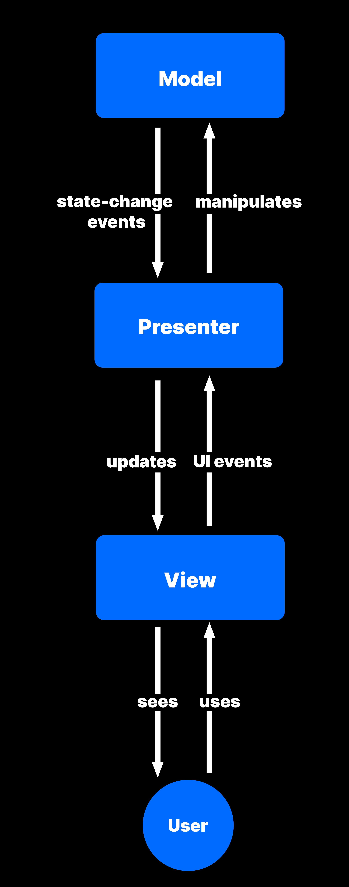
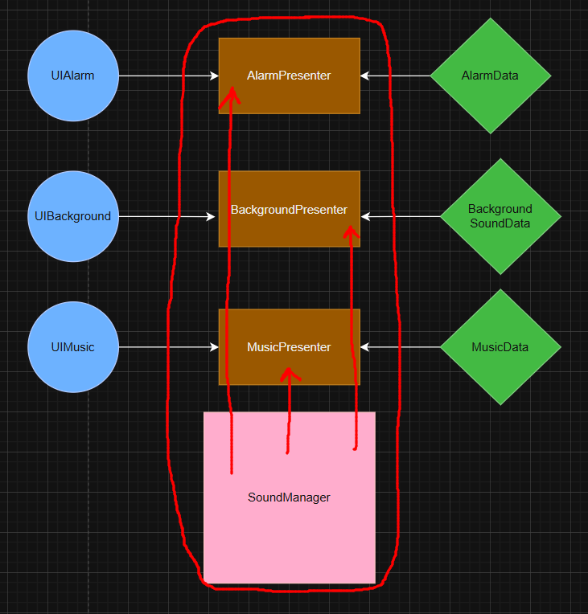
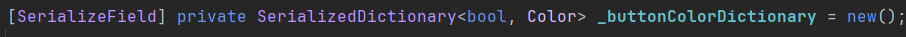
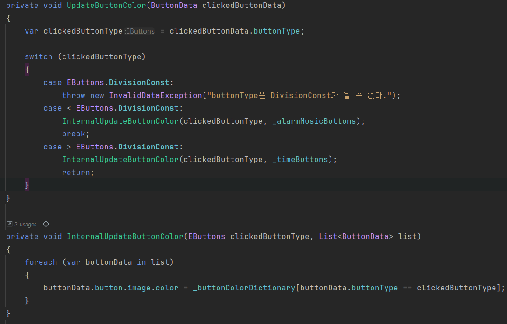
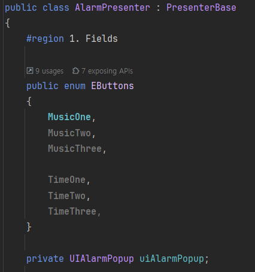
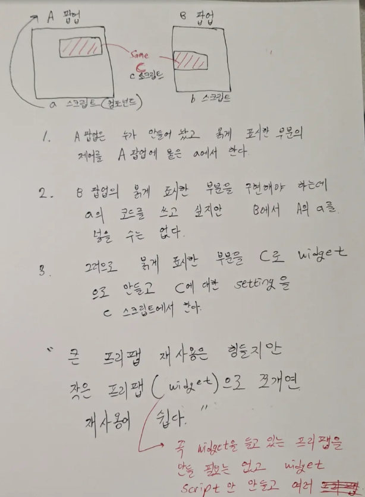

## :fireworks: MVP + Manager + User

  
 :point_up_2: 누르면 매우 큰 이미지가 나옵니다...  

  

## :fire: MVP+Manager Pattern을 써라.   :fire: Model = 순수 Data Class   :fire: View = UI 요소를 담당하는 MonoBehaviour Class   :fire: Presenter = Model 과 View를 1 : 1로 연결하는 Class   :fire: Manager = 여러 개의 Presenter class들을 관리하는 class.
- Model은 Data Class로도 구현이 되지만, PlayerPrefs or ScriptableObject로도 구현이 된다.
  - :link:[which methods should be in Model class except set/get members?](https://stackoverflow.com/questions/13550143/mvc-which-methods-should-be-in-model-class-except-set-get-members)
- 연결을 위해 presenter는 model 과 view를 멤버로 들고 있는다.
- 관리를 위해 manager는 presenter를 멤버로 들고 있는다.
- OOOO이 XXXX를 들고 있다 or 관리하고 있다 = 멤버로 저장하고 있다.
- OOOO이 XXXX를 모른다 = 멤버로 저장하고 있지 않다.

#### [Sound System을 통한 예시]

  
 :point_up_2: 누르면 매우 큰 이미지가 나옵니다...  

- Presenter 끼리의 직접 소통은 금지하고 SoundManager를 통해 소통한다.
- SoundManager가 UIManager와 소통하기 위해서는 SoundManager가 들고 있는 Presenter 들을 통해 필요한 정보를 가져와서 전달해야 한다.

  

## :earth_asia: Model, View, Present, Manager에 대한 역할과   무엇을 적어야 하는 지 적어 놓았다.   제목 말고 아래의 글 까지 읽어야 한다. 

  

## :fire: Model
#### :one: 역할 및 책임

 

#### :two: 멤버로 들고 있을 것

 

#### :three: 특징
- 절대로 View를 멤버로 갖지 않는다.
- 1개의 Model로 여러개의 Presenter와 연결 할 수 있다?? 
- 게임 로드시에 모두 로딩한다??

  

## :fire: View
#### :one: 역할 및 책임
> the View is responsible for handling user input.
  - View는 User의 Input을 받고 Presenter에게 알리는 역할만 하면 된다.
  - 이를 UniRx를 이용해서 구현한다.
- View는 Pub/Sub 구조에서 publisher의 역할을 갖고 있다.
  - View는 User의 Input을 받기 때문에 이벤트를 만들고 발행 시킬 수 있다. (Subject)
  - View는 자신과 loose하게 연관된 Presenter에게 이벤트를 구독하도록 제공한다. (IObservable)

 

#### :two: 멤버로 들고 있을 것
- **자신보다 작은 개념의 View Struct 또는 View Widget**
  - [누르면 설명으로 이동한다](#fire-scene에서-큰-viewpopup는-작은-view들button-image-scrollview을-들고-있다--fire-작은-view를-구현할-때-view-struct-와-view-widget-중-선택한다)
- **private Subject & public IObservable**
  - View에서는 event를 감지만 하고, event handle logic은 Presenter에서 처리하도록 rx를 제공만 한다. 
  - 예시 코드
    - private readonly Subject<Unit> _onSoundButtonClicked = new();
    - public IObservable<Unit> OnSoundButtonClicked => _onSoundButtonClicked;
- **Presenter가 MonoBehaviour 관련 데이터(ex : transform)를 요청 할 때, 그걸 줄 수 있는 Public Get Method**
- **Presenter를 통해 Model과 Manager에 접근 할 필요 없는 수준의 UI 갱신 데이터(=field)와 로직(=method)**
  - > For me it depends on what data we're talking about. If there is any UI component that has any potential business logic tied with it, I'd prefer to keep it in my ViewModel (as a standalone state or part of a UiState data class as Lackner does it). However suppose we have a toggle which <ins>just changes appearances and has nothing to do with any of your app's business logic, I'd keep that in my compose code as that is Ui centric logic.</ins>
  - 
  - 
    - 마우스 클릭으로 버튼의 색상을 변경하는 경우, 버튼의 색상 값과 변경 로직 정도는 View에 구현한다.
    - Model 과 Manager가 필요 없고, View 갱신만 담당하기에 로직임에도 View Script에 구현해도 문제가 없다.
- :question:**처음에는 Presenter를 들고 있기로 했으나, 지금은 들고 있지 않도록 변경**
  > In the Model-View-Presenter (MVP) architectural pattern, the View component exposes public methods to allow the Presenter to interact with and manipulate the User Interface (UI). These public methods represent the contract between the Presenter and the View, defining how the Presenter can instruct the View to display data, update UI elements, or perform other UI-related actions. 
  - :link:[Model-View-Presenter implementation thoughts](https://softwareengineering.stackexchange.com/questions/60774/model-view-presenter-implementation-thoughts?utm_source=chatgpt.com)
    - 3가지 Choice가 있다.
  - :link:[The Model-View-Presenter pattern and its implementation in ASP.NET](https://www.codeproject.com/Articles/5388787/The-Model-View-Presenter-pattern-and-its-implement)
    - view가 presenter를 class Type으로 들고 있다.

 

#### :three: 특징
- 절대로 Model을 멤버로 갖지 않는다.
  - > Since Passive View makes the widgets entirely humble, without even a mapping present, Passive View eliminates even the small risk present with Presentation Model. 
  - :link:[MatinFowler MVP](https://martinfowler.com/eaaDev/uiArchs.html) 

  

## :fire: Presenter
#### :one: 역할 및 책임
> Presenter: Model과 View 사이를 연결하는 **중재자(mediator)**입니다. View로부터 입력 이벤트를 받으면 Model을 업데이트하고, Model의 결과를 다시 View로 전달해 화면을 갱신하는 일을 맡습니다.
  - Presenter가 1대1로 Model과 View를 연결하는 Unit 단위 연결 통로라면, Presenter들 끼리의 소통은 Manager를 통해 한다.
  - SoundManager가 필요한 정보를 UIManager에게 전달하려면 SoundManager가 Presenter를 참조해서 정보를 얻고, UIManager에게 전달한다.
> The presenter receives events from the view, retrieves data from the model and updates the view with the data.
- Presenter는 Pub/Sub 구조에서 subscriber의 역할을 갖고 있다.
  - View가 제공한 이벤트를 구독하여 이벤트가 발생했을 때 수행할 로직을 구현한다.

 

#### :two: 멤버로 들고 있을 것
- **View 와 Model을 멤버로 갖는다.**
- **View에서 전달 받은 event의 <ins>Handle Method</ins>**
~~~c#
 _view.OnSoundButtonClicked.Subscribe(unit => OpenPopup()).AddTo(_disposable);
 ~~~
- **Manager**
  - Manager가 Presenter를 들고 있거나 Rx로 구현하는 방식은 복잡도가 매우 올라간다고 판단했다.
  - 그리고 Manager는 Singleton이기 때문에 어차피 의존성 높은 객체라.
- **Manager에게 Request 하는 Method**
- **Enum**
  - Class 외부에 선언하지 않도록 주의한다. (Scope)
  - 

 

#### :three: 기타 사항
> Model does not know the View or the Presenter. Presenter knows both Models and Views, but only through their interfaces.
- :link:[Unity에서 MVP 패턴으로 UI를 깔끔하게 관리하기](https://wolstar.tistory.com/73)

  

## :fire: Manager
#### :one: 역할 및 책임
- 좀 더 실력이 늘면 factory class와 분리하는 게 맞지만 지금은 factory class의 역할을 manager에서 해도 좋을 것 같다. (factory class에서 presenter에 model과 view의 interface를 argument로 전달해서 DI를 진행한다.)

 

#### :two: 멤버로 들고 있을 것
- 게임에 상주하는 UnityEngine.Object 상속 받는 Object
  - Command Pattern

 

#### :three: 기타 사항
:question: :link:[여러 개의 view와 1개의 model을 대응할 때 presenter?](https://chatgpt.com/c/68501688-00ec-8004-af44-6a66c19db681)
  - 나는 이런 걸 Manager로 해버리려 했다. 예를 들어 StringManager 1개가 모든 string을 관리하는 것.
  - 그러나 토론에서는 1:1로 presenter를 만들라는데, 일단 stringManager를 구현하면서 여기를 수정한다.

  

## :fire: Scene에서 큰 View(Popup)는 작은 View들(Button, Image, ScrollView)을 들고 있다.   :fire: 작은 View를 구현할 때 View Struct 와 View Widget 중 선택한다.

#### :one: 거대해졌는데 아직 로직은 없다 -> Presenter가 쉽게 이용하도록 <ins>**public Struct로 묶기**</ins>

 

~~~c#
// Ebuttons 하나 추가하려고 Widget으로 빼서 Script를 만드는 것 도 낭비다.
public struct ButtonData
{
  public Button button;
  public EButtons buttonType;
}
~~~

 

#### :two: 거대해졌는데 로직도 필요하다 -> <ins>**Widget Script로 빼기**</ins>   
- :link:[Do you create a component for every element? ](https://www.reddit.com/r/reactjs/comments/kp356z/do_you_create_a_component_for_every_element/)
> extracting the button into a component that lets you control these different variants with props would save a lot of time of creating it on the fly each time. same with inputs/titles, there maybe the repeated variants across your app that would be easier to manage by extracting a component. Everything is a trade off though. I'm not saying doing this every time is the right way, for example I also think that trying to make every single thing reusable can overcomplicate things if you take it too far.
- Popup 안에 있는 Button을 Widget화 시켜서 스크립트를 만들어 관리한다. 크게 볼 때 많은 중복을 줄일 수 있다.

 

#### [회사에서 적어 놓은 내용]

  
 :point_up_2: 눌러서 이미지를 확인 합니다.  

- 

  

## :fire: Presenter가 View와 1대1 대응을 하면 view를 Implemented Type으로 들고 있어도 된다.   :fire: Presenter가 View와 1대다 대응을 하면 view를 Interface Type으로 들고 있는 게 좋다.   :question: 유지 보수를 생각하면 언제나 Interface로 들고 있는 게 맞는 듯 하지만, 아직 명확한 답을 내리지 못했다.

  

## :question: 무수히 다양한 추상화 레벨의 View와 Presenter가 Project에 있지만,   어떤 Presenter와 View가 추상화 레벨이 같다면, 해당 Presenter가 자신과 같은 추상화 레벨의 View Type을 명시적으로 멤버로 들고 있자???
- 어떤 View의 상속 단계가 4단계 중 2단계이다. 이 View와 연결된 Presenter가 있다. 그러면 이 Presenter는 IView 타입으로 view를 자신의 필드로 들고 있는 게 아니라, View의 상속 2단계 타입으로 들고 있는다.  
- :bangbang:한 동안 무조건 Iview로 들고 있어야 한다고 생각을 했고, 이 위에도 그런데. 좀 더 구현하면서 두 개념을 다듬어 보자
- :link:[내가 적은 Abstract Programming](https://github.com/pjw960316/Unity_Client_Programmer/blob/main/1.%20Unity%20Programming/C%23%20Ver_2/%EB%B2%88%EC%99%B8_Abstract%20Programming.md)

  

## :fire: View는 필드로 다른 view를 들고 있는 경우가 대부분이다.   (예를 들면, Popup 내부에는 여러 개의 Button이 있다.)   :fire:구현 초기에는, Popup에서 모든 하위 View들을 필드로 관리하는 데 어려움이 없다.   그러나 추후에 하위 View들이 거대해지면서 코드의 중복이 생기기 시작한다.   :fire::star:이 때가 필드로 들고 있던 view를 독립적인 새로운 View Script를 빼서 관리해야 할 때다.   회사에서는 이걸 widget화 한다고 배웠었다.

  

## :earth_asia: MVP + Manager의 역할을 위에서 알아보았고 각각 생성을 할 수 있다.   이제는 Dependency Injection을 통해   서로를 연결 시켜주어야 한다.

  

## :fire: Dependency Injection은 필요한 instance를 직접 new로 생성하지 않고,   외부(다른 class or interface)에서 제공 받는 것 이다.    :fire: 만약 필요한 instance의 field가 100개라면   직접 new 할 때 100개의 field를 모두 초기화해줘야 하는 끔찍한 일이 벌어진다.   :fire: 흔히 Dependency를 다른 class를 '알아야 한다'고 표현하는데   new 할 때 100개의 field를 다 초기화 해줘야 하니 '알아야 한다'와 일맥상통 한다.

#### [DI 없음 : 직접 new로 생성하는 쓰레기 코드]
~~~c#
public class Employee 
{
    private ComplexClass oneHundredFieldInstance; // 필드 100개인 instance

    public Employee() 
    {
        this.oneHundredFieldInstance = new ComplexClass(arg0, arg1, arg2, ... , arg99); // 직접 생성
    }
}
~~~

 

#### [DI 있음 : 외부로 주입 받는 좋은 코드]
~~~c#
public class Employee 
{
    private IComplexClass oneHundredFieldInstance; // 필드 100개인 instance + Interface로 받는다.

    public Employee(IComplexClass oneHundredFieldInstance) 
    { 
      // 외부에서 생성된 인스턴스를 받음
        this.oneHundredFieldInstance = oneHundredFieldInstance;
    }
}
~~~
- :link:[How to explain dependency injection to a 5-year-old? - what about this? 형님 글_추천수 92](https://stackoverflow.com/questions/1638919/how-to-explain-dependency-injection-to-a-5-year-old)
> The main problem comes when you need to test one particular object, you need to create an instance of other object, and most likely you need to create an instance of yet other object to do that. The chain may become unmanageable.
- 테스트 할 때 외부로 주입을 받는 다면 MockAddress instance를 만들어서 쉽게 테스트가 가능하지만, 내가 직접 생성해야 하면 내가 직접 다 만들어야 하는 괴로움이 있다. 

  

## :zzz: MVC는 Controller가 애매해서 Unity에서 사용하기 어렵다고 생각한다.
> M stands for Model (Which is a fancy name for **Data**)

> V stands for View (which is UI elements)

> C stands for Contoller, which is the logic **binding the two.**
  - 이 Controller가 Unity에서 일부는 Model class에 들어가고, 일부는 View class에 들어가서 모호한 개념이다.   
- :link:[What is a manager and controller?](https://www.reddit.com/r/Unity3D/comments/qe1s6f/what_is_a_manager_and_controller_in_beginner/)

  

## :fire: 잡설
- MVVM은 이전 프로젝트에서 Binding Hell을 겪어서 갈아 엎었다는 걸 들은 적이 있다.
- MVRP (R = Reactive) 
  - 지금 결국 구현하는 게 사실 MVRP?
- MVP를 챙기지 않아서 UI에서 모든 걸 처리하는 스파게티 코드 양산 개발자...
