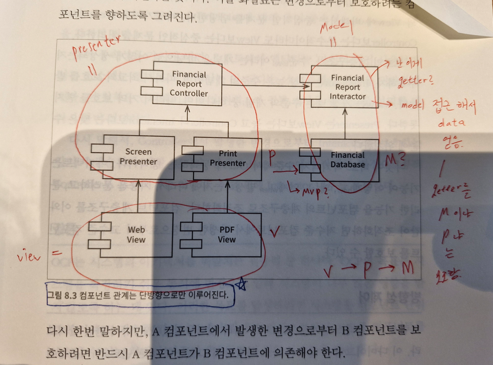

## :fireworks: MVP + Manager + User

  

## :fireworks: MVP+Manager Pattern을 사용합니다.   :fire: Model = 순수 Data Class   :fire: View = UI 요소를 담당하는 MonoBehaviour Class   :fire: Presenter = Model 과 View를 1 : 1로 연결하는 Class   :fire: Manager = 여러 개의 Presenter class들을 관리하는 class.
- Model은 Data Class로도 구현이 되지만, PlayerPrefs or ScriptableObject로도 구현이 된다.
  - :link:[which methods should be in Model class except set/get members?](https://stackoverflow.com/questions/13550143/mvc-which-methods-should-be-in-model-class-except-set-get-members)
- 연결을 위해 presenter는 model 과 view를 멤버로 들고 있는다.
- 관리를 위해 manager는 presenter를 멤버로 들고 있는다.
- OOOO이 XXXX를 들고 있다 or 관리하고 있다 = 멤버로 저장하고 있다.
- OOOO이 XXXX를 모른다 = 멤버로 저장하고 있지 않다.

#### [Sound System을 통한 예시]

  
 :point_up_2: 누르면 매우 큰 이미지가 나옵니다...  

- Presenter 끼리의 직접 소통은 금지하고 SoundManager를 통해 소통한다.
- SoundManager가 UIManager와 소통하기 위해서는 SoundManager가 들고 있는 Presenter 들을 통해 필요한 정보를 가져와서 전달해야 한다.

  

## :fire: 컴포넌트(MVP + Manager) 관계는 단방향으로 이루어진다. (:book: Clean Architecture)
- 
- View는 Presenter에 의존해야 하며 Presenter -> View는 있을 수 없다.

  

## :fireworks: MVP Pattern을 사용하니 체감되는 생산성
- View, Presenter, Model을 분리해서 개발하니 View 구현 시간이 현저히 줄었다. View는 의도적으로 멍청하게 만들어 두고, Presenter에서 모든 로직을 처리한 뒤 View에는 최소한의 데이터만 전달(SetText 정도) 하면 된다. 이 구조 덕분에 View 개발은 단순 작업 수준으로 떨어지고, 핵심은 Presenter 로직 설계에만 집중하면 되므로 전체 생산성이 크게 향상됨을 체감했다.

 

- 전 직장에서는 View와 Presenter 로직이 뒤섞여 있어 View 수정도 로직 파악이 필요했고, 결과적으로 작업 시간이 오래 걸렸다. 역할을 명확히 분리하자, 반복적인 View 작업이 단순화되고 유지보수도 쉬워졌다.

  

## :fire: Dependency Injection은 필요한 instance를 직접 new로 생성하지 않고,   외부(다른 class or interface)에서 제공 받는 것 이다.   :fire: 만약 필요한 instance의 field가 100개라면   직접 new 할 때 100개의 field를 모두 초기화해줘야 하는 끔찍한 일이 벌어진다.   :fire: 흔히 Dependency를 다른 class를 '알아야 한다'고 표현하는데   new 할 때 100개의 field를 다 초기화 해줘야 하니 '알아야 한다'와 일맥상통 한다.

#### [DI 없음 : 직접 new로 생성하는 쓰레기 코드]
~~~c#
public class Employee 
{
    private ComplexClass oneHundredFieldInstance; // 필드 100개인 instance

    public Employee() 
    {
        this.oneHundredFieldInstance = new ComplexClass(arg0, arg1, arg2, ... , arg99); // 직접 생성
    }
}
~~~

 

#### [DI 있음 : 외부로 주입 받는 좋은 코드]
~~~c#
public class Employee 
{
    private IComplexClass oneHundredFieldInstance; // 필드 100개인 instance + Interface로 받는다.

    public Employee(IComplexClass oneHundredFieldInstance) 
    { 
      // 외부에서 생성된 인스턴스를 받음
        this.oneHundredFieldInstance = oneHundredFieldInstance;
    }
}
~~~
- :link:[How to explain dependency injection to a 5-year-old? - what about this? 형님 글_추천수 92](https://stackoverflow.com/questions/1638919/how-to-explain-dependency-injection-to-a-5-year-old)
> The main problem comes when you need to test one particular object, you need to create an instance of other object, and most likely you need to create an instance of yet other object to do that. The chain may become unmanageable.
- 테스트 할 때 외부로 주입을 받는 다면 MockAddress instance를 만들어서 쉽게 테스트가 가능하지만, 내가 직접 생성해야 하면 내가 직접 다 만들어야 하는 괴로움이 있다. 

  

## :zzz: MVC는 Controller가 애매해서 Unity에서 사용하기 어렵다고 생각한다.
> M stands for Model (Which is a fancy name for **Data**)

> V stands for View (which is UI elements)

> C stands for Contoller, which is the logic **binding the two.**
  - 이 Controller가 Unity에서 일부는 Model class에 들어가고, 일부는 View class에 들어가서 모호한 개념이다.   
- :link:[What is a manager and controller?](https://www.reddit.com/r/Unity3D/comments/qe1s6f/what_is_a_manager_and_controller_in_beginner/)