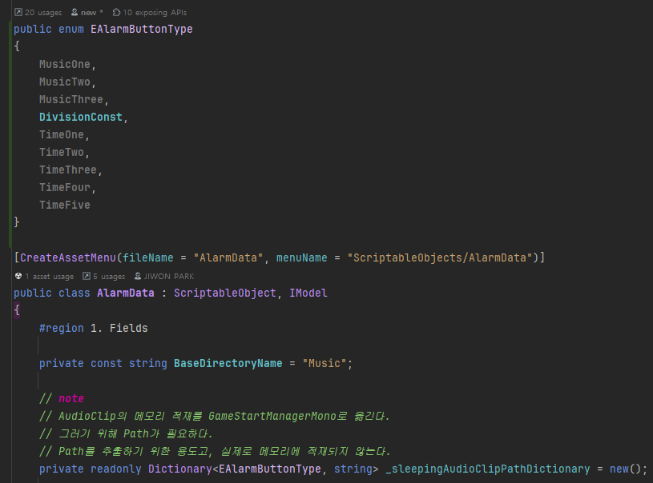
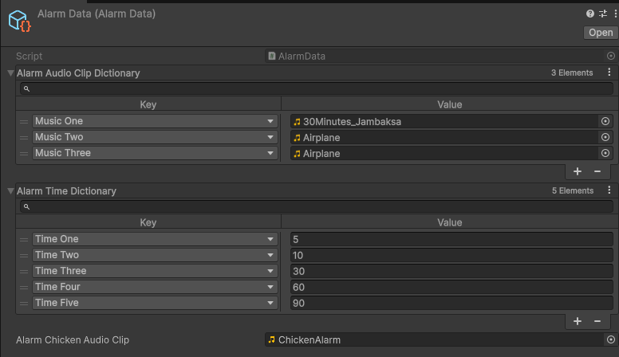
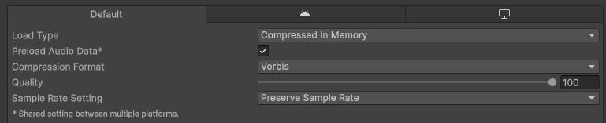

## :fireworks: Model의 역할 및 책임
### :one: Presenter 또는 Manager가 데이터를 요청 할 때 get, set, update를 담당할 책임이 있다.
- Get, Set, Update는 매우 단순한 동작을 처리해야 한다. 

 

### :two: 캡슐화를 최우선적으로 지킨다.   private으로 데이터를 관리하고, public property로 getter만 오픈한다.
- Field의 경우 private back field + public getter property의 구조로 데이터를 관리한다.
- Container의 경우 private 형태의 외부 접근 불가한 기본 Container(List, Dictionary)로 관리하고, public 형태의 외부 접근 가능한 ImmutableContainer의 Getter Property로 관리한다.
- :link:[06장_Type and Member Basics (=Class).md](https://github.com/pjw960316/Unity_Client_Programmer/blob/main/1.%20Unity%20Programming/C%23%20Ver_2/06%EC%9E%A5_Type%20and%20Member%20Basics%20(%3DClass).md)

 

### :three: Enum을 관리할 책임이 있다.
- Class 외부에 선언하지 않도록 주의한다. (Scope)
- 

 

### :four: ReactiveProperty (Unirx)
- State field를 private reactiveProperty로 구현하고 public Iobservable을 제공한다. 
- 그러면 상태 변경에 따라 호출되는 method를 구독 시킬 수 있다.

  

## :fireworks: Model의 특징 및 주의사항
### :one: 절대로 View를 멤버로 갖지 않는다.

 

### :two: 다음 3가지 (ScriptableObject, Xml, FieldObjectAnimalData 같은 IModel 구현 클래스)는 모두 모델이다.   그러나 ScriptableObject와 Xml은 Manager Class로 관리되기 때문에 일반 모델과는 조금 구분해서 구현한다.
~~~c#
public class FieldObjectAnimalData : IModel
~~~

~~~c#
public class AlarmData : ScriptableObject, IModel

public class ScriptableObjectManager : ManagerBase<ScriptableObjectManager>
{
    #region 1. Fields

    private List<ScriptableObject> _scriptableObjectList = new(); //IModel 대신에 ScriptableObject로 타입을 명시한다.
}
~~~
- AlarmData의 경우 Model이므로 IModel을 상속 받지만, ScriptableObject도 상속받는다.
- ScriptableObjectManager에서는 List<ScriptableObject> _scriptableObjectList 타입으로 생성시킨다. 그로 인해 IModel 보다는 더 특정하게 ScriptableObject로 관리한다.

 

### :three: ScriptableObject로 구현된 Model의 경우, Model Instance가 생성되면 Field들이 메모리에 로드된다. 그러나 AudioClip은 설정을 해줘야 메모리에 로드된다.
- 
~~~c#
public class AlarmData : ScriptableObject, IModel
{
    #region 1. Fields

    [SerializeField] private SerializedDictionary<EAlarmButtonType, AudioClip> _alarmAudioClipDictionary = new();
    [SerializeField] private SerializedDictionary<EAlarmButtonType, float> _alarmTimeDictionary = new();
    [SerializeField] private AudioClip _alarmChickenAudioClip;

    #endregion
}
~~~
- 여기 존재하는 필드는 메모리에 올라가지만 AudioClip의 경우 완전히 메모리에 올라가지는 않는다. 
- 그러므로, 높은 용량의 audioClip을 참조할 때 disk-load로 인한 2~3초 정도의 렉이 발생한다. 
> When Preload Audio Data is enabled, the audio data is loaded into memory along with the object when the scene loads or the asset is referenced. If disabled, Unity will not load audio data into memory until you explicitly call AudioClip.LoadAudioData() or call Play(), which implicitly does so.
- 
  - Preload Audio Data를 하면 Memory에 미리 로드해서 렉은 없어지지만 memory에 상주한다는 단점이 있다. (Trade-Off)