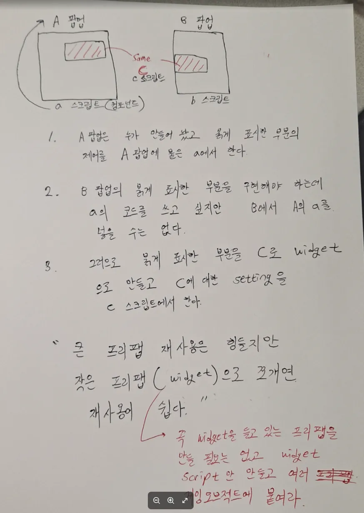

## :fire::one: View의 역할 및 책임
> the View is responsible for handling user input.
  - View는 User의 Input을 받고 Presenter에게 알리는 역할만 하면 된다.
  - 이를 UniRx를 이용해서 구현한다.
- View는 Pub/Sub 구조에서 publisher의 역할을 갖고 있다.
  - View는 User의 Input을 받기 때문에 이벤트를 만들고 발행 시킬 수 있다. (Subject)
  - View는 자신과 loose하게 연관된 Presenter에게 이벤트를 구독하도록 제공한다. (IObservable)

 

#### :two: 멤버로 들고 있을 것
- **자신보다 작은 개념의 View Struct 또는 View Widget**
  - [누르면 설명으로 이동한다](#fire-scene에서-큰-viewpopup는-작은-view들button-image-scrollview을-들고-있다--fire-작은-view를-구현할-때-view-struct-와-view-widget-중-선택한다)
- **private Subject & public IObservable**
  - View에서는 event를 감지만 하고, event handle logic은 Presenter에서 처리하도록 rx를 제공만 한다. 
  - 예시 코드
    - private readonly Subject<Unit> _onSoundButtonClicked = new();
    - public IObservable<Unit> OnSoundButtonClicked => _onSoundButtonClicked;
- **Presenter가 MonoBehaviour 관련 데이터(ex : transform)를 요청 할 때, 그걸 줄 수 있는 Public Get Method**
- **Presenter를 통해 Model과 Manager에 접근 할 필요 없는 수준의 UI 갱신 데이터(=field)와 로직(=method)**
  - 단순한 position 계산, scale 계산 같은 순수 UI 수치 계산은 View에서 처리해도 무방하다.
  - > For me it depends on what data we're talking about. If there is any UI component that has any potential business logic tied with it, I'd prefer to keep it in my ViewModel (as a standalone state or part of a UiState data class as Lackner does it). However suppose we have a toggle which <ins>just changes appearances and has nothing to do with any of your app's business logic, I'd keep that in my compose code as that is Ui centric logic.</ins>
  - 
  - 
    - 마우스 클릭으로 버튼의 색상을 변경하는 경우, 버튼의 색상 값과 변경 로직 정도는 View에 구현한다.
    - Model 과 Manager가 필요 없고, View 갱신만 담당하기에 로직임에도 View Script에 구현해도 문제가 없다.
- :question:**처음에는 Presenter를 들고 있기로 했으나, 지금은 들고 있지 않도록 변경**
  > In the Model-View-Presenter (MVP) architectural pattern, the View component exposes public methods to allow the Presenter to interact with and manipulate the User Interface (UI). These public methods represent the contract between the Presenter and the View, defining how the Presenter can instruct the View to display data, update UI elements, or perform other UI-related actions. 
    - View의 Method를 Public으로 구현하여, Presenter에서 Call하는 방식.
  - :link:[Model-View-Presenter implementation thoughts](https://softwareengineering.stackexchange.com/questions/60774/model-view-presenter-implementation-thoughts?utm_source=chatgpt.com)
    - 3가지 Choice가 있다.
  - :link:[The Model-View-Presenter pattern and its implementation in ASP.NET](https://www.codeproject.com/Articles/5388787/The-Model-View-Presenter-pattern-and-its-implement)
    - view가 presenter를 class Type으로 들고 있다.

 

#### :three: 특징
- **절대로 Model을 멤버로 갖지 않는다.**
  - > Since Passive View makes the widgets entirely humble, without even a mapping present, Passive View eliminates even the small risk present with Presentation Model. 
  - :link:[MatinFowler MVP](https://martinfowler.com/eaaDev/uiArchs.html) 
- **아무것도 모르는 멍청이로 구현 할수록 올바른 View의 형태다.**
- **View 마다 반드시 Presenter를 구현해야 하는 것 은 아니다.**
  - View가 Presenter를 들고 있지 않으면 단방향 의존성이라는 좋은 설계가 이루어진다. (현재는 최대한 들고 있지 않도록 노력 중)
  > If you want to implement MVP by the book and stay true to its principals, every UI that has user interaction should have a presenter. In this case, if your activity is not interacting with the user, there is no need to have a presenter, and your fragments can have their own. If your activity needs, let's say show a loading to the user because of some data loading prior to show the fragments (this is a user interaction because you are interacting with the user to let them know that something is happening so they should wait), then might be good to consider having a presenter for the activity.
- **구현 순서  :  View Initialize() -> View에서 Presenter 생성 -> Presenter는 생성되면서 Initialize() -> Presenter가 SetData()를 통해 Manager 또는 Model에서 받아온 Data로 View에 Inject하여 Data를 세팅한다.**
  > We already know how the widgets should look, therefore, we call setupScreen() first. Then, we call activate() the presenter, which, if required, can read the relevant data from the model (like data from the previous screens or from hardware) and call functions available in the view to update the state of the widgets

 

#### :four: 예전에 회사에서 적은 내용

  
 :point_up_2: 눌러서 이미지를 확인 합시다  

  

## :fire: Scene에서 큰 View(Popup)는 작은 View들(Button, Image, ScrollView)을 들고 있다.   :fire: 작은 View를 구현할 때 View Struct 와 View Widget 중 선택한다.

#### :one: 거대해졌는데 아직 로직은 없다 -> Presenter가 쉽게 이용하도록 <ins>**public Struct로 묶기**</ins>

 

~~~c#
// Ebuttons 하나 추가하려고 Widget으로 빼서 Script를 만드는 것 도 낭비다.
public struct ButtonData
{
  public Button button;
  public EButtons buttonType;
}
~~~

 

#### :two: 거대해졌는데 로직도 필요하다 -> <ins>**Widget Script로 빼기**</ins>   
- :link:[Do you create a component for every element? ](https://www.reddit.com/r/reactjs/comments/kp356z/do_you_create_a_component_for_every_element/)
> extracting the button into a component that lets you control these different variants with props would save a lot of time of creating it on the fly each time. same with inputs/titles, there maybe the repeated variants across your app that would be easier to manage by extracting a component. Everything is a trade off though. I'm not saying doing this every time is the right way, for example I also think that trying to make every single thing reusable can overcomplicate things if you take it too far.
- Popup 안에 있는 Button을 Widget화 시켜서 스크립트를 만들어 관리한다. 크게 볼 때 많은 중복을 줄일 수 있다.

 

#### [회사에서 적어 놓은 내용]

  
 :point_up_2: 눌러서 이미지를 확인 합니다.  

- 

  

## :fire: View는 필드로 다른 view를 들고 있는 경우가 대부분이다.   (예를 들면, Popup 내부에는 여러 개의 Button이 있다.)   :fire:구현 초기에는, Popup에서 모든 하위 View들을 필드로 관리하는 데 어려움이 없다.   그러나 추후에 하위 View들이 거대해지면서 코드의 중복이 생기기 시작한다.   :fire::star:이 때가 필드로 들고 있던 view를 독립적인 새로운 View Script를 빼서 관리해야 할 때다.   회사에서는 이걸 widget화 한다고 배웠었다.

