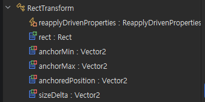

## :fire: Unity는 left-handed (Z가 게임 화면 안 쪽)
- Scene에서 left-handed로 맞춘다.

  

## :fire: Euler Vector는 Vector3(30,45,90)일 때   x축으로 30도 회전하고   y축으로 45도 회전하고, z축으로 90도 회정하고를 의미한다.   하지만 Euler Vector는 결국 quartenion으로 변환된다.

  

## :fire: 프로그래밍에서는 라디안을 사용한다.   fire: 라디안은 57.3도를 의미하는 상수고, 파이도 3.14를 의미하는 상수다.
- 30도는 사람이 편하자고 사용되는 단위 일 뿐, 프로그래밍에서는 라디안을 사용하기 때문에 변환을 해줘야 한다. 그래서 Degree2Rad(=Degrees-to-radians conversion constant) 라는 property가 존재하는 것
  - 
- :bangbang: 간혹, radian과 radius(반지름)이 r로 혼용될 때가 있는데 주의한다.

  

## :fire: 카메라에서 FOV는 <ins>각도</ins>다.   Tan(FOV / 2)는 화면 (절반의 높이 / 카메라와의 평면거리)를 의미한다. 
- 카메라가 해상도에 따라 화면을 보정할 때 이용되는 개념이다.
- Unity는 카메라의 FOV 계산에 실제 화면 크기(cm)를 사용하지 않고, 화면 비율(해상도 1080 x 1920 이면 1080 / 1920을 의미한다.)과 픽셀 기준 렌더링 결과만 고려한다.

#### [화면 해상도에 맞게 코드에서 FOV를 변경하는 코드]
~~~c#
private const float UNITY_DEV_ASPECT_RATIO = 1080f / 1920f;

private void InitializeCameraFOV()
{
    // note : 개발 단계에서 기획자가 최선의 각도를 맞춰 놓았을 것.
    var originFOVDegree = _mainCamera.fieldOfView;
    var originTanFOV = Mathf.Tan(originFOVDegree * Mathf.Deg2Rad / 2f);

    var deviceAspect = Screen.width / (float)Screen.height;
    var aspectRatio = UNITY_DEV_ASPECT_RATIO / deviceAspect;

    var newFovDegree = 2f * Mathf.Atan(originTanFOV * aspectRatio) * Mathf.Rad2Deg;

    _mainCamera.fieldOfView = newFovDegree;
    _initializedMainCameraFOV = _mainCamera.fieldOfView;
}
~~~