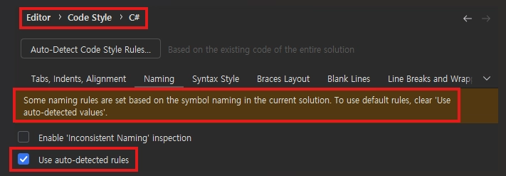
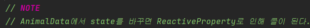
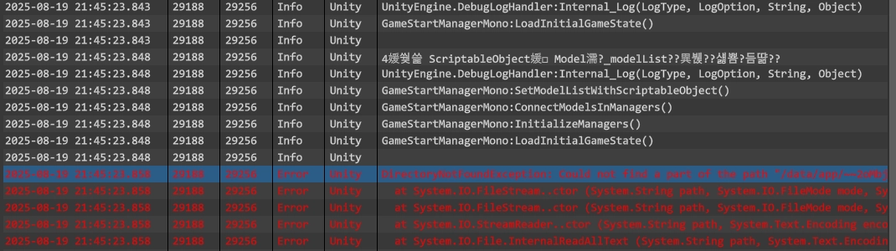

## :fire: 네이밍 규칙
#### :one: Field & Container
- **private & protected field  : _myMusic**
- **public field & property : MyMusic**
- **local value & method params : myMusic**
- **static field  :  _myMusic**
- **const  field :  APPLE_PRICE**
- **List : myMusicList**
- **Dictionary : myMusicDictionary**
- **IEnumerable : myMusics**
- **Subject  :  _onClickButton**
- **IObservable   : OnClickButton**
- **Widget  :  MyMusicWidget**

 

#### :two: Method
- **method & static method  :  PlayMusic()**
- **Event Handle Method  :  OnClickButton()**
- **내부에서 하는 초기화 : Initialize()**
- **외부에서 데이터를 주입 받는 초기화 : SetXXXXX()**

 

#### :three: Class & Interface
- **Class : MusicPlayer**
- **Base Class : MusicPlayerBase**
- **Mono Inherited Class : MusicPlayerMono**
- **Interface : IMusicPlayer**
- **Partial Class : MusicPlayer.Field**
  - Partial Class는 using을 공유하지 않는다.
- **Enum Class** : EMusicPlayer

 

#### :four: 기타
- **Enum Instance** : MusicPlayerType
- **Generic : TValue**
- **LINQ는  .(Chain)마다 개행하기**

  

## :fire: 클래스 멤버 순서
- **지정자**
  - **public → protected → internal → private**
1. **Fields**
   - Const
   - SerializedField
   - Non SerializedFied
   - UniRX Subject
2. **Properties**
3. **Constructor + Initialize Method + SetData Method**
4. **Event Handle Method**
5. **Request Method**
6. **Method**

 

  

## :fire: TODO 키워드
- 주석 예시
  - 

 

- **NOTE**
  - 나중에 주의해야 할 코드 설명
  - 클래스 or 메서드 거시적 설명
- **TODO**
  - 구현해야 할 내용
- **FIX**
  - 동작은 하지만, 알고 있는 문제점이 존재하는 코드
- **REFACTOR**
  - 동작은 하지만, 더 좋은 코드가 분명히 있을 것 같은 코드
  - 추후에 개선하면 실력이 늘 수 있다.
- **TEST**
  - 테스트 코드
  - 테스트 완료 시에 제거한다.

  

## :fire: GitHub Commit Message
- **feat.**
  - 기능 추가
- **fix.**
  - 버그 수정
- **refactor.**
  - 리팩터링
- **docs.**
  - 문서 작업
- **chore.**
  - 테스트
  - 코드 스타일 변경
  - 잡 일

  

## :fire: 개발 프로세스 순서
1. **일단 코드 중복, 코드 최적화 모두 생각하지 않고 구현한다.**
2. **의도한 구현을 완료하면 가볍게 정리 후 커밋한다.**
3. **코드 중복, 코드 최적화 할 만한 내용을 파악한다.**
4. **리팩토링을 진행한다.**
> 나는 소프트웨어를 개발할 때 목적이 '기능 추가'냐, 아니면 '리팩터링'이냐를 구분해 작업한다.

> 나는 소프트웨어를 개발하는 동안 두 모자를 자주 바꿔 쓴다. 새 기능을 추가하다 보면 코드 구조를 바꿔야 작업하기 쉽겠다는 생각이 들거나 코드가 이해하기 어렵게 짜인 경우 모자를 바꿔 쓰고 리팩터링한 후에 어느 정도 개선되면 다시 모자를 바꿔 쓰고 기능 추가를 이어간다.
 
> 전체 작업 시간이 10분 정도로 짧다 해도, 항상 내가 쓰고 있는 모자가 무엇인지와 그에 따른 미묘한 작업 방식의 차이를 분명하게 인식해야 한다.
   - 켄트 벡은 이를 두 개의 모자에 비유했다. 
   - 기능을 추가할 때는 '기능 추가' 모자를 쓴 다음 기존 코드는 절대 건드리지 않고 새 기능을 추가하기만 한다. 
   - 반면 리팩터링 할 때는 '리팩터링' 모자를 쓴 다음 기능 추가는 하지 않기도 다짐한 뒤 오로지 코드 재구성에만 전념한다. 
   - 테스트도 새로 만들지 않는다.

  

## :fire: 화 내지 않고, 유니티 디버거 사용하기
1. **잠시 눈을 감고 호흡한다.**
2. **Unity에서 Play 종료**
3. **Unity에서 Ctrl+R**
4. **Rider Debug 켜기**
5. **Unity에서 디버그 허용**
6. **Rider에서 ‘Initialize Debug…’ 기다리기** 
7. **Unity HoldOn 기다리기 
   - Unity는 병신이라 오래 걸림을 인지한다.
   - 업데이트 이후 or 오랜만에 하면 5분도 가끔 걸린다.
8. **Ctrl + Alt + B로 기존 중단점 모두 제거**
9. **중단점 찍기**
10. **디버깅**
    - F5 : 중단점만 읽기
    - F10 : Method 호출시에 내부를 보지 않고 이어서 읽기
    - F11 : Method 호출시에 해당 메서드 내부로 진입해서 deep하게 읽기

  

## :fire: 안드로이드 디버깅
- **기본 환경 세팅**
  - PackageManager에서 Unity Registry -> ‘Android Logcat’을 다운로드 한다.
  - 내 스마트폰은 ‘개발자 모드 → USB 디버깅 허용’을 켜야 한다.
  - :airplane: [링크](https://developer.android.com/studio/debug/dev-options?hl=ko)

 

- **디버깅 방법**
  1. **핸드폰 연결**
     - 개발자모드를 켠다.
     - USB 디버깅 -> 권한 주기 
  2. **Build And Run** (유니티에서 안드로이드 빌드 뽑기) 
  3. **Android Logcat(Alt+6 단축키)에서 Filter를 Unity로 변경**
     
        
  

## :fire: Asset 관리
- Data는 ScriptableObject와 xml로 관리한다.
- 외부 Package (ex : Unirx)는 Plugin 폴더에 모아 놓고 관리한다.
  - PackageManager 와 AssetStore를 이용해서 다운로드
- 에셋 다운로드시에는 ‘Animation / Material / Model / Texture를 ArtAsset’ 폴더에 저장한다. 
- Prefab은 Prefab 폴더에 따로 저장한다.