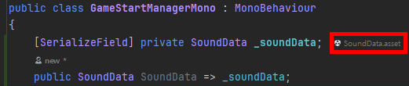
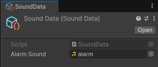

## :book: SO == ScriptableObject

  

## :fire: Runtime에 변하지 않는 (큰?) Readonly Data는 SO에 저장한다.   한 번 만 쓰인다면 prefab에 직접 넣어도 되지만, 파편화 방지를 위해 SO에 저장한다.  
> ScriptableObject is a data container that you can use to **save large amounts of data, independent of class instances.**
> It’s common to have many GameObjects which rely on duplicate data that **does not need to change at runtime**. Rather than having this duplicate local data on each GameObject, you can funnel(이동시키다) it into a ScriptableObject. Each of the objects stores a reference to the shared data asset, rather than copying the data itself. This can provide significant performance improvements in projects with thousands of objects.
- [Ex] AudioClip이 단 한 번만 사용되더라도 SoundData 명칭의 ScriptableObject Script에 저장한다. -> 추후에 바꿀 수도 있지만 현재는 이렇게 한다.
- 기획자는 XML로 데이터를 관리하고, 개발자는 SO로 데이터를 관리한다.
  - PlayerPrefs, Addressable도 있다.
- :wrench: TODO : SO를 좀 더 다루면서 계속 갱신해야 한다.

  

## :fire: SO는 Manager Class로 관리한다. 
> While Scriptable Objects don't have a dedicated manager, a **manager class** might be used to access or manage multiple instances of a Scriptable Object or to coordinate their usage with other parts of the game. A presenter class might also use Scriptable Objects to provide data to UI elements
- 현재는 ScriptableObject의 범위를 크게 설정하여 특정 Sound Data만 모으지 않고, 모든 Sound Data를 모으고 있기 때문에 이런 방향으로 진행한다.

  

## :fire: SO.asset이 메모리에 로드되는 가장 쉬운 방법   :point_right: monoBehaviour 상속 받은 script의 [SerializeField] 필드로 존재하기
- 
- 
  - SoundData.asset == SO.asset
  - SoundData Script == ScriptableObject를 상속 받고 있는 Class
- SO.asset과 SO를 상속 받는 Script는 GameObject와 MonoBehaviour를 상속 받는 Script와 비슷한 관계다.
  - SO가 Model로 게임 내에서 동작하려면 SO를 상속 받는 Script가 component로 존재하는 SO.asset이 필요하다.

  

## :question: ScriptableObject가 singleton이나 static이 아닌데도 copy 없이 1개를 참조 하는 거 공부해서 적어 [그로 인해 데이터의 의미 없는 복사 제거]
- 다수의 Script에서 Manager에 있는 하나의 SO.asset을 참조하기 때문에...
> One of the main use cases for ScriptableObjects is to reduce your project’s memory usage by avoiding copies of values.
> This means that there is one copy of the data in memory.
> SO는 constructor가 호출 되지 않는다.