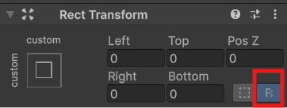
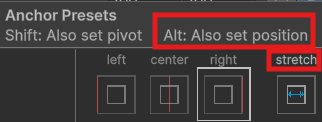
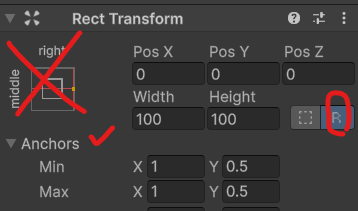

## :link: (UGUI Docs)(https://docs.unity3d.com/Packages/com.unity.ugui@3.0/manual/index.html)

  

## :fireworks: UGUI가 짜증나는 이유는 Unity가 직접 수정하는 것을 보정하기 때문이다.  :fire: Edit Raw Mode를 켜고 작업한다.   그러나 또 어디서 Unity가 지맘대로 보정할지 모르니 항상 Position 값 들이 '0'인지 확인한다.
> Raw Edit Mode	활성화된 경우 피벗 및 앵커 값을 편집하면 사각형이 한 자리에 머무르도록 사각형의 포지션과 크기를 반대로 조정하지 않습니다.
- 

  

## :fire: Pivot은 나를 기준으로 나의 RectTransform의 기준점을 설정한다.   :fire: Anchor는 부모의 RectTransform을 기준으로 나의 RectTransform을 설정한다.    :fire: Pivot은 변경 시켜도 위치만 변하고 크기는 유지되지만   :fire: Anchor는 위치와 크기 모두 변경 될 수 있다.  

  

## :fireworks: 간단한 UI Object 배치는 Anchor Preset을 사용하지만, 아래의 주의사항을 명심한다.   :fire: 'Anchor Preset'은 자동으로 position을 보정해서 의도한 대로 UI의 위치를 변경되지 않는다.   :fire: Alt만 눌러서 사용하고, position을 항상 0으로 변경해서 의도한 대로 Preset을 사용한다. 
- 
- 'Anchor Presets'에서 Alt만 사용하면 Pivot은 (0.5,0.5)로 고정되어 UI Object의 중점을 기준점으로 한다.
- Shift를 누르면 pivot이 변하기 때문에 되도록 사용하지 않는다. (머리 아픔)

  

## :fireworks: 복잡한 UI Object 배치는 Anchor Preset을 사용하지 않고, 직접 Anchor를 사용한다.
- 
- Anchor는 0 ~ 1로 부모 RectTransform에 대한 비율을 표시한다.
  - ex : Min X가 0.05고 Max X가 0.95 면 좌우에 부모 기준 5~95%의 가로 길이로 자신의 크기를 설정한다.
- :bangbang: 만약 동작을 하지 않는다면, 유니티가 또 Pos를 보정하지 않았는 지 체크한다.

