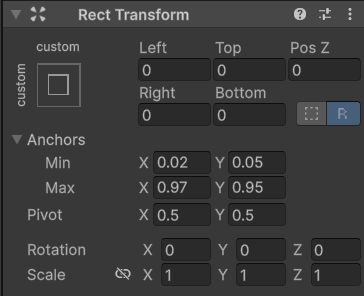
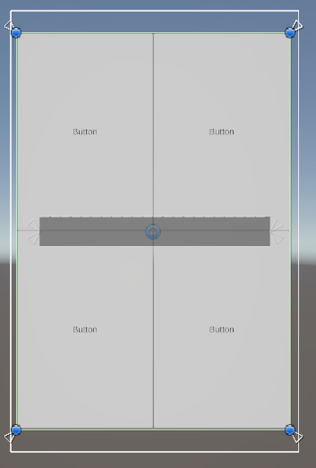

## :link: Unity Docs 
- :link:(UGUI Docs)(https://docs.unity3d.com/Packages/com.unity.ugui@3.0/manual/index.html)

  

## :fire: Pivot은 나를 기준으로 나의 RectTransform의 기준점을 설정한다.   :fire: Anchor는 부모의 RectTransform을 기준으로 나의 RectTransform을 설정한다.    :fire: Pivot은 변경 시켜도 위치만 변하고 크기는 유지되지만   :fire: Anchor는 위치와 크기 모두 변경 될 수 있다.  
- 감을 잃었다면 직접 연습하는 게 pivot 과 anchor는 공식 문서 보는 것 보다 도움이 된다.

  

## :fireworks: UGUI가 짜증나는 이유는 Unity가 직접 수정하는 것을 보정하기 때문이다.  :fire: Edit Raw Mode를 켜고 작업한다.   :fire: 그러나 또 어디서 Unity가 지맘대로 보정할지 모르니   항상 Position 값 들이 '0'인지 확인한다.
> Raw Edit Mode	활성화된 경우 피벗 및 앵커 값을 편집하면 사각형이 한 자리에 머무르도록 사각형의 포지션과 크기를 반대로 조정하지 않습니다.
- 

  

## :fire::fire::fireworks: UI Object 배치는 그냥 이렇게 하자.   :one: Alt+Shift로 Stretch 시킨다.   :two: Anchor를 직접 0 ~ 1의 비율로 설정한다.   :three: Unity가 보정한 Position을 0으로 복구시킨다.
- 
- 
- 
  - Anchor는 0 ~ 1로 부모 RectTransform에 대한 비율을 표시한다.
  - 자료에서 Min Y가 0.05고 Max Y가 0.95다. 그렇기 때문에, UI Object의 세로 길이를 부모의 5~95%로 설정하고 있다.
- :bangbang: 항상 유니티가 또 Pos를 보정하지 않았는 지 체크한다.

  

## :fire: 하위 오브젝트들이 모두 동일한 크기와 배치라면 Horizontal / Vertical Layout을 사용한다.   그러나, 그 외에 조금이라도 달라지면 바로 직접 Anchor (0~1)를 조절한다.
- 부모가 자식을 컨트롤 하게 되는데, 이게 기억이 나지 않으면 고치기 힘들다.

  

## :fire: UI Object의 절대적인 위치와 크기는 RectTransform.rect로 알아낸다 :fire: UI Object의 상대적인(부모를 기준) 위치는 RectTransform.anchoredPosition으로 알아낸다.    그리고 anchoredPosition이 UI Object의 Inspector의 Position이다. 
- 
~~~c#
void Test()
{
  _contentsRectTransform = _contents.GetComponent<RectTransform>();

  _widgetRectWidth = _contentsRectTransform.rect.width;
  _widgetRectHeight = _scrollPanel.GetComponent<RectTransform>().rect.height / WIDGET_SHOW_COUNT;
}
~~~
> Rect Transform is a new transform component that is used for all UI elements. Rect Transform on it, it will instead change the width and the height, keeping the local scale unchanged. This resizing will not affect font sizes, border on sliced images, and so on.