## :fireworks: Unirx 기능의 Tips
#### :one: hasObserver는 Subject에서 사용한다. 해석이 좀 헷갈리는데. 이건 IObservable이 구독한 메서드의 개수다.
- Subject가 유튜브고, 구독을 할 수 있는 환경을 구현 후 나(외부)에게 IObservable로 제공한다. 나는 IObservable을 통해 여러 채널(메서드)을 구독(Subscribe)한다.
- hasObserver는 구독하신 채널이 있는 지 묻는 거고 내가 구독하고 있는 채널이 몇 개 있으면 hasObserver는 true다. 하지만 Dispose를 통해 모든 구독을 취소해서 구독하고 있는 채널이 없으면 false가 된다.
#### :two: Subject는 OnCompleted() 또는 OnError()가 한 번이라도 호출되면 자동으로 모든 구독에 대해 Dispose를 수행합니다.

  

## :fire: MVP에서 View에 Subject, Iobservable을 만들고   Presenter에서 Iobservable에 SubScribe를 하는 것은 일회성이 아닐 때   :fire: 일회성일 때는 Observable Static Class를 사용한다.

~~~c#
Observable.Timer(TimeSpan.FromSeconds(playingTime))
            .Subscribe(_ => RequestPlayingWakeUpSound())
            .AddTo(Disposable);
~~~

  

## :fire: UniRx에서 Subscriber에게 데이터를 전달할 때 params가 1개 이상은 전달 할 수 없다.   그러므로, struct로 DTO를 만들어서 2개 이상의 데이터를 묶어 전달한다.
~~~c#
public struct ScrollData
{
    public readonly float Offset;
    public readonly bool IsScrollDown;
    public readonly UIRoutineRecordWidget MovingWidget; // note : 보이지 않아서 움직일 widget 

    public ScrollData(float offset, bool isScrollDown, UIRoutineRecordWidget movingWidget)
    {
        Offset = offset;
        IsScrollDown = isScrollDown;
        MovingWidget = movingWidget;
    }
}

private readonly Subject<ScrollData> _onUpdateScrollWidget = new();
public IObservable<ScrollData> OnUpdateScrollWidget => _onUpdateScrollWidget;
~~~

  

## :fireworks: Disposable의 대상 
> Unity의 MonoBehaviour를 상속받은 UI 요소라면 Destroy(gameObject)로 파괴됩니다. 이때 Unity는 OnDestroy() 호출 후 GC 대상이 됩니다.
일반 C# 객체라면 Unity 오브젝트가 아니므로 Destroy() 대상이 아니고, 명시적으로 참조를 해제하거나 null로 만들지 않으면 GC가 수거하지 않습니다.

  

## :fire: Observable.Timer는 작업을 마치면   개발자가 수동으로 Dispose() 하지 않아도   자동으로 시간이 지나면 Dispose() 된다.  :fire: 그러나 중간 종료에 대해서는 보장하지 않으므로, 반드시 CompositeDisposable에 Add 주어야 한다!

#### [Observable.Timer 예제]
~~~c#
Observable.Timer(TimeSpan.FromSeconds(1f)).Subscribe(_ => { MainCanvas.ToastMessage.SetActive(false); });
~~~
- :one: **Static으로 편하게 받고, 내부에서 Instance를 생성한다. (쉽게 사용 가능)**
  - 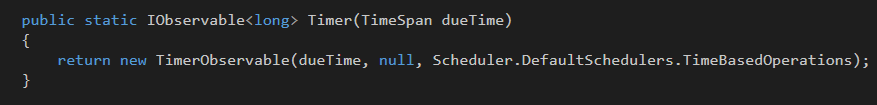

 

- :two: **내부적으로는 생성자가 이렇게 동작하는데 이것까지는 알 필요 없다.**
- 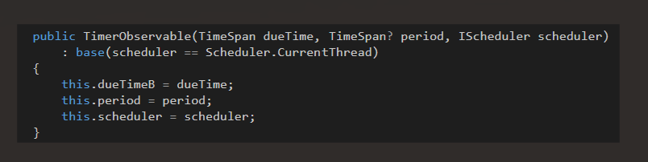
 
 

- :three: **BaseType이 SubScribe를 구현하고 있다.**
  - 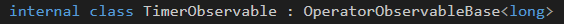
  - 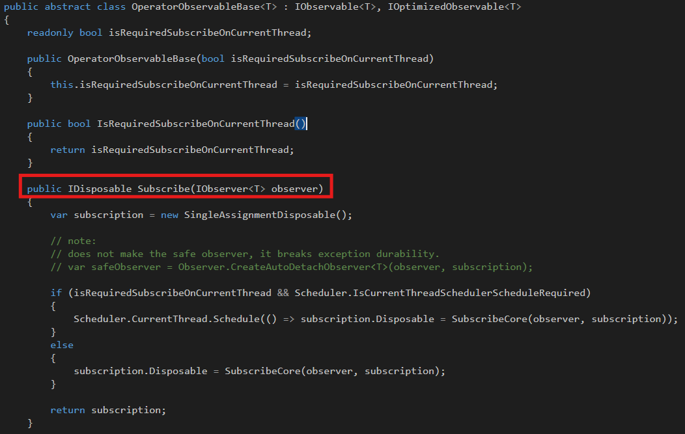

 

- :four: **Action이 있어서 ObservableExtension을 이용하고 있다.**
  - 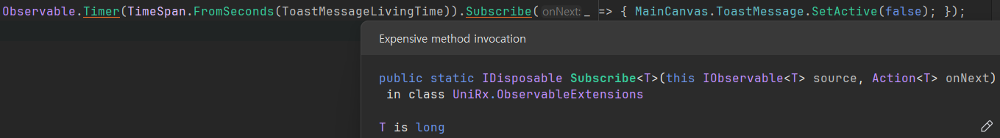
  - 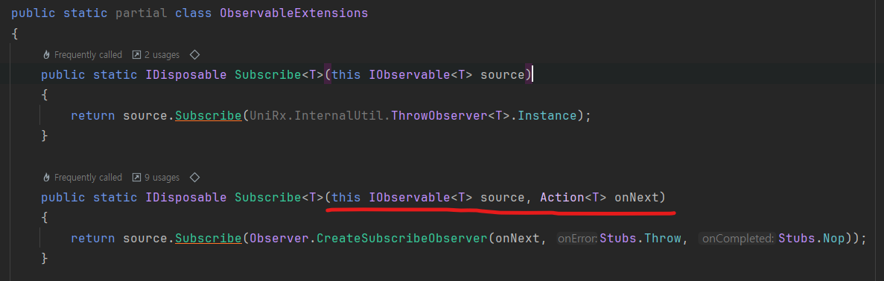
  - Observable.Timer가 반환하는 TimerObservable은 OperatorObservableBase<long>를 상속받는다. 
  - ObservableExtensions.Subscribe는 IObservable<T>.Subscribe를 호출하지만, 이 인터페이스의 실제 구현은 OperatorObservableBase<T> Subscribe이다.
  - 따라서 결과적으로 Observable.Timer의 Subscribe는 OperatorObservableBase의 Subscribe가 된다.

 

- :five: **내가 적은 1f 시간 만큼 Time이 걸린다.**
  - 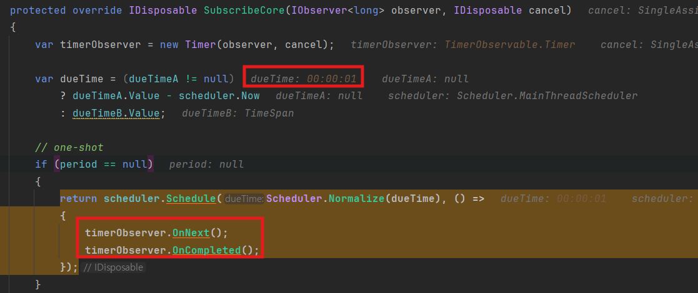
  - 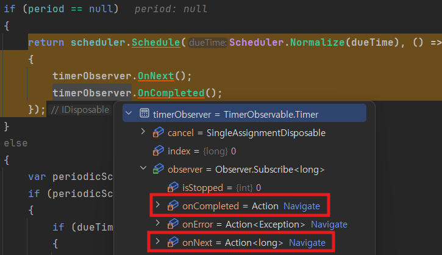

 

- :six: **MainThreadScheduler의 Schedule method에서 Delay Action coroutine을 생성해서 작업을 진행한다.**   **작업 완료 콜백의 Action은 OnNext와 OnComplete을 호출한다.**
  - 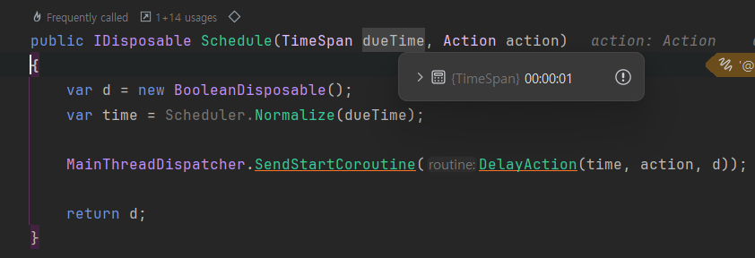
  - 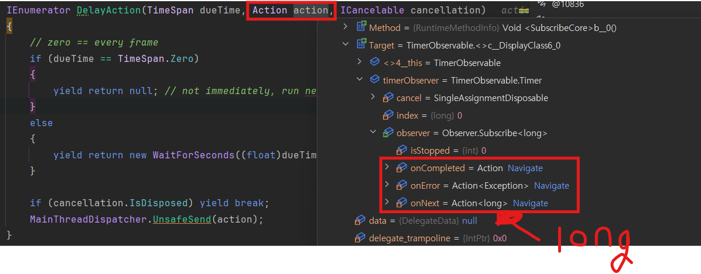
  - 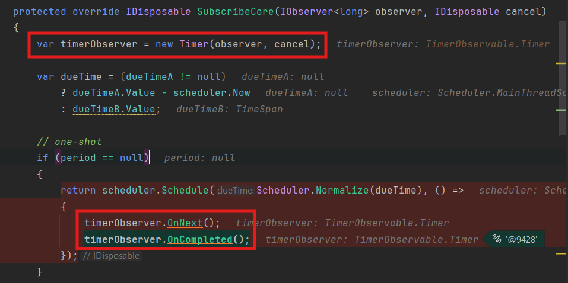
    - 맨 위의 코드에서 **long Type** Iobservable을 전달하고 있다.

 

- :seven: **Timer는 OperatorObserverBase를 상속 받고 있고, OperatorObserverBase의 Dispose()를 호출한다.**   **그 결과 내가 Dispose()를 하지 않아도 Observable.Timer은 Dispose()가 되는 것 이다.**
  - 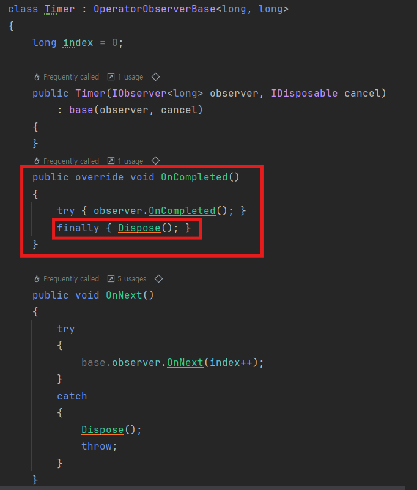
  - 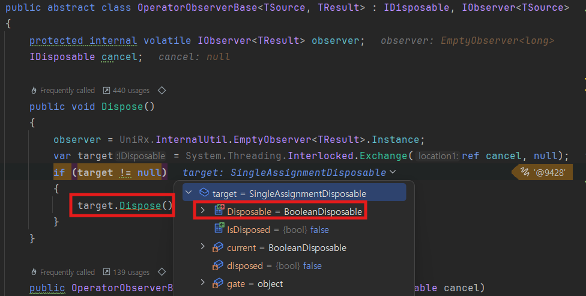
    - :five:의 Schedule() method에서 'var d = new BooleanDisposal'을 만들고 return 하고 있다.