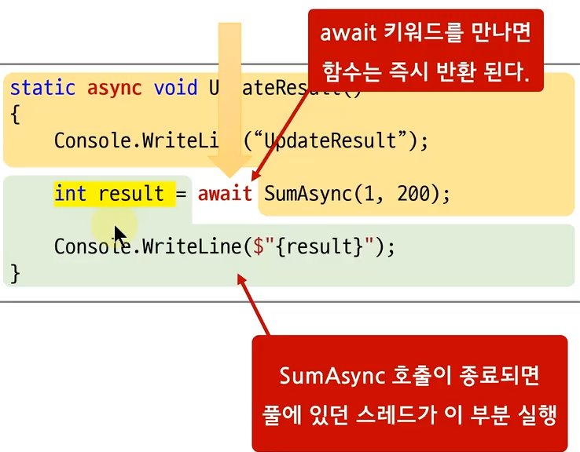

## :fire: await 키워드를 만나면 메서드는 즉시 반환 되고, 그 시점을 저장하고 있는다.   :fire: await 걸린 비동기 호출이 완료되면 풀에 있던 스레드가 해당 부분을 실행한다.
#### [await 예제]
~~~c#
private void Test()
{
    UpdateResult().Forget();

    Debug.Log("Main : Run Event Loop");
}

private async UniTaskVoid UpdateResult()
{
    Debug.Log("UpdateResult");

    var result = await SumAsync(100, 200);

    Debug.Log($"{result}");
}

private async UniTask<int> SumAsync(int n1, int n2)
{
    await UniTask.Delay(1000);

    var ret = n1 + n2;

    return ret;
}

/*
UpdateResult
Main : Run Event Loop
300
*/
~~~
- 

  

## :link: 과거 문서
- [Async & Await](https://github.com/pjw960316/Unity_Client_Programmer/blob/main/1.%20Unity%20Programming/C%23%20Ver_1/%EB%B9%84%EB%8F%99%EA%B8%B0_Async%20%26%20Await.md)
- [UniTask](https://github.com/pjw960316/Unity_Client_Programmer/blob/main/1.%20Unity%20Programming/C%23%20Ver_1/%EB%B9%84%EB%8F%99%EA%B8%B0_Unitask.md)