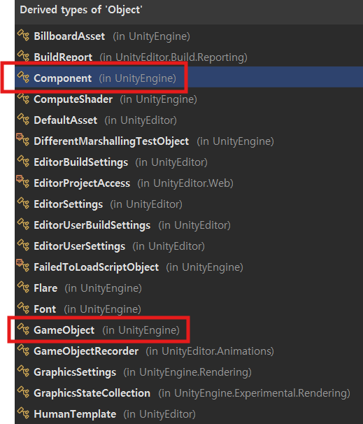
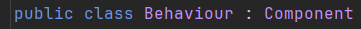
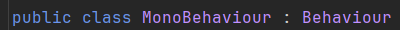

## :fire: GameObject는 UnityEngine.CoreModule에 존재하는 'Object' 클래스를 상속 받은 클래스다.
- :link:[GameObject](https://docs.unity3d.com/6000.0/Documentation/ScriptReference/GameObject.html)

#### [Object 아래에는 Component도 있고, GameObject도 있고, Monobehaviour도 있다.]

  
 :point_up_2: 눌러서 이미지를 확인 합시다  

  

## :fire: 직접 Destroy()로 파괴하는 것과 Scene이 변경되어 자동으로 파괴되는 것은   '파괴'의 관점에서는 거의 비슷하다.   :fire: 둘 다 UnityEngine.Object(!= C# Object)를 상속 받는 Scene에 존재하는 모든 Instance들을 파괴한다.
- Scene이 변경될 때 
  > OnDestroy occurs when a Scene or game ends. Stopping the Play mode when running from inside the Editor will end the application. As this end happens an OnDestroy will be executed. Also, <ins>if a Scene is closed and a new Scene is loaded</ins> the OnDestroy call will be made.
- Scene이 변경될 때 DontDestroyOnLoad를 사용하지 않으면 Scene의 Object 들은 파괴된다.
  - > Do not destroy the target Object when loading a new Scene. (DontDestroyOnLoad의 정의)
  - 이걸 반대로 생각하면 Do Destroy가 되고, GameObject가 아닌 unityengine.Object를 모두 파괴시킨다.

  

## :fire: Object가 Destroy되면   Object의 Monobehaviour 상속 스크립트 내부의 필드들은   모두 unity null(=fake null) 상태가 된다. 
- 정확히 <ins>필드</ins>들이 fake null이 됨을 강조하기 위해 따로 적었다. 

  

## :fire: Object가 unity null이 되면   unity 세상에서 완전히 죽은(=어떠한 기능도 할 수 없는) Instance로 취급 된다.   그러나 엄밀히 이야기 하면 unity의 null은 C#의 null이 아니다.   이는 Unity가 C++로 구현되어 그렇다.   :fire: unity null 상태의 Object는 GC의 수집대상이다.
> Yes, true null values are detected by both operators. However, Unity is a bit special. <ins>Unity is a C++ engine</ins>, and when it comes to memory management, there are some major issues. In C# you can not destroy any object manually as this is completely in the hand of the garbage collector. References to objects can not suddenly become null in C#.

> Since native (C++) objects in Unity can be destroyed at any time, this creates an issue with the C# scripting layer. A GameObject or other Component reference can not magically become null. So Unity uses a trick. They have overloaded the == operator and the Equals method, and when comparing dead objects to null, those will return true. This is called a <ins>fake null object. It's still a **valid** C# object, **but it can no longer be used** because the actual native object was destroyed.</ins> Most built-in components and classes in Unity are just C# wrapper classes which have a native object behind the scenes. (Every class derived from UnityEngine.Object)
  - But 뒤에가 중요한 문구다. 이제 사용할 수 없는!

> That means you can not use the is null or any of the null coalescing operators on variables with a type that is derived from UnityEngine.Object. When those references are truly null, it would work. However in most cases you would encounter a fake null object and an is null check would not see this as null since it's still an instance.

- 과거에 멘토님이 GameObject에 대해서 ?를 쓰거나 null을 쓸 때 주의하라고 했는데 그 이유가 Unity Null이라 그렇다.

  

## :star::fire: UnityEngine.Object에 대한 null 사용 방법은 아래를 읽어 본다!
#### :one: ?.(=null-conditional operator) 그리고 ??(=null-coalescing operator) 사용하지 않기 
> unfortunately the most reliable approach <ins>is not using it for Unity objects</ins>

  

## :fire: Prefab Reference를 Non-MonoBehaviour Script에서 사용하려면   MonoBehaviour를 상속 받은 script에서 presenter나 Manager를 통해   주입 받아야 한다.
- Prefab 생성에는 Prefeb reference가 핵심이다. 
> To instantiate a prefab at runtime, your code needs a reference to the prefab. To make this reference, you can create a public field of type in your code, then assign the prefab you want to use to this field in the **Inspector**.

  