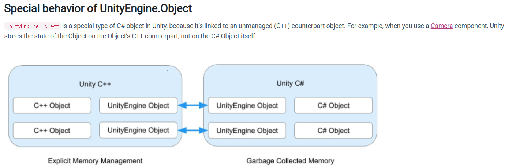
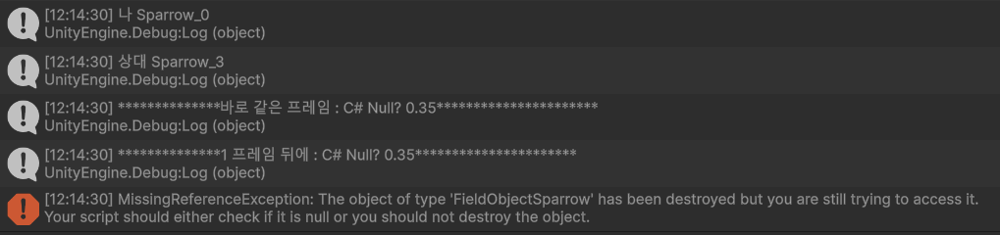

## :fire: 직접 Destroy()로 파괴하는 것과   Scene이 변경되어 자동으로 파괴되는 것은   '파괴'의 관점에서는 거의 비슷하다.   :fire: 둘 다 UnityEngine.Object(!= C# Object)를 상속 받는   Scene에 존재하는 모든 Instance들을 파괴한다.
- Scene이 변경될 때 
  > OnDestroy occurs when a Scene or game ends. Stopping the Play mode when running from inside the Editor will end the application. As this end happens an OnDestroy will be executed. Also, <ins>if a Scene is closed and a new Scene is loaded</ins> the OnDestroy call will be made.
- Scene이 변경될 때 DontDestroyOnLoad를 사용하지 않으면 Scene의 Object 들은 파괴된다.
  - > Do not destroy the target Object when loading a new Scene. (DontDestroyOnLoad의 정의)
  - 이걸 반대로 생각하면 Do Destroy가 되고, GameObject가 아닌 unityengine.Object를 모두 파괴시킨다.

  

## :fireworks: Unity에서 UnityEngine.Object를 상속 받은 instance에서   발견할 수 있는 fake-null을 알아보자.   :fire: UnityEngine.Object에 대해서는 == null만 쓰고   '?.'은 사용하지 않는다. 
#### :one: 우선 UnityEngine.Object는 C++에서의 null과 C#에서의 null이 동시에 존재한다는 걸 인지하고 간다.

> Yes, true null values are detected by both operators. However, Unity is a bit special. <ins>Unity is a C++ engine</ins>, and when it comes to memory management, there are some major issues. In C# you can not destroy any object manually as this is completely in the hand of the garbage collector. References to objects can not suddenly become null in C#.

 

#### :two: UnityEngine.Object가 Destroy 되면   C++ 레벨의 null은 1 프레임 뒤에 null이 되고,   C# 레벨의 null은 GC가 담당하기 때문에 언제인지 알 수 없다.

> Since native (C++) objects in Unity can be destroyed at any time, this creates an issue with the C# scripting layer. A GameObject or other Component reference can not magically become null. So Unity uses a trick. <ins>They have overloaded the == operator and the Equals method, and when comparing dead objects to null, those will return true. This is called a fake null object. It's still a **valid** C# object, **but it can no longer be used** because the actual native object was destroyed.</ins> Most built-in components and classes in Unity are just C# wrapper classes which have a native object behind the scenes. (Every class derived from UnityEngine.Object)
- But 뒤에가 중요한 문구다. 이제 사용할 수 없는!

 

#### :three: 그러므로 fake-null이란, Unity 내부(C++)에서는 이미 파괴되어 없지만 C# 객체는 살아 있는 상태를 말한다.   다시 말해, 코드에서 == null의 결과는 true인데 ?.의 결과는 false가 나오는 상태다.   :fire: 원인은 UnityEngine.Object를 상속 받는 instance에 대해 사용하는 '=='은 오버로딩 되어 있기 때문이다.
- 
> For types that inherit from UnityEngine.Object, Unity uses a <ins>custom version</ins> of the C# equality and inequality operators. This means the null check myGameObject == null can evaluate true (and conversely myGameObject != null can evaluate false) even if myGameObject technically holds a valid <ins>C# object reference.</ins>

> That means you can not use the is null or any of the null coalescing operators on variables with a type that is derived from UnityEngine.Object. When those references are truly null, it would work. However in most cases you would encounter a fake null object and an is null check would not see this as null since it's still an instance.

 

#### :four: 실제 테스트 결과 확인한다.
~~~c#
// Unity API
public static bool operator ==(Object x, Object y) => Object.CompareBaseObjects(x, y);

private static bool CompareBaseObjects(Object lhs, Object rhs)
{

  // 1. 일단 C#에서 null인지 검사
  bool flag1 = (object) lhs == null;
  bool flag2 = (object) rhs == null;

  // 2. 함수명 부터 IsNativeObjectAlive -> C++ Native Object가 null인지 검사
  if (flag2 & flag1)
    return true;
  if (flag2)
    return !Object.IsNativeObjectAlive(lhs);
  return flag1 ? !Object.IsNativeObjectAlive(rhs) : lhs.m_InstanceID == rhs.m_InstanceID;
}
~~~

 

~~~c# 
//test
if (enumKey == 3)
{
  Debug.Log($"나 {name}");
  var otherSparrow = _fieldObjectManager.GetFirstSparrow(_instanceID);

  Debug.Log($"상대 {otherSparrow.name}");

  Destroy(otherSparrow.gameObject);

  // 바로 같은 프레임이라 아직은 native Object가 null이 아니다.  
  if (otherSparrow.gameObject == null)
  {
    Debug.Log("**************바로 같은 프레임 : Fake-Null?**********************");
  }
  Debug.Log($"**************바로 같은 프레임 : C# Null? {otherSparrow?.DefaultSparrowSpeed}**********************");

  // 1 프레임 뒤에 재호출
  Observable.TimerFrame(1).Subscribe(_ =>
  {
    Debug.Log($"**************1 프레임 뒤에 : C# Null? {otherSparrow?.DefaultSparrowSpeed}**********************");
    
    if (otherSparrow.gameObject == null) // MissingReferenceException
    {
      Debug.Log("**************1 프레임 뒤에 Fake-Null?**********************");
    }
  });
}
~~~
- 

- Destroy()는 1 프레임 뒤에 게임 오브젝트를 제거하므로 C++ 레벨에서는 null이 된다. 그래서 MissingReferenceException이 발생한다.
  > The object is not immediately destroyed. Actual object destruction is delayed until after the current Update loop, but before rendering.
- 하위 컴포넌트(script 포함)도 같은 프레임에 제거 된다.
  > If the object is a component, only that component is removed and destroyed. If the object is a GameObject, the GameObject, all its components, and all its transform children are destroyed together.
- C# 레벨에서 null을 검사하는 ?.에서는 프레임 상관없이 모두 null이 아니라고 판정하고 있다. 그래서 otherSparrow?.DefaultSparrowSpeed가 출력되고 있다.
- :star:**그러므로 UnityEngine.Object에 대해 ?.를 붙이는 건 위험하다.**
  > Because you can’t overload the ?? and ?. operators, they aren’t compatible with objects that derive from UnityEngine.Object. 
  > The operators don’t return the same results as the equality and inequality operators when you use them on a destroyed MonoBehaviour or ScriptableObject while the managed object still exists.
- :link:[= null'과 'unreachable'은 명백히 다른 개념이다.unreachable은 인스턴스에 대한 '모든' 참조가 null이 되어야 한다.참조가 100개 되어 있는데, 고작 1개를 null로 초기화 한다고 unreachable이 되지 않는다](https://github.com/pjw960316/Unity_Client_Programmer/blob/main/1.%20Unity%20Programming/C%23%20Ver_2/21%EC%9E%A5_The%20Managed%20Heap%20and%20Garbage%20Collection.md#fire--null%EA%B3%BC-unreachable%EC%9D%80-%EB%AA%85%EB%B0%B1%ED%9E%88-%EB%8B%A4%EB%A5%B8-%EA%B0%9C%EB%85%90%EC%9D%B4%EB%8B%A4--unreachable%EC%9D%80-%EC%9D%B8%EC%8A%A4%ED%84%B4%EC%8A%A4%EC%97%90-%EB%8C%80%ED%95%9C-%EB%AA%A8%EB%93%A0-%EC%B0%B8%EC%A1%B0%EA%B0%80-null%EC%9D%B4-%EB%90%98%EC%96%B4%EC%95%BC-%ED%95%9C%EB%8B%A4--%EC%B0%B8%EC%A1%B0%EA%B0%80-100%EA%B0%9C-%EB%90%98%EC%96%B4-%EC%9E%88%EB%8A%94%EB%8D%B0-%EA%B3%A0%EC%9E%91-1%EA%B0%9C%EB%A5%BC-null%EB%A1%9C-%EC%B4%88%EA%B8%B0%ED%99%94-%ED%95%9C%EB%8B%A4%EA%B3%A0-unreachable%EC%9D%B4-%EB%90%98%EC%A7%80-%EC%95%8A%EB%8A%94%EB%8B%A4)
- :link:[MSDN_1](https://docs.unity3d.com/ScriptReference/Object-operator_eq.html)
- :link:[MSDN_2](https://docs.unity3d.com/Manual/class-Object.html)