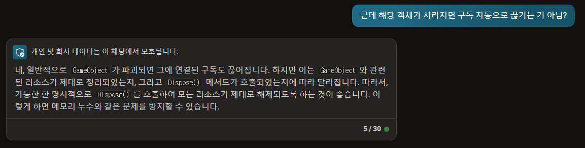

# 개요
- Unirx의 기능.
- 얘는 객체를 삭제하고 그런 친구가 아니다.
- unirx로 등록한 메서드의 구독을 끊는 것 이다.

# 구독 
> 맞습니다. _ss.Dispose()를 호출하면 _ss에 추가된 모든 구독이 해제되지만, Create로 생성된 GameObject는 해제되지 않습니다. CompositeDisposable의 Dispose() 메서드는 컬렉션에 추가된 IDisposable 객체들의 Dispose() 메서드를 호출하므로, 이는 구독을 끊는 것을 의미합니다. 따라서, GameObject를 직접 삭제하려면 별도의 메서드를 호출해야 합니다.

# 의미 있나?
- 