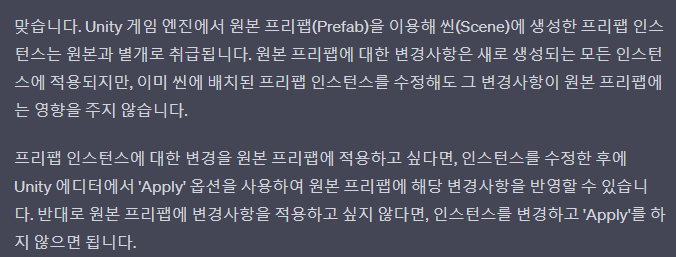
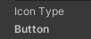

# 목차
- [목차](#목차)
- [개요](#개요)
- [Prefab (의외로 개념을 명확하게 이해하고 있지 않았었다.)](#prefab-의외로-개념을-명확하게-이해하고-있지-않았었다)
- [자식 객체를 연결할 때 더 이상 Getchild(), Getchildren()을 사용하지 말고 SerializeField로 직접 넣어주자.](#자식-객체를-연결할-때-더-이상-getchild-getchildren을-사용하지-말고-serializefield로-직접-넣어주자)
- [GetComponent로 부모 스크립트만 가져오기](#getcomponent로-부모-스크립트만-가져오기)
- [스크립트의 본질을 잊지마라. 어딘 가에는 붙어있을 것 이다.](#스크립트의-본질을-잊지마라-어딘-가에는-붙어있을-것-이다)
- [부모가 SetActive(false)면 자식도 SetActive(false)가 되나?](#부모가-setactivefalse면-자식도-setactivefalse가-되나)
- [유니티에서 변경 되지 않는 이미지는 연결할 필요가 없다.](#유니티에서-변경-되지-않는-이미지는-연결할-필요가-없다)
- [A 프리팹 안에 존재하는 B 프리팹](#a-프리팹-안에-존재하는-b-프리팹)
- [Prefab Instance](#prefab-instance)

# 개요
- 게임 오브젝트와 프리팹과 관련된 대다수의 내용을 이 곳에 정리한다.

# Prefab (의외로 개념을 명확하게 이해하고 있지 않았었다.)
- 
- Asset 폴더에 있는 프리팹은 프리팹 에셋이라 표현하겠다. 게임 내부에서 프리팹을 통해 생성 되는 객체들은 모두 프리팹 에셋의 복제품이면 (clone)이 표기되어 생성된다. 이렇게 생성되는 것을 instantiate 라고 한다.
  - :star:프리팹 에셋을 변화 시키면 당연히 복제된 객체들은 모두 변화한다. 하지만 복제된 객체를 변화 시킨다고 다른 복제품 들과 프리팹 에셋이 변하지는 않는다.
- 학부 시절에는 매우 큰 프리팹 안에 작은 프리팹들을 넣어본 적이 별로 없다. 하지만 프리팹안에는 10개 이상의 계층이 생길 수도 있고 하위에 많은 프리팹이 존재할 수도 있다.
- 즉, 엄청 큰 A 프리팹 애셋이 있다. 그리고 A 프리팹 에셋을 이용해서 게임에서는 A 프리팹의 복제품들을 생성한다. A 프리팹의 하위 5번째 계층에 B 프리팹이 존재한다. 여기서 매우 중요하다. 가장 실수를 많이 하는 부분이다. 우리가 A 프리팹 복제 객체에 존재하는 B 복제 객체에 어떤 스크립트를 넣으려면 어떻게 해야할까? 절대로 B 프리팹 에셋이 해당 스크립트를 넣는 것이 아니라, Asset에 가서 A 프리팹 에셋에 존재하는 B 프리팹에 넣어주어야 한다.
- 그리고 게임을 Play해서 생기는 (clone)객체들에 어떠한 작업을 해도 어차피 게임이 꺼지면 모두 사라진다. 

# 자식 객체를 연결할 때 더 이상 Getchild(), Getchildren()을 사용하지 말고 SerializeField로 직접 넣어주자.
- 이전에는 게임 오브젝트에 붙어있는 자식 게임 오브젝트를 찾을 때 GetChildren()을 사용했었다. 일반적인 컴포넌트를 찾아주려면 넣어줘야 하지만 자식은 Unity의 함수로 찾을 수 있기 때문이다.
  - 하지만 필연적으로 인덱스나 이름을 parameter로 넣어줘야 하며 이는 하드코딩에 가깝다. 또한 성능도 좋지 않다.
  - 
    - 혼자 허접한 게임을 만들 때는 자식의 개수가 적었지만, 큰 구조라면 자식도 많아지고 자주 호출된다. 
- 게임 오브젝트에 자식 게임 오브젝트의 스크립트를 Serialize Field로 만들어서 추가해 버리면 매우 안전하고 이 방식이 현재는 정답이라고 생각한다.
- **주의 : Serialize Field로 선언한 멤버의 이름을 바꾸면 null exception이 날 것 이다. 다시 연결해줘야 한다.**
  - 하지만 해당 이름으로 유지 시켜주는 FormerlySerializedAsAttribute 라는 것도 있다.
  - 
  - https://docs.unity3d.com/ScriptReference/Serialization.FormerlySerializedAsAttribute.html

# GetComponent로 부모 스크립트만 가져오기
- 
  - 상속 관계에서의 GetComponent

# 스크립트의 본질을 잊지마라. 어딘 가에는 붙어있을 것 이다.
- 스크립트에 적은 것은 결국 어떤 객체의 컴포넌트로 쓰기 위함이다. 
- 프리팹으로 만든 복잡한 게임오브젝트 내부를 파고들어 하위의 하위의 하위의 계층을 파고들면 어딘가에는 연결되어 있을 것 이다!
- 물론 아닌 것도 있지만 그런 애들은 정말 특별한 목적의 스크립트다. 

# 부모가 SetActive(false)면 자식도 SetActive(false)가 되나?
- 일단 부모에서 SetActive(false)를 하면 게임에서 자식도 모두 꺼진다.
- 그러나 inspector에서는 여전히 살아있는 걸로 나온다.
- 
  - 꺼지는 게 맞다.
  - 하지만 Script는 꺼지지 않는다. 스크립트를 끄고 키는 것은 enable로 담당한다.
- 여러 테스트를 해봤지만 정확한 답은 사실 찾지 못했다. 개발을 하다가 완벽한 예시를 찾으면 다시 테스트 해본다.

# 유니티에서 변경 되지 않는 이미지는 연결할 필요가 없다.
- 조금만 생각해보면 너무 당연한 이야기다.
- 어떤 이미지에 대해 변경사항이 존재한다면 게임 오브젝트에 해당 이미지를 스크립트에 연결해야 하지만 변경 사항이 없다면 그럴 필요 없이 게임 오브젝트에만 연결해주면 된다. 

# A 프리팹 안에 존재하는 B 프리팹
- B 프리팹도 파란색으로 표시되는 프리팹이다. 과연 B 프리팹을 변경 했을 때 원본 B도 변경이 되는가?
  - 결론부터 말하면 아니다.
- 

# Prefab Instance
- Hierarchy에서 파란색 네모로 표시되어 자신이 Prefab Instance 라는 것을 나타낸다.
- Project 폴더에 있는 프리팹을 Scene에 끌어다가 사용하면 Prefab Instance가 된다.
- 
- **:star:star:주의점**
  - 어떠한 방법으로 원본 프리팹을 변경하는 경우가 있다.
  - 이러면 당연히 원본 프리팹과 연결된 모든 프리팹 인스턴스도 변경이 된다.
  - 독립적인 프리팹 인스턴스만 변경하려고 했는데 원본 프리팹을 변경하면 다른 프리팹 인스턴스는 의도하지 않았는데 변경된다.
    - 이 경우 다행이도 Perforce에 원본이 변경된 것도 Pending에 잡히므로 반드시 확인하고 원본을 변경하지 않도록 한다
- 올바르게 프리팹 인스턴스의 inspector만 변경을 하면 해당 변경 사항이 Bold 처리되어 나온다. (Override 됨을 의미)
  - 