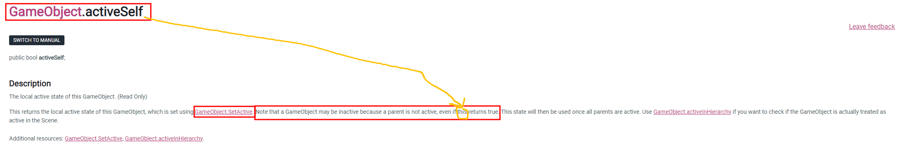
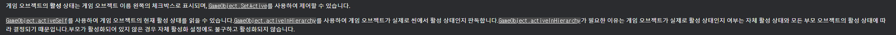
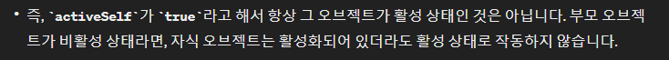
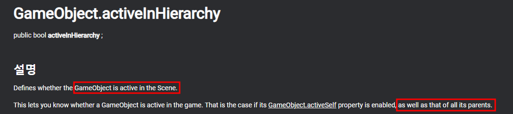
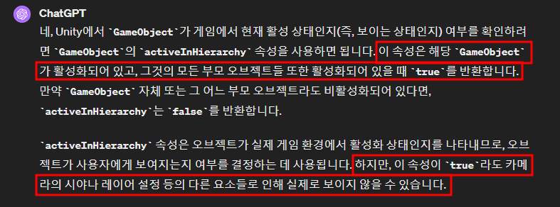
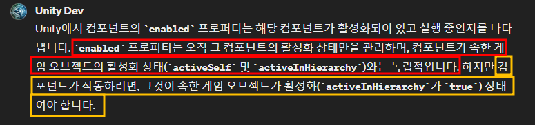
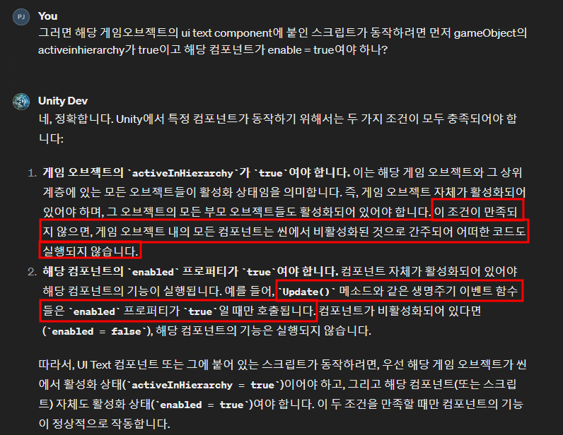

# 목차
- [목차](#목차)
- [일단 나(=GameObject)는 켠다! : SetActive(true) 와 activeSelf를 확인한다](#일단-나gameobject는-켠다--setactivetrue-와-activeself를-확인한다)
- [내가 정말 게임에서 켜져 있는 지 확인하는 방법 : activeInHierarchy](#내가-정말-게임에서-켜져-있는-지-확인하는-방법--activeinhierarchy)
- [Enable은 Component의 개념이고, SetActive는 GameObject의 개념이다.](#enable은-component의-개념이고-setactive는-gameobject의-개념이다)
- [Unity 게임 오브젝트에 붙은 스크립트가 동작하려면 2가지 조건을 만족해야 한다.](#unity-게임-오브젝트에-붙은-스크립트가-동작하려면-2가지-조건을-만족해야-한다)

   

# 일단 나(=GameObject)는 켠다! : SetActive(true) 와 activeSelf를 확인한다
- 
- 
- 
- 현재 타겟의 GameObject에 대해서 SetActive(true)를 하면 나는 켜진다. 
- $\bf{\large{\color{#ff0000}하지만\ SetActive(true)를\ 확인하거나\ activeSelf=true라고\ 해당\ 게임\ 오브젝트가\ 게임에서\ 보이는\ 건\ 장담할\ 수\ 없다!!!}}$

   

# 내가 정말 게임에서 켜져 있는 지 확인하는 방법 : activeInHierarchy
- 
- 
- > activeInHierarchy는 activeSelf가 true인지 여부를 포함하여, 해당 오브젝트와 그 상위 계층의 모든 오브젝트들이 활성화 상태인지를 검사합니다. 
- SetActive(true)로 백날 켜도 부모가 꺼져 있다면 보이지 않고 activeInHierarchy는 false를 리턴한다.

   

# Enable은 Component의 개념이고, SetActive는 GameObject의 개념이다.
- 
  - 붉은 박스에서 개념적으로는 독립적이지만, 노란 박스에서 컴포넌트가 setActive에 의존적임을 알 수 있다.
  - >게임 오브젝트의 활성화 상태를 체크할 때 activeSelf가 아닌 activeInHierarchy가 True인 걸 확인 해야 합니다.
- > Unity에서 SetActive() 메소드와 enabled 프로퍼티는 각각 게임 오브젝트와 컴포넌트의 활성화 상태를 제어하는 데 사용되는데, 이들은 서로 다른 계층과 단위에서 작동합니다.

   

# Unity 게임 오브젝트에 붙은 스크립트가 동작하려면 2가지 조건을 만족해야 한다.
- 1) 게임 오브젝트의 activeInHierarchy가 true여야 한다.
- 2) 해당 스크립트가 붙은 component의 enable이 true여야 한다.
- 