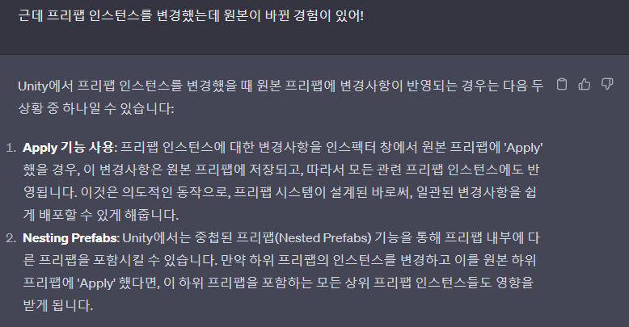
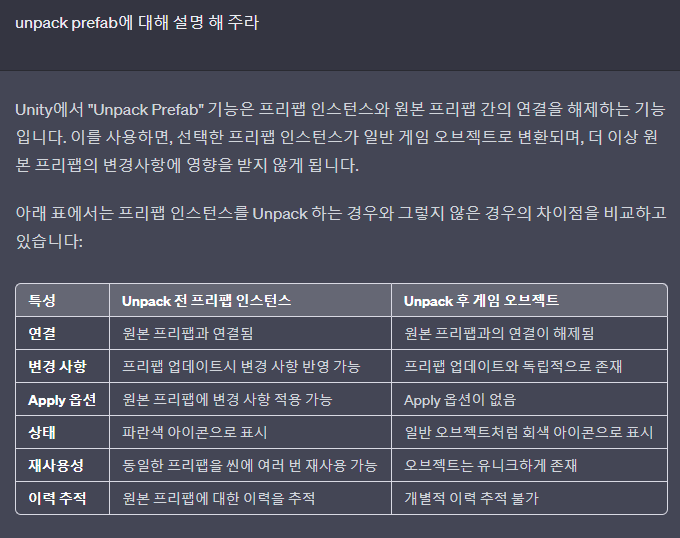

# 목차
- [목차](#목차)
- [공식문서 : https://docs.unity3d.com/kr/2023.2/Manual/Prefabs.html](#공식문서--httpsdocsunity3dcomkr20232manualprefabshtml)
- [Prefab](#prefab)
    - [1. Prefab Asset vs Prefab Instance의 기본적인 차이점](#1-prefab-asset-vs-prefab-instance의-기본적인-차이점)
    - [2. Prefab Asset](#2-prefab-asset)
    - [3. Prefab Instance](#3-prefab-instance)
- [A 프리팹 안에 존재하는 B 프리팹](#a-프리팹-안에-존재하는-b-프리팹)
- [Prefab Instance](#prefab-instance)
- [Unpack Prefab](#unpack-prefab)

   

# 공식문서 : https://docs.unity3d.com/kr/2023.2/Manual/Prefabs.html

   

# Prefab
### 1. Prefab Asset vs Prefab Instance의 기본적인 차이점
- 
- 
- Prefab Asset은 Asset 폴더에 존재하는 클래스 같은 존재고 Prefab Instance는 Hierarchy에 존재하는 인스턴스 같은 존재다.

 

### 2. Prefab Asset

- Prefab Asset
  - 

  - 
- Prefab Asset에 대한 수정은 모든 prefab instance에 영향을 미친다. 
- 유니티 공식 문서
  - 

 

### 3. Prefab Instance
- Prefab Instance의 수정은 Prefab Instance에만 영향을 미친다.
- 학부 시절에는 매우 큰 프리팹 안에 작은 프리팹들을 넣어본 적이 별로 없다. 하지만 프리팹안에는 10개 이상의 계층이 생길 수도 있고 하위에 많은 프리팹이 존재할 수도 있다.
- 즉, 엄청 큰 A 프리팹 애셋이 있다. 그리고 A 프리팹 에셋을 이용해서 게임에서는 A 프리팹의 복제품들을 생성한다. A 프리팹의 하위 5번째 계층에 B 프리팹이 존재한다. 여기서 매우 중요하다. 가장 실수를 많이 하는 부분이다. 우리가 A 프리팹 복제 객체에 존재하는 B 복제 객체에 어떤 스크립트를 넣으려면 어떻게 해야할까? 절대로 B 프리팹 에셋이 해당 스크립트를 넣는 것이 아니라, Asset에 가서 A 프리팹 에셋에 존재하는 B 프리팹에 넣어주어야 한다.
- 그리고 게임을 Play해서 생기는 (clone)객체들에 어떠한 작업을 해도 어차피 게임이 꺼지면 모두 사라진다.

   

# A 프리팹 안에 존재하는 B 프리팹
- B 프리팹도 파란색으로 표시되는 프리팹이다. 과연 B 프리팹을 변경 했을 때 원본 B도 변경이 되는가?
  - 결론부터 말하면 아니다.
- 

# Prefab Instance
- Hierarchy에서 파란색 네모로 표시되어 자신이 Prefab Instance 라는 것을 나타낸다.
- Project 폴더에 있는 프리팹을 Scene에 끌어다가 사용하면 Prefab Instance가 된다.
- 
- **:star:star:주의점**
  - 어떠한 방법으로 원본 프리팹을 변경하는 경우가 있다.
    - Apply 옵션이라고 한다. (이건 반드시 주의해야 한다.)
    - 
  - 이러면 당연히 원본 프리팹과 연결된 모든 프리팹 인스턴스도 변경이 된다.
  - 독립적인 프리팹 인스턴스만 변경하려고 했는데 원본 프리팹을 변경하면 다른 프리팹 인스턴스는 의도하지 않았는데 변경된다.
    - 이 경우 다행이도 Perforce에 원본이 변경된 것도 Pending에 잡히므로 반드시 확인하고 원본을 변경하지 않도록 한다
- 올바르게 프리팹 인스턴스의 inspector만 변경을 하면 해당 변경 사항이 Bold 처리되어 나온다. (Override 됨을 의미)
  - 

# Unpack Prefab
- 
- Unpack은 되도록 하지 말자. 다른 작업자가 프리팹 원본에 대해 작업 했을 때 UnPack된 프리팹은 변경 되지 않아 작업에 난항이 생긴다.