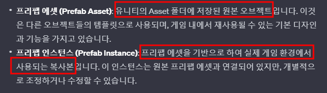
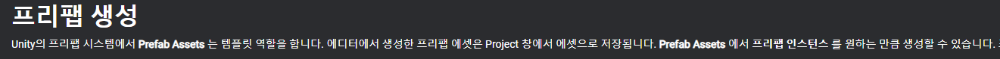
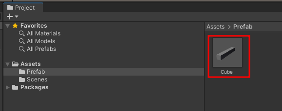
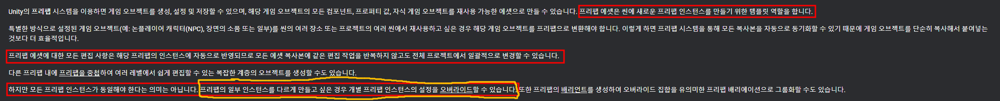
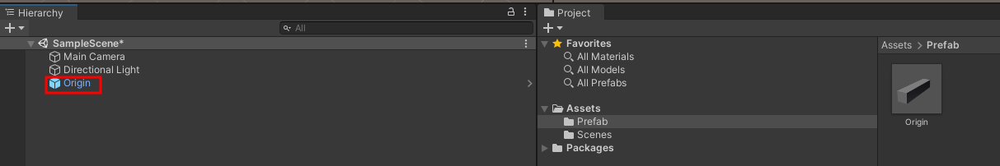
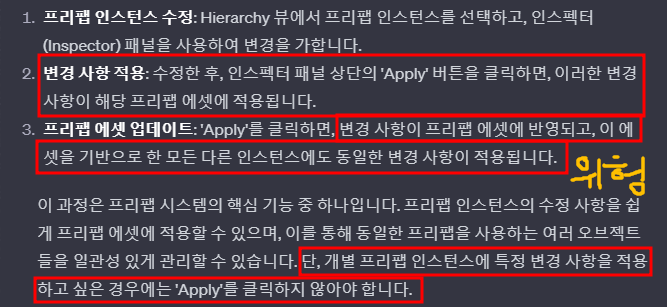
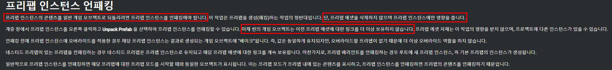

# 목차
- [목차](#목차)
- [공식문서 : https://docs.unity3d.com/kr/2023.2/Manual/Prefabs.html](#공식문서--httpsdocsunity3dcomkr20232manualprefabshtml)
- [Prefab](#prefab)
    - [1. Prefab Asset 과 Prefab Instance 의 기본적인 차이점](#1-prefab-asset-과-prefab-instance-의-기본적인-차이점)
    - [2. Prefab Asset (원본)](#2-prefab-asset-원본)
    - [3. Prefab Instance (원본으로 생성된 인스턴스)](#3-prefab-instance-원본으로-생성된-인스턴스)
- [Unpack Completely](#unpack-completely)
- [Nested Prefab 공부 해야 한다.](#nested-prefab-공부-해야-한다)
- [Prefab Variant 공부 해야 한다.](#prefab-variant-공부-해야-한다)

   

# 공식문서 : https://docs.unity3d.com/kr/2023.2/Manual/Prefabs.html

   

# Prefab
### 1. Prefab Asset 과 Prefab Instance 의 기본적인 차이점
- 
- 
  - C#으로 비유
    - Prefab Asset은 Asset 폴더에 존재하는 클래스 같은 존재다.
    - Prefab Instance는 Hierarchy에 존재하는 인스턴스 같은 존재다.

 

### 2. Prefab Asset (원본)
- 
- Prefab Asset에 대한 수정은 모든 prefab instance에 영향을 미친다. 
- 유니티 공식 문서
  - 

 

### 3. Prefab Instance (원본으로 생성된 인스턴스)
- 
- Prefab Instance로도 Apply를 누르면 Prefab Asset을 변경 시켜 버릴 수 있기 때문에 $\bf{\large{\color{#ff0000}절대로\ 'Apply'를\ 누르지\ 않도록\ 한다.}}$ 
- 
- **파란색 네모로 표시되는 이유**
  - > 유니티에서 프리팹 인스턴스가 파란색 네모로 표시되는 것은 **해당 인스턴스가 프리팹 에셋과 연결되어 있음을 나타냅니다.** 이 파란색 네모는 프리팹 인스턴스가 원본 프리팹 에셋의 모든 속성을 상속받고 있으며, 에셋에 가해진 변경 사항이 이 인스턴스에도 영향을 미칠 수 있음을 의미합니다.
  - UnPack Completely로 해당 연결을 끊을 수 있다.
- **변경 사항이 굵은 글씨체로 표시되는 이유**
  - > 유니티에서 프리팹 인스턴스의 속성 값이 굵은 글씨체(Bold)로 표시되는 것은 해당 속성이 **원본 프리팹 에셋의 값과 다르게 오버라이드(Override)되었음**을 나타냅니다. 이는 프리팹 인스턴스가 원본 프리팹과 연결되어 있으면서도, 특정 속성에 대해 개별적인 수정이 이루어진 경우에 발생합니다.
    - 보통 프리팹 인스턴스만 수정하고 그 수정사항을 원본인 prefab asset에는 적용시키고 싶지 않기 때문에 Bold된 경우는 제대로 진행 한 것 이다.
   

# Unpack Completely
-  
  - "Unpack Completely" 기능을 사용하면 프리팹 인스턴스와 원본 프리팹 에셋 간의 연결을 완전히 끊을 수 있다.
- 클라이언트 개발자가 직접적으로 Unpack은 되도록 하지 말자.
  - UI 작업자가 프리팹 원본에 대해 작업 했을 때 UnPack된 프리팹은 변경 되지 않아 작업에 난항이 생긴다. 

   

# Nested Prefab 공부 해야 한다.

# Prefab Variant 공부 해야 한다.