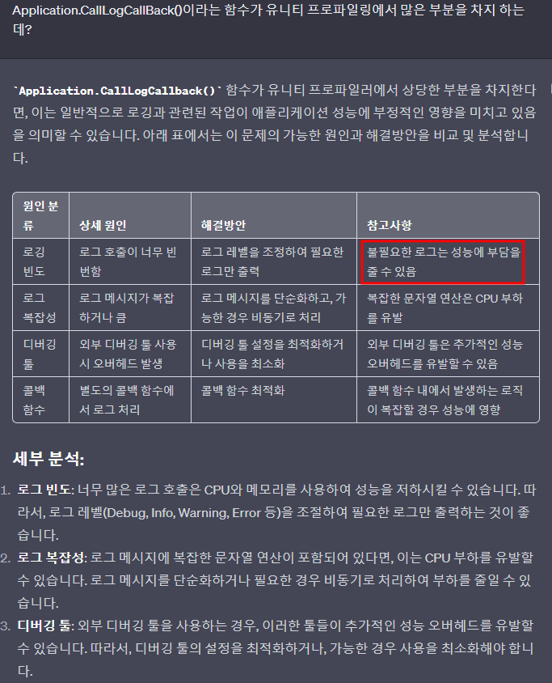
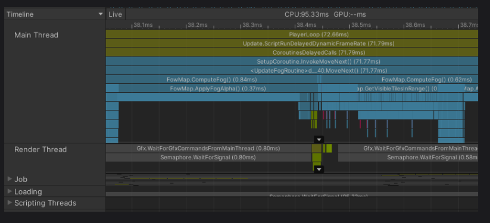

# 목차
- [목차](#목차)
- [프로파일링을 해야 하는 이유](#프로파일링을-해야-하는-이유)
- [TimeLine View](#timeline-view)

   

# 프로파일링을 해야 하는 이유
- 여기서 부하가 걸릴 것 같다 -> 확실하지 않다.
- 부하가 걸리는 정확한 메서드와 부하의 정도를 알면 효율적으로 부하를 제거 할 수 있다.
  - 부하가 클 것 으로 예측된 코드를 수정했는데 실제로는 미비 했을 수도 있다.
  - 프로그래머의 감 보다는 프로파일링 결과 수치를 믿어야 한다.

- 

   

# TimeLine View
- 
- 계층 구조다.
  - 맨 위에 있는 블록을 1단계로 쪼개면 그 아래 블록이고, 그 블록들을 또 쪼개면 아래 블록들로 이루어진다.
  - 예를 들어 200ms가 걸리는 어떤 함수를 발견했다. 그 함수는 2가지 기능으로 이루어져서 한 기능이 120ms, 다른 하나가 80ms를 동작시키면 200ms 함수 아래에 2개의 블록이 각각 120ms와 80ms로 존재할 것 이다.
- 파란색 블록은 스크립트를 의미하고 7호선 색 블록은 엔진 코드를 의미하므로 실질적으로 눈여겨 볼 항목은 파란색 블록이다.
  - 파란색 블록이 스크립트를 담당하므로 내가 작성한 스크립트와 메서드 이름이 블록위에 적혀있다.