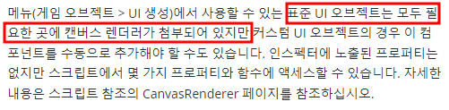
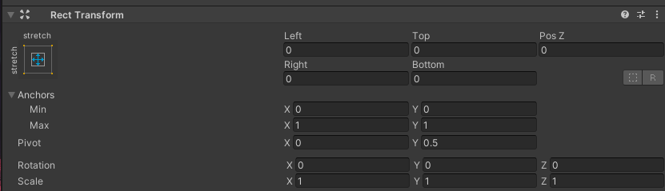

# 목차
- [목차](#목차)
- [UGUI](#ugui)
- [Canvas](#canvas)
- [Canvas Renderer](#canvas-renderer)
- [Graphic Raycaster](#graphic-raycaster)
- [Canvas Group](#canvas-group)
- [Canvas Scaler](#canvas-scaler)
- [EventSystem](#eventsystem)
- [RectTransform 변경하기](#recttransform-변경하기)

   

# UGUI
- 

   

# Canvas
- 하나의 scene에 여러 개 배치가 가능하다.
  - UI를 만들 때 당연히 많은 캔버스를 만들 것 이고, 캔버스의 자식으로 캔버스를 놓을 수 있다.
    - 
- **모든 UI는 캔버스의 자식이어야 한다.**
- :star: **'UI == Canvas == UI 전문 GameObject == 객체'** 으로 이해해도 무방하다고 생각한다.
- Render Mode
  - Screen Space - Camera
    - UI를 전문적으로 다루는 카메라를 만들고 이를 적용한다.
    - 카메라와 UI의 거리에 따라 고정적인 거리를 갖고 움직인다.
- **캔버스 하위의 동일 계층 UI의 그려지는 순서**
  - 같은 계층이라면 맨 위에 있는 UI 부터 그리므로 가장 아래에 깔린다.

   

# Canvas Renderer
- UI 오브젝트가 화면에 그려지기 위해서 필요한 컴포넌트.
- 
  - Image 같은 표준 UI 오브젝트는 Inspector에서 별도로 Canvas Renderer가 보이지 않아도 정상적으로 화면에 그려진다.

   

# Graphic Raycaster
- $\bf{\large{\color{#ff0000}UI\ 버튼이\ 클릭이\ 되지\ 않는다면\ Graphic\ Raycaster가\ 존재하는\ 지\ 확인해야\ 한다!}}$
- 
- Graphic Raycaster가 존재하지 않으면 해당 UI는 광선(raycast)에 충돌되지 않고 통과된다.

   

# Canvas Group
- 나의 하위 UI 객체들은 모두 나의 명령(alpha, interactable, blocks raycasts)을 거스르지 않고 수행한다.
- 
    - Blocks Raycasts를 조금 더 제대로 이해해보자
      - 마우스의 클릭은 광선을 발사한다.
      - 이 광선이 어떤 객체와 부딪혀 충돌을 일으키면 클릭이 발생한다.
      - 하지만 이걸 블록시키면 canvas group 하위의 모든 UI 객체는 광선을 통과시킨다.
- 하나의 거대한 UI는 많은 캔버스로 구성되어 있다. 각각의 캔버스에 canvas group을 달아주면 해당 계층의 하위는 모두 컨트롤 할 수 있다.
- https://wergia.tistory.com/177

   

# Canvas Scaler
- 
  - 핸드폰마다 화면크기가 다르기 때문에 이걸 많이 사용하게 된다.
  
   
    
# EventSystem
- 
- Scene에 1개만 존재
- 얘 덕분에 이벤트를 UI에서 감지하고 처리할 수 있나 보다.
- GraphicRaycaster의 충돌정보를 처리한다.

# RectTransform 변경하기
- 
~~~c#
_rect.offsetMin = new Vector2(200, 0);
_rect.offsetMax = new Vector2(-300, 0);
~~~
  - 이러면 left값이 200, right 값이 300이 된다.
  - left는 parent에 대해서 왼쪽으로 200을 떨어뜨리고
  - right는 parent에 대해서 오른쪽으로 300을 떨어뜨린다.

